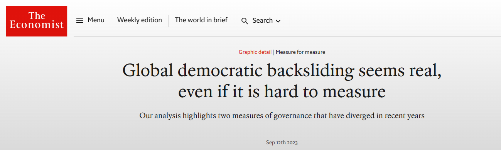
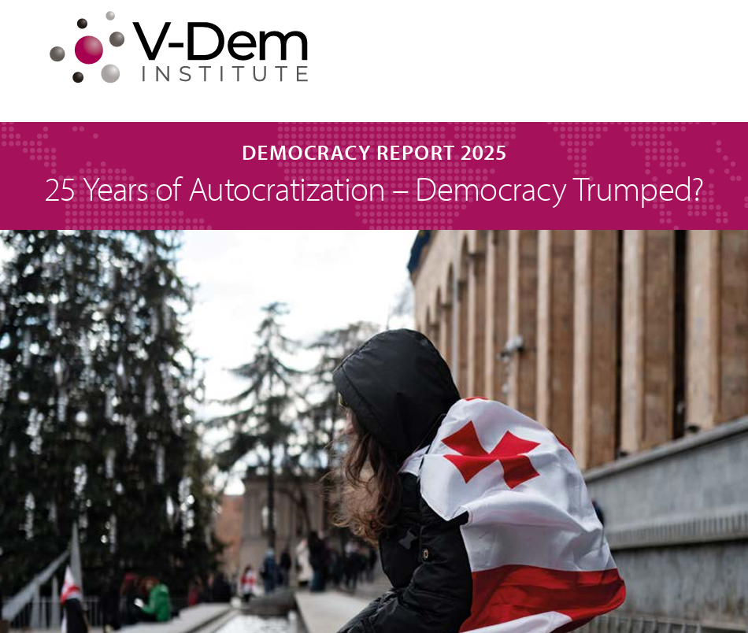
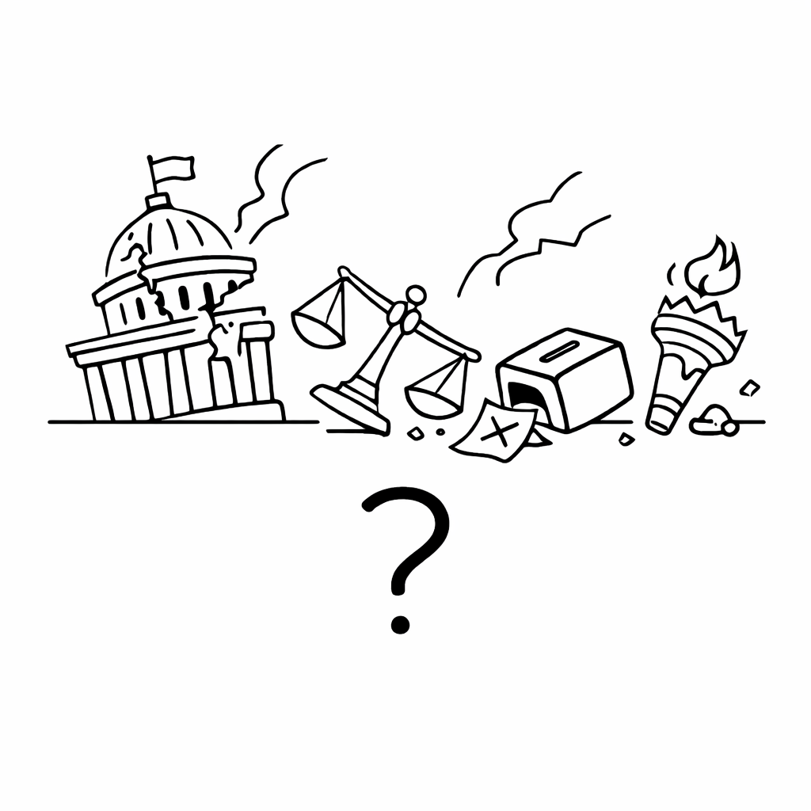

# About me

---

## Dr. Álvaro Canalejo-Molero

<br>

<div style="font-size:90%">

<ul>
<li class="fragment">Postdoctoral researcher at the SNF-funded project <a href="https://www.unilu.ch/en/faculties/faculty-of-humanities-and-social-sciences/institutes-departements-and-research-centres/department-of-political-science/research/digitalization-and-political-conflict-parties-voters-and-electoral-alignment-digipol/#section=c122045">DIGIPOL</a> and the Chair of Political Behaviour and Communication</li>

<li class="fragment">PhD in Political and Social Sciences from the <a href="https://www.eui.eu/en/home">EUI</a></li>

<li class="fragment">Interested in <strong>political behaviour</strong>, <strong>comparative politics</strong>, <strong>democratic attitudes and preferences</strong>, <strong>quantitative methods</strong></li>

<li class="fragment">Originally from the <a href="https://www.architecturaldigest.com/story/cordoba-spain-has-most-unesco-world-heritage-sites">city with the most UNESCO heritage sites in the world</a></li>

<li class="fragment">You can find more information about me in <a href="https://acanalejo.github.io/">my personal website</a></li>
</ul>

</div>

# What about you?

---

<br>

<br>

- Name

- Academic background

. . .

- Why did you take the course?

- What do you expect from this course?


# What is this course about?

---

<div style="position: relative; width: 900px; height: 520px; margin: 0 auto;">

  

  

  

</div>

## 🧐

<div style="height:1.2em;"></div>

. . .

- What is **democratic backsliding**?

. . .

- How pervasive is it? Is it a **global threat**?

. . .

- What ***explains*** <span style="color:#9a9a9a;">—the politics of—</span> democratic backsliding?

  ::: {.fragment}
  - What is the **role of elites**?
  :::

  ::: {.fragment}
  - And of **voters**?
  :::
  
. . .

- Can democratic **backsliding reverse**? And be **fought back**?


# The course organization

## Course overview

<br>

<div style="font-size:90%">

<ul>
<li class="fragment"><strong>Block I. Democracy and Democratic Backsliding</strong> (27.02.2026 / 9:00–15:30) — INE 220</li>

<li class="fragment"><strong>Block II. The Supply-Side of Democratic Backsliding</strong> (13.03.2026 / 9:00–17:30) — INE 220</li>

<li class="fragment"><strong>Block III. The Demand-Side of Democratic Backsliding</strong> (17.04.2026 / 9:00–17:30) — INE 220</li>

<li class="fragment"><strong>Block IV. Trends and Debates on Democratic Backsliding</strong> (15.05.2026 / 15:45–17:30) — 4B02</li>
</ul>

</div>

---

**Block I. Democracy and Democratic Backsliding**

. . .

<div style="font-size:70%">

- **Session 1. Introduction** (27.02.2026 / 9:00–10:45)

    - Przeworski, A. (2019). *Crises of democracy*. Cambridge University Press. *Chapter 1*

</div>

. . .

<div style="font-size:70%">

- **Session 2. What is Democracy?** (27.02.2026 / 11:00–12:45)


    - Dahl, R. A. (1972). *Polyarchy: Participation and opposition*. Yale university press. *Chapter 1* 

    - Przeworski, A. (1991). *Democracy and the market: Political and economic reforms in Eastern Europe and Latin America* (Vol. 181). Cambridge University Press. *Chapter 1*

</div>

. . .

<div style="font-size:70%">

- **Session 3. What is Democratic Backsliding?** (27.02.2026 / 13:45–15:30)

    - Bermeo, N. (2016). On democratic backsliding. *Journal of Democracy*, 27(1), 5-19.

    - Waldner, D., & Lust, E. (2018). Unwelcome change: Coming to terms with democratic backsliding. *Annual Review of Political Science*, 21, 93-113.

</div>

---

**Block II. The Supply-Side of Democratic Backsliding (I)**

. . .

<div style="font-size:70%">

- **Session 4. Weakening Horizontal Accountability** (13.03.2026 / 9:00–10:45)

  - Varol, Ozan. (2015). Stealth Authoritarianism. *Iowa Law Review*, 100(4): 1673–1742. *Parts I, II and III*

  - Levitsky, Steven and Daniel Ziblatt. (2018). *How Democracies Die*. New York: Crown. *Chapter 4*

</div>

. . .

<div style="font-size:70%">

- **Session 5. Weakening Vertical Accountability** (13.03.2026 / 11:00–12:45)

  - Bentele, Keith G., and Erin E. O’Brien. (2013). Jim Crow 2.0? Why States Consider and Adopt Restrictive Voter Access Policies. *Perspectives on Politics*, 11(4): 1088–1116.

  - Birch, S., & Van Ham, C. (2017). Getting away with foul play? The importance of formal and informal oversight institutions for electoral integrity. *European Journal of Political Research*, 56(3), 487–511.

</div>


---

**Block II. The Supply-Side of Democratic Backsliding (II)**


<div style="font-size:70%">

- **Session 6. Weakening Democratic Norms** (13.03.2026 / 13:45–15:30)

  - Bursztyn, L., Egorov, G., & Fiorin, S. (2020). From extreme to mainstream: The erosion of social norms. *American Economic Review*, 110(11), 3522–3548.

  - Clayton, K., Davis, N. T., Nyhan, B., Porter, E., Ryan, T. J., & Wood, T. J. (2021). Elite rhetoric can undermine democratic norms. *Proceedings of the National Academy of Sciences*, 118(23), e2024125118.

</div>

. . .

<div style="font-size:70%">

- **Session 7. Populism and the Weakening of 'Party Democracy'** (13.03.2026 / 15:45–17:30)

  - Kriesi, H. (2017). The populist challenge. In *The role of parties in twenty-first century politics* (pp. 131–148). Routledge.

  - Bessen, B. R. (2024). Populist discourse and public support for executive aggrandizement in Latin America. *Comparative Political Studies*, 57(13), 2118–2151.

</div>

---

**Block III. The Demand-Side of Democratic Backsliding (I)**

. . .

<div style="font-size:70%">

- **Session 8. Support for Democracy and Political Trust** (17.04.2026 / 9:00–10:45)

  - Claassen, C. (2020). Does public support help democracy survive? *American Journal of Political Science*, 64(1), 118–134.

  - Jacob, M. S. (2025). Citizen support for democracy, anti‐pluralist parties in power and democratic backsliding. *European Journal of Political Research*, 64(1), 348–373.

</div>

. . .

<div style="font-size:70%">

- **Session 9. Democratic Values and Hypocrisy** (17.04.2026 / 11:00–12:45)

  - Graham, M. H., & Svolik, M. W. (2020). Democracy in America? Partisanship, polarization, and the robustness of support for democracy in the United States. *American Political Science Review*, 114(2), 392–409.

  - Chu, J. A., Williamson, S., & Yeung, E. S. (2025). Are people willing to trade away democracy for desirable outcomes? Experimental evidence from six countries. *Comparative Political Studies*, 00104140251392539.

</div>

---

**Block III. The Demand-Side of Democratic Backsliding (II)**

<div style="font-size:70%">

- **Session 10. Grievances and Resentment** (17.04.2026 / 13:45–15:30)

  - Cramer, K. J. (2016). *The politics of resentment: Rural consciousness in Wisconsin and the rise of Scott Walker*. University of Chicago Press. *Chapter 1*

  - Berman, S. (2021). The causes of populism in the West. *Annual Review of Political Science*, 24(1), 71–88.

</div>

. . .

<div style="font-size:70%">

- **Session 11. Media Change and Disinformation** (17.04.2026 / 15:45–17:30)

  - Lecheler, S., & Egelhofer, J. L. (2022). Disinformation, misinformation, and fake news: Understanding the supply side. In *Knowledge resistance in high-choice information environments* (pp. 69–87). Taylor & Francis.

  - Tucker, J. A., Guess, A., Barberá, P., Vaccari, C., Siegel, A., Sanovich, S., & Nyhan, B. (2018). Social media, political polarization, and political disinformation: A review of the scientific literature. *Working paper*.

</div>

---

**Block IV. Trends and Debates on Democratic Backsliding**

. . .

<div style="font-size:70%">

- **Session 12. Measuring Democratic Backsliding** (15.05.2026 / 9:00–10:45)

  - Marina, N. et al. (2024). *Democracy Report 2024: Democracy Winning and Losing at the Ballot*. University of Gothenburg: V-Dem Institute.

  - Little, A. T., & Meng, A. (2024). Measuring democratic backsliding. *PS: Political Science & Politics*, 57(2), 149–161.

</div>

. . .

<div style="font-size:68%">

- **Session 13. Institutional and Civil Resistance** (15.05.2026 / 11:00–12:45)

  - Graham, B. A., Miller, M. K., & Strøm, K. W. (2017). Safeguarding democracy: Powersharing and democratic survival. *APSR*, 111(4), 686–704.

  - Chenoweth, E., & Stephan, M. J. (2011). *Why civil resistance works: The strategic logic of nonviolent conflict*. Columbia University Press. *Chapter 1*

</div>

. . .

<div style="font-size:70%">

- **Session 14. Is Democracy in Danger? Final Remarks** (15.05.2026 / 13:45–15:30)

  - Riedl, R. B., Friesen, P., McCoy, J., & Roberts, K. (2024). Democratic backsliding, resilience, and resistance. *World Politics*.

</div>

# Course policies and evaluation

## Teaching policy

<br>

This is a **seminar**, ***not a lecture!***

. . .

- Mandatory readings must be **read in advance**

. . .

- The lecturer will *'lecture'* the first half of the session

. . .

- The second half is **driven by students** *(i.e., presentations!)*

. . .

- **Active participation** is essential, and will be evaluated

## Integration and interaction policy

. . .

<br>

- No discrimination

- Inclusive language

- No bullying

- **Everyone** should **participate in equal terms**

## Artificial intelligence (AI) policy

<br>

. . .

- AI tools, like ChatGPT, are allowed

- They should ***augment, not replace***, human work

. . .

- **Mandatory declaration policy**

  - For every *class assignment*!

## Requirements & evaluation I

. . .

1. **Attend** all the sessions 

    - Max. two missing sessions

. . .

2. **Read** the mandatory readings before each session 

    - [How to Read a Scientific Article](https://macartan.github.io/teaching/how-to-read) 
    
    - Readings in OLAT!

. . .

3. **Participate** actively

    - Again: *active engagement* is expected

## Requirements & evaluation II

<div style="height:0.6em;"></div>


4. **Write** two response papers (500–700 words)

. . .

<div style="font-size:90%; margin-left:40px;">   
    
  - Two sessions to be selected

  - Focus on one reading per session
    
  - Each session must be from a different block, and should not coincide wiht the presentation block
    
  - Follow naming convention and updloading guidelines (i.e., one week before the session) in the syllabus
    
  - [How to Critique a Scientific Article](https://macartan.github.io/teaching/how-to-critique)

</div>

## Requirements & evaluation III

5. **Present** a case study of a country under democratic backsliding

. . .

<div style="font-size:70%; margin-left:40px;">  
    
  - Individually or in pairs
    
  - **Maximum 30 minutes** + 15 minutes for discussion
    
  - Case studies will be assigned by the end of this session
    
  - The **presentations should include**:
    
      1. Country background (~10 minutes)
      
      2. Democratic backsliding and trends over time (~10 minutes)
      
      3. Opposition, resilience, and future prospects (~10 minutes)
      
      4. Discussion question
    
  - The **slides** must be uploaded to OLAT the day before the presentation
</div>
   
    
## 

<br>

```{r echo=FALSE, fig.width=6, fig.height=3, fig.align = "center"}
# Load necessary library
library(ggplot2)

# Data for grading policy
grades <- data.frame(
  Category = c("Class Participation", "Response papers", "Presentation"),
  Percentage = c(10, 40, 50)
)

# Reorder the levels of Category based on Percentage from higher to lower
grades$Category <- factor(grades$Category, levels = grades$Category[order(-grades$Percentage)])

# Create a bar chart
ggplot(grades, aes(x = reorder(Category, -Percentage), y = Percentage, fill = Category)) +
  geom_bar(stat = "identity") +
  geom_text(aes(label = paste0(Percentage, "%")), vjust = -0.5) +  # Add percentage labels
  theme_minimal() +
  labs(title = "Grading Policy Breakdown", x = "Category", y = "Percentage") +  # Remove x-axis label
  scale_fill_brewer(palette = "Set2") +
  ylim(0,60) +
  theme(legend.position = "right",  # Add legend for categories
        legend.title = element_blank(),  # Remove legend title
        axis.text.x = element_blank(),  # Remove x-axis text
        plot.title = element_text(hjust = 0.5))  # Center title
```

## Seminar paper (4/6 credits)

<div style="height:0.6em;"></div>

. . .

- Between *6,000* and *10,000* words

- **Topic** related to the seminar; to be agreed with the lecturer

- Paper **outline** of by **May 1st 2026**

    -	Research question

    - Academic and societal relevance

    -	Theory and hypotheses

    -	Approach and structure of the paper

- Submission **deadline** in **September 2026**

## No office hours!

<br>

. . .

<br>

Send me an email at [alvaro.canalejo@unilu.ch](alvaro.canalejo@unilu.ch) to schedule a meeting at least *one week in advance* (**Office 3.B14**)


# Organization of the presentations

## Calendar

. . .

<div style="font-size:75%; line-height:1.2;">


| Session | Date        | Time          | Case study     |
|--------:|-------------|---------------|----------------|
| 4       | 13.03.2026  | 10:00–10:45   | Hungary        |
| 5       | 13.03.2026  | 12:00–12:45   | Turkey         |
| 6       | 13.03.2026  | 14:45–15:30   | India          |
| 7       | 13.03.2026  | 16:45–17:30   | United States  |
|         |             |               |                |
| 8       | 17.04.2026  | 10:00–10:45   | Bangladesh     |
| 9       | 17.04.2026  | 12:00–12:45   | Nicaragua      |
| 10      | 17.04.2026  | 14:45–15:30   | El Salvador    |
| 11      | 17.04.2026  | 16:45–17:30   | Philippines    |
|         |             |               |                |
| 12      | 15.05.2026  | 10:00–10:45   | Brazil         |
| 13      | 15.05.2026  | 12:00–12:45   | Poland         |

</div>

# Conclusion

## Learning outcomes

By the end of this course, you will be able to...

<div style="height:0.6em;"></div>

<div style="font-size:90%">

<ol>
<li class="fragment">...understand **key theories of democracy and democratic erosion**, and **assess major threats, trends, and forms of resilience**.</li>

<li class="fragment">...**critically evaluate quantitative research on democracy and political behavior**, assessing theory and empirical strategy.</li>

<li class="fragment">...**write critical response papers** on scientific articles related to democracy and political behavior.</li>

<li class="fragment">...**debate with colleagues and communicate complex concepts** effectively to a broad audience.</li>
</ol>


</div>


---

{fig-align="center"}

## Today's sessions

<div style="height:0.6em;"></div>

. . .

<div style="font-size:75%">

- **Session 2. What is Democracy?** (27.02.2026 / 11:00–12:45)


    - Dahl, R. A. (1972). *Polyarchy: Participation and opposition*. Yale university press. *Chapter 1* 

    - Przeworski, A. (1991). *Democracy and the market: Political and economic reforms in Eastern Europe and Latin America* (Vol. 181). Cambridge University Press. *Chapter 1*


- **Session 3. What is Democratic Backsliding?** (27.02.2026 / 13:45–15:30)

    - Bermeo, N. (2016). On democratic backsliding. *Journal of Democracy*, 27(1), 5-19.

    - Waldner, D., & Lust, E. (2018). Unwelcome change: Coming to terms with democratic backsliding. *Annual Review of Political Science*, 21, 93-113.

</div>


## Let's hear your thoughts!

<br>

{fig-align="center"}

<br>


---

<br>

{fig-align="center"}

## Do not forget to register at UniPortal!

{fig-align="center"}


## Thanks! :slightly_smiling_face:

<br>

<br>

<br>

<center>[alvaro.canalejo@unilu.ch](alvaro.canalejo@unilu.ch)</center>
