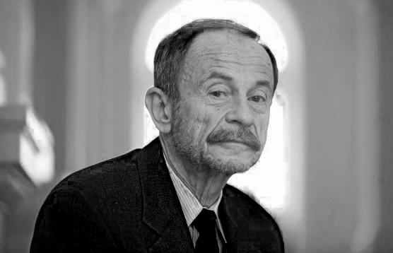

# Introduction

::: notes
~ 15 minutes
:::


## This session's goals

. . .


- Understand what **democracy is**... and is not

. . .

- Survey the main theoretical traditions and assess **which approaches serve our purposes**

. . .

- Establish a **working definition** 

. . .

- See how that definition connects to **measurement**

. . .

- Set up the conceptual **foundations for studying backsliding**

::: notes
This slide frames the session as building toward a practical goal; not just a survey of democratic theory for its own sake. The last bullet is the most important: everything covered today (definition, measurement, datasets) is scaffolding for the rest of the course. Students should leave with a clear sense of what democracy means empirically, how we observe it, and therefore what it would look like for it to deteriorate.
:::

## Democracy is a contested concept

<br>

. . .

Different definitions emphasise different *aspects* of self-governance

. . .

Each has its **merits** and its **blind spots**

. . .

<br>

> Why should we follow one approach rather than another?

::: notes
Open with this as a genuine puzzle, not a rhetorical question. The goal is to motivate why the choice of definition is not trivial, it has direct consequences for what we count as democratic backsliding, how we measure it, and what cases we worry about.
:::

---

## The classics

. . .

<div style="height:0.6em;"></div>

::: {.text-tiny}

| Thinker | Work | Core contribution |
|---|---|---|
| **John Locke** | *Two Treatises of Government* (1689) | Government authority derives from **consent of the governed** to protect natural rights: life, liberty, and property |
| **Montesquieu** | *The Spirit of the Laws* (1748) | Liberty requires **separation of powers** — legislature, executive, and judiciary must be distinct |
| **James Madison** | *Federalist No. 10* (1787) | The danger is **faction**; the solution is republican representation and institutional checks |
| **Alexis de Tocqueville** | *Democracy in America* (1835–40) | Democracy's strength is civil association; its danger is the **tyranny of the majority** |

:::

::: notes
These four figures establish the core vocabulary the modern debate inherits. Locke gives us consent and rights; Montesquieu gives us institutional design as the key safeguard — not moral character; Madison gives us the countermajoritarian worry and checks-and-balances, and also the realist insight that direct democracy is dangerous; Tocqueville gives us the sociological lens — democracy as a condition of society, not just a form of government, and raises the concern about soft despotism through conformity. Spend no more than 4–5 minutes here. The goal is anchoring, not a philosophy lecture.
:::

---

## Modern approaches: an overview

<br>

::: {.text-tiny}

| Tradition | Key thinkers | Core claim |
|---|---|---|
| **Electoral / procedural** | Schumpeter, Schattschneider, Przeworski | Democracy = competitive selection of leaders through elections |
| **Liberal / polyarchic** | Dahl, Lijphart, Schmitter | Democracy = contestation + participation + civil liberties |
| **Participatory** | Pateman, Barber | Democracy = active, continuous citizen self-governance |
| **Deliberative** | Habermas, Rawls | Democracy = decisions reached through public reason |
| **Substantive / social** | Dewey, Polanyi, Fraser | Democracy = meaningful equality of condition, not just procedure |
:::


::: notes
This is a reference table. Briefly note the logic running across the rows: each successive tradition adds more demanding conditions. The electoral tradition asks "who governs?"; the liberal asks "under what institutional conditions?"; the participatory asks "how actively do citizens engage?"; the deliberative asks "how are decisions reached?"; the substantive asks "with what social outcomes?". The more demanding the definition, the fewer real-world cases qualify — and the harder it becomes to study variation and deterioration empirically.
:::

---


## Descriptive vs. normative approaches {.smaller}

<br>

::: {.columns}
::: {.column width="50%" .fragment}

**Descriptive**

Departs from how democracy **works in practice**

- Electoral / procedural
- Liberal / polyarchic

Goal: observe, compare, measure

:::
::: {.column width="50%" .fragment}

**Normative**

Departs from how democracy **ought to work**

- Participatory
- Deliberative
- Substantive / social

Goal: critique, reform, aspire

:::
:::

. . .

::: {.callout-note}
These are ideal types; real democracies may incorporate deliberative or participatory elements, but the *definition* starts from observable practice, not normative ideals
:::

::: notes
This distinction is crucial for framing the rest of the session. Normative theories are not wrong — they point to genuine deficiencies in actually-existing democracies. But for the purposes of this course, we need a definition that allows us to observe and measure democratic quality and its deterioration. A definition that no real polity satisfies cannot do that work. Note also that even procedural definitions impose normative standards — they just set the bar at a level where real-world cases can be evaluated.
:::

# Descriptive Approaches

::: notes
~ 40 minutes
:::

## Why we need a descriptive approach?

<br>

. . .

The goal of this course: evaluate **levels, quality, and deterioration** of democracy

. . .

<br>

::: {.text-small}

That requires a definition that:

- Departs from how democracy works in the **real world**
- Identifies **empirically observable** elements
- Allows for **measurement and comparability** across space and time
- Ultimately allows us to observe **deterioration** in each of those elements

:::

::: notes
This is the bridge between the philosophical overview and the empirical core. The non-circularity point is methodological and important: if we pack too much into our definition, we define backsliding away or make it tautological. Munck & Verkuilen (2002) call this the maximalist trap. Stress it — students often find overly rich definitions intuitively appealing precisely because they capture what democracy should be for. But that intuition, however legitimate normatively, is analytically costly.
:::

## Robert Dahl

::: {.columns}
::: {.column width="50%" .text-small  .fragment}

- American political scientist (1915–2014)
- Professor at Yale for most of his career
- One of the most influential democratic theorists of the 20th century
- Key works: *A Preface to Democratic Theory* (1956), **Polyarchy** (1971), *Democracy and Its Critics* (1989)
- Introduced the concept of **polyarchy**

:::
::: {.column width="50%"}


:::
:::

::: notes
Brief biography to anchor the reading. Dahl was both a normative theorist and an empirical scientist — unusual combination. Polyarchy (1971) is the key text for today; it operationalises his two-dimensional conception of democracy and remains the foundation of most large-N measurement efforts. His later Democracy and Its Critics (1989) develops the normative side more fully but builds on the same framework.
:::


## Dahl's polyarchy {.smaller}

<br>

Democracy is an **ideal**; polyarchy is the best real-world approximation

. . .

**Two** core **dimensions** (Dahl, 1971):

<br>


::: {.columns}

::: {.column width="50%" .fragment}

### Contestation
*Can opposition meaningfully compete?*

- Freedom to form and join organisations
- Freedom of expression
- Access to alternative information
- Free and fair elections
- Elected officials actually govern

:::

::: {.column width="50%" .fragment}

### Participation
*Who gets to take part?*

- Universal (adult) suffrage
- Right to run for office
- Equal and effective citizenship

:::
:::

::: notes
Stress two points: (1) contestation without participation is oligarchic competition — only some can compete; (2) participation without contestation is plebiscitary authoritarianism — everyone can vote but only for one option. Both dimensions are analytically necessary. The fifth bullet under contestation is often overlooked: elected officials must actually be the ones governing — not the military, a parallel party structure, or unelected technocrats. This is relevant for assessing cases like Pakistan or Thailand.
:::

---


## Dahl: ideal types

```{r}
#| fig-align: center
#| fig-width: 7
#| fig-height: 5

library(tidyverse)
library(ggrepel)

ideal_types <- tibble(
  label = c("Closed\nHegemony", "Competitive\nOligarchy", "Inclusive\nHegemony", "Polyarchy\n(Democracy)"),
  contestation = c(0.05, 0.95, 0.05, 0.95),
  participation = c(0.05, 0.05, 0.95, 0.95)
)

ggplot(ideal_types, aes(x = contestation, y = participation, label = label)) +
  geom_point(size = 5, colour = "#1C7293") +
  geom_text_repel(size = 4.5, fontface = "bold", colour = "#1C7293", box.padding = 0.6) +
  scale_x_continuous(limits = c(-0.1, 1.1), breaks = c(0, 1), labels = c("Low", "High")) +
  scale_y_continuous(limits = c(-0.1, 1.1), breaks = c(0, 1), labels = c("Low", "High")) +
  labs(x = "Contestation (liberalisation)",
       y = "Participation (inclusiveness)",
       caption = "Adapted from Dahl (1971)") +
  theme_minimal(base_size = 14) +
  theme(panel.grid.minor = element_blank(),
        axis.title = element_text(face = "bold"),
        plot.caption = element_text(colour = "grey50"))
```

::: notes
Walk through each quadrant: closed hegemony (Soviet bloc, absolute monarchies — no competition, no inclusion); competitive oligarchy (19th-century Britain before mass suffrage — parties competed but most could not vote); inclusive hegemony (some post-colonial single-party states with universal suffrage but no real opposition — e.g., Mexico under the PRI for decades); polyarchy (contemporary liberal democracies). Most backsliding today involves movement away from polyarchy — usually by eroding contestation while formally maintaining elections and suffrage. That is what makes it hard to detect.
:::

---

## The conditions of polyarchy

::: {.text-small}

Dahl identifies **seven institutional guarantees** necessary for polyarchy:

:::

<br>

. . .

::: {.text-small}

1. Freedom to form and join **organisations**
2. Freedom of **expression**
3. Right to **vote**
4. **Eligibility** for public office
5. Right of political leaders to **compete** for support
6. Access to alternative sources of **information**
7. **Free and fair elections** that *determine policy*

:::

::: notes
This is the full Dahl list from Polyarchy (1971), pp. 3–4. It is worth pausing here because this is precisely what backsliding erodes — often not elections themselves, but the surrounding conditions: independent media (6), opposition organisation (1), free expression (2). 
:::

## Dahl's logic of toleration

<div style="height:0.6em;"></div>

. . .

```{r tolerance}
#| fig-align: center
#| fig-width: 8
#| fig-height: 5

library(tidyverse)

df <- tibble(
  x = seq(0, 10, length.out = 100),
  cost_suppression = 2 + 0.7 * x,
  cost_toleration  = 8 - 0.5 * x
)

df_long <- df |>
  pivot_longer(cols = c(cost_suppression, cost_toleration),
               names_to = "line", values_to = "cost") |>
  mutate(line = recode(line,
    cost_suppression = "Cost of suppression",
    cost_toleration  = "Cost of toleration"
  ))

crossing <- df |>
  mutate(diff = abs(cost_suppression - cost_toleration)) |>
  slice_min(diff, n = 1)

ggplot(df_long, aes(x = x, y = cost, colour = line, linetype = line)) +
  geom_line(linewidth = 1.2) +
  geom_vline(xintercept = crossing$x, linetype = "dashed", colour = "grey40") +
  annotate("text", x = crossing$x + 0.3, y = 1.5,
           label = "Threshold:\ntoleration becomes\nrational", hjust = 0.1,
           vjust = -1, size = 3.5, colour = "grey30") +
  annotate("text", x = 1, y = 9.5,
           label = "← Suppression\npreferred", size = 3.5, colour = "grey30") +
  annotate("text", x = 9, y = 2,
           label = "Toleration\npreferred →", size = 3.5, colour = "grey30") +
  scale_colour_manual(values = c("#1C7293", "#B85042")) +
  scale_x_continuous(breaks = c(0, 10), labels = c("Low", "High")) +
  scale_y_continuous(breaks = NULL) +
  labs(
    x = "Organisational capacity and resources of opposition",
    y = "Cost (to the government)",
    colour = NULL, linetype = NULL,
    caption = "Adapted from Dahl (1971)"
  ) +
  theme_minimal(base_size = 13) +
  theme(
    legend.position = "top",
    panel.grid.minor = element_blank(),
    plot.caption = element_text(colour = "grey50")
  )
```

::: notes
Dahl's argument in chapter 1 of Polyarchy is that the probability a government tolerates organised opposition depends on the relative costs. When the cost of suppression exceeds the cost of toleration — typically as the opposition grows stronger and more organised — rational governments shift toward toleration. The x-axis captures the opposition's organisational capacity: a weak, fragmented opposition is cheap to suppress; a strong, resourceful one is not. The threshold is where toleration becomes the rational choice. This framework predicts both democratisation (costs of suppression rise over time) and backsliding (incumbents act to weaken opposition capacity, pushing the threshold rightward before it is reached).
:::

---

## Adam Przeworski

::: {.columns}
::: {.column width="50%" .text-small  .fragment}

- Polish-American political scientist (b. 1940)
- Professor at NYU; previously at University of Chicago
- Key works: *Capitalism and Social Democracy* (1985), **Democracy and the Market** (1991), *Democracy and Development* (2000)
- Known for applying **rational choice and game theory** to the study of democracy

:::
::: {.column width="50%"}



:::
:::

::: notes
Brief biography. Przeworski bridges political economy and democratic theory in a way few others do. His 1991 book is the key reading for today. 
:::

## Przeworski's minimalist approach {.smaller}

<br>

. . .

> *"Democracy is a system in which parties lose elections"*
> — Przeworski (1991, p. 10)

. . .

<br>

The core criterion: **contestation is sufficient**

. . .

Democracy is defined not by its ideals but by its **process**:

- Conflicts exist and are organised
- Competition proceeds under known rules
- **Outcomes cannot be known in advance**
- Winners and losers alternate; defeats are reversible

. . .

Democracy is understood as **organised uncertainty**

::: notes
Przeworski builds on Schumpeter's competitive elitism but sharpens it considerably. The key move is treating democracy as a matter of organised uncertainty — not chaos, not randomness, but rule-bounded unpredictability. This is why he says democracy is essentially about losing: if you can't lose, it isn't democracy. Stress the word "reversible" — this is the thread connecting Przeworski to the backsliding literature. When reversibility is cancelled — when incumbents make it structurally impossible to lose — democracy ends.
:::

---

## Democracy is conflict, not harmony {.smaller}

<br>

. . .

Przeworski rejects the Rousseauian tradition: democracy does **not** discover a ***common good***

<br>

. . .

Societies contain **genuinely conflicting interests**; politics cannot dissolve them

. . .

Democracy therefore:

- Does not resolve conflicts *permanently*
- Merely terminates them *temporarily* under accepted rules
- Is "government *pro tempore*" — always subject to revision

. . .

Elite negotiations, legislation, and courts settle disputes **only until the next round**

. . .

Not only elections but **all these regulated conflict resolution processes** define democracy

::: notes
This is a foundational philosophical move. Przeworski is aligned with the Schumpeterian and pluralist traditions against idealist democratic theory. The implication for backsliding is immediate: when losers decide they no longer accept the next round — when they treat defeat as permanent — democracy breaks down. Note also the contrast with deliberative theory (Habermas, Rawls): Przeworski is sceptical that discussion alone can resolve genuine conflicts of interest.
:::

---

## The core puzzle: why do losers comply? {.smaller}

<br>

Democracy produces **losers**

But democracy only survives if losers **comply**

::: {.columns}
::: {.column width="50%" .fragment}

*Why does the military accept civilian government?*

*Why do capitalists accept unfavourable laws?*

*Why do citizens obey policies that harm them?*

:::
::: {.column width="50%" .fragment}

**Consent to procedures ≠ consent to outcomes**

Nothing in the rules *guarantees* obedience to the results

:::
:::

. . .

::: {.callout-note}
This makes democracy inherently **fragile**; compliance is never automatic
:::

::: notes
This is Przeworski's central theoretical contribution and the direct theoretical ancestor of the backsliding literature. The puzzle is real: democratic legitimacy is not self-executing. Levitsky and Ziblatt (2018) and others build directly on this — institutions depend on the willingness of actors to abide by them. Once major actors — the military, business elites, a political party — conclude that compliance is irrational, democratic survival is threatened.
:::

---

## Democracy as equilibrium {.smaller}

<br>

Przeworski's answer: actors comply when democracy is a **self-enforcing equilibrium**

. . .

<br>

Compliance is rational when:

- Actors expect **future opportunities** to compete and win
- Defeats are understood as **temporary**
- The rules appear **fair and effective**
- Abandoning democracy would worsen their situation

. . .

::: {.callout-note}
Democracy endures not because it is morally right, but because compliance is in actors' **self-interest**
:::

::: notes
Three competing explanations for compliance exist: (1) spontaneous equilibrium — the strategic logic above; (2) external enforcement — courts, military, international pressure; (3) normative commitment — actors believe in democracy as a value. Przeworski's argument strongly favours (1), supplemented by (2). Implication: to understand when democracies break down, we should look for conditions that alter actors' time horizons and expected future payoffs — not primarily for shifts in democratic values. That is a testable, empirical claim. It also suggests why backsliding is hard to reverse once started: once actors recalculate that the game is rigged, the equilibrium unravels quickly.
::::

---

## Institutionalising uncertainty {.smaller}

<br>

The decisive step toward democracy:

**transfer of power from persons to rules** (i.e. *institutions*)

. . .

*Democratisation* occurs when:

- **No actor can guarantee victory in advance**
- All **interests** become subject to **open competition**
- **Losing** is possible and **accepted**

. . .

::: {.columns}
::: {.column width="50%"}
**Authoritarian logic**

Outcomes predetermined

Losers excluded or punished

Compliance enforced by fear

:::
::: {.column width="50%"}
**Democratic logic**

Outcomes uncertain

Losers accept results

Compliance is strategic

:::
:::

::: notes
The contrast with authoritarian logic is pedagogically useful: authoritarianism resolves the compliance problem by brute force and by making losing catastrophic; democracy resolves it by making losing *tolerable* through the promise of future competition. Backsliding is the process by which this promise is gradually cancelled — outcomes become more predictable for the incumbent, costs of losing rise for the opposition, and actors begin to recalculate. The transition from democratic to authoritarian logic is rarely abrupt; it is incremental, which is again why backsliding is so hard to detect.
:::

---

## Dahl vs. Przeworski {.smaller}

<br>

> How do they differ, and where do they agree?

. . .

Both agree on the **core**: meaningful political competition with alternation of power

. . .

Both recognise the importance of civil liberties for *sustaining* competition

. . .

<br>

But they **disagree on their relationship to democracy**:

- **Dahl**: civil liberties and institutional guarantees are **definitional**, i.e. necessary and jointly sufficient conditions for polyarchy
- **Przeworski**: they are **instrumental**, i.e. they matter because they sustain the conditions under which elections can be lost and results accepted

::: notes
This comparison is important because students will encounter both in the literature. The practical difference is significant for backsliding research: Dahl's framework detects erosion of press freedom, judicial independence, or opposition rights as democratic deterioration even while elections are still held. Przeworski's framework only registers backsliding once elections themselves are compromised. Contemporary backsliding scholars (Bermeo, Levitsky & Ziblatt, Lührmann & Lindberg) broadly follow the Dahlian framework — and V-Dem's liberal democracy index is its direct operationalisation.
:::


## Dahl vs. Przeworski: overview

<br>

::: {.text-small}

| | **Dahl (polyarchy)** | **Przeworski** |
|---|---|---|
| Core criterion | Contestation + participation | Contestation |
| Civil liberties | **Definitional** (7 guarantees) | **Instrumental** (support competition) |
| Focus | Institutional conditions | Strategic equilibrium |
| Empirical referent | Constitutional and effective liberties | Electoral outcomes and reactions |

:::

## A note on institutional design(s) {.smaller}

<br>

. . .

Neither Dahl nor Przeworski includes ***rule of law*** or ***separation of powers*** **in their definition** of democracy

. . .

<br>

These are features of **institutional design** that matter because *enable*:

. . .

::: {.columns}
::: {.column width="50%"}

**In Dahl**

The **conditions of contestation**; free expression and opposition organisation


:::
::: {.column width="50%"}

**In Przeworski**

The **stakes of elections bounded**

- Stakes must be high enough to motivate participation
- But not so high that losers prefer to fight rather than accept defeat

:::
:::

::: notes
This is a crucial clarification students often miss. Neither Dahl nor Przeworski is a constitutional theorist in the Madisonian sense — they don't define democracy by its institutional architecture. The rule of law matters in Dahl because without judicial independence and legal constraints, the seven guarantees become paper rights; it matters in Przeworski because unbounded executive power raises the stakes of losing to the point where rational actors prefer not to lose at all — which means they stop playing by the rules. Separation of powers, federalism, and judicial review are therefore instrumental, not constitutive. This also explains why backsliding so frequently targets courts and prosecutors first: weakening those institutions raises the cost of losing without (yet) touching elections directly.
:::


## Why not broader definitions? {.smaller}

<br>

. . .

::: {.text-small}

> Maximalist definitions foreclose the questions that are "just too interesting to resolve by definitional fiat"
(Przeworski et al. 1996, p. 20)

:::

<br>

. . .

**Participatory democracy**

→ Demands continuous active participation by all citizens; no real-world polity qualifies


**Deliberative democracy**

→ Requires decisions to emerge from unconstrained public reason; an aspirational ideal; ignores irreducible conflicts of interest

**Substantive / social democracy**

→ Conflates *process* with *outcomes*; if social equality is definitional, we cannot study whether democracy produces it


::: notes
The Przeworski quote is verbatim and worth using. The point is methodological, not political: social democracy theorists are not wrong to care about equality — they are wrong to make equality *definitional*. Once you do that, the empirical relationship between democratic procedures and egalitarian outcomes becomes unstudyable. Same for deliberative theories: they describe an ideal deliberative process but tell us nothing about how to distinguish actually-existing democracies from authoritarian regimes.
:::

# Towards a Working Definition

::: notes
~ 15 minutes
:::

## What do democracies have in common? {.smaller}

<br>

. . .

Synthesising Dahl and Przeworski, a **working procedural definition** should include:

<br>

::: {.columns}
::: {.column width="48%"}
:ballot_box: Competitive elections

:busts_in_silhouette: Universal suffrage and right to run

:newspaper: Access to alternative information

:loudspeaker: Freedom of expression and organisation
:::
::: {.column width="48%"}
:briefcase: Civil and political rights

:classical_building: Elected officials who actually govern

:handshake: Peaceful and accepted transfer of power

:::
:::

. . .

> Is this enough? Is this all?

::: notes
This synthesis reflects the mainstream of empirical political science as of the 2000s–2020s. The first column is more Przeworskian; the second is more Dahlian. Together they define what the V-Dem Electoral Democracy and Liberal Democracy indices operationalise. Crucially, each element can erode partially — that is what democratic backsliding typically looks like. You don't need a coup; you need sustained, incremental erosion of one or more pillars.
:::

---

## Conceptualizing and measuring democracy {.smaller}

<br>

Munck & Verkuilen (2002) identify three sequential challenges:

<br>

::: {.columns}
::: {.column width="33%" .fragment}
**1. Conceptualisation**

Which attributes are constitutive of democracy?

*Avoid maximalist and minimalist traps*
:::
::: {.column width="33%" .fragment}
**2. Measurement**

How do we observe each attribute?

*Validity, reliability, replicability*
:::
::: {.column width="33%" .fragment}
**3. Aggregation**

How do we combine attributes into a score?

*Level and rule of aggregation*
:::
:::

::: notes
This is the Munck & Verkuilen (2002) framework. Stress that these are sequential: bad conceptualisation contaminates everything downstream. Give the analogy of measuring GDP: you have to define what counts as economic output before you can measure it or aggregate it. Walk through each column briefly — we will see how existing datasets fare in a moment.
:::

---

## The maximalist–minimalist trade-off {.smaller}

<br>

::: {.columns}
::: {.column width="50%" .fragment}

**Too maximalist**

Includes theoretically irrelevant attributes

→ No real-world cases qualify

→ Forecloses interesting empirical questions

*Example: Freedom House including socioeconomic rights and freedom from war*

:::
::: {.column width="50%" .fragment}

**Too minimalist**

Omits theoretically relevant attributes

→ Cannot discriminate among regimes

→ Misses gradual erosion

*Example: ACLP ignoring civil liberties*

:::
:::

<br>

. . .

**The goal**: lean enough to observe, rich enough to matter

::: notes
Freedom House is the canonical maximalist case; ACLP is the canonical minimalist case. Both are extreme. Most modern datasets — and our working definition — try to occupy the middle ground.
:::

## Aggregation and conceptualisation {.smaller}

<br>

. . .

How we combine attributes reflects our **theory of what democracy requires**

<br>


::: {.columns}
::: {.column width="33%" .fragment}

**Additive features**

Attributes are *substitutable*

A deficit in one can be compensated by a surplus in another


:::
::: {.column width="33%" .fragment}

**Necessary conditions**

All attributes must be present; any zero collapses the score

:::
::: {.column width="33%" .fragment}

**Sufficient conditions**

Some attributes alone are enough to qualify

:::
:::


::: notes
The aggregation rule is not a technical detail — it is a theoretical commitment. If you believe elections and civil liberties are both necessary, you multiply (ACLP logic). If you believe they are substitutable, you add (Freedom House logic). If you believe elections alone suffice, a single indicator is enough. Getting this wrong produces systematic measurement error: additive rules mask cases where one dimension has collapsed entirely but others compensate. The two questions at the bottom set up the next slide — what goes in the minimum definition vs. what is additional.
:::

---

## Our working definition {.smaller}

::: {.columns}
::: {.column width="50%" .fragment}

**Constitutive elements**

*What makes something a democracy at all*

**Przeworski**:

- Competitive elections
- Possibility of losing
- Alternation of power accepted

**Dahl**:

- The above, **plus**
    - Civil liberties (expression, organisation, information)
    - Effective elected governance

:::
::: {.column width="50%" .fragment}

**Additional elements**

*Features that qualify or measure democratic quality*

- Separation of powers
- Rule of law
- Participation

These are **not constitutive**; a democracy can exist without them being fully developed

They matter because they allow us to **measure democratic quality** and its erosion

:::
:::

::: notes
This is the key conceptual distinction for the course. The left column defines the threshold — below it, we are not talking about democracy at all. The right column defines the space within which democracies vary in quality. Democratic backsliding typically operates in the right column first: incumbents erode judicial independence, weaken the rule of law, and concentrate executive power — all before elections themselves are compromised.
::: 

# Measuring Democracy

::: notes
~ 15 minutes
:::

## Major democracy datasets {.smaller}

<br>

::: {.text-tiny}

| Dataset | Core concept | Attributes | Aggregation | Scale | Coverage |
|---|---|---|---|---|---|
| **Polity V** | Institutionalised democracy vs. autocracy | Executive recruitment, constraints on executive, political competition | Additive (weighted); democracy minus autocracy score | Ordinal (−10 to +10) | 1800–present |
| **Freedom House** | Political rights + civil liberties | 9 political rights + 15 civil liberties components | Additive within each attribute; no theoretical justification for weights | Ordinal (1–7 each) | 1972–present |
| **ACLP / DDDD** | Electoral democracy | Chief executive elected, legislature elected, competitive elections, alternation | Multiplicative — all four necessary; any zero = not democratic | Dichotomous (0/1) | 1950–present |
| **V-Dem** | Multiple democracy principles | ~400 indicators across five indices | Bayesian IRT model; separate indices, not collapsed into one | Continuous (0–1) | 1789–present |

:::

. . .

::: {.callout-warning}
Additive rules allow low scores on one attribute to be **compensated** by others — masking collapse of a key dimension
:::

::: notes
Walk through the aggregation column — this is where theoretical commitments become visible. ACLP's multiplicative rule is theoretically motivated: all four conditions are necessary, so a zero on any one collapses the whole. Freedom House's additive rule has no justification — a country can score poorly on press freedom but compensate elsewhere and still look fairly democratic. V-Dem's Bayesian approach is the most sophisticated: it models measurement error explicitly and produces confidence intervals rather than point estimates.
:::

---

## V-Dem: five principles {.smaller}

<br>

::: {.text-tiny}

| Principle | Core idea | Constitutive or additional? | Aggregation |
|---|---|---|---|
| **Electoral** | Free and fair multiparty elections determine who governs | **Constitutive** (Przeworski + Dahl minimum) | Bayesian IRT across electoral indicators |
| **Liberal** | Individual rights and minority protections against state and majority | **Constitutive** (Dahl) + additional quality | Electoral index × liberal component — *both necessary* |
| **Participatory** | Active citizen engagement beyond elections | Additional — measures democratic quality | Additive combination of participation components |
| **Deliberative** | Decisions justified through inclusive public reason | Additional — measures democratic quality | Additive combination of deliberation components |
| **Egalitarian** | Equal political power and access across social groups | Additional — measures democratic quality | Additive combination of equality components |

:::

. . .

<br>

The **liberal** index multiplies electoral × liberal components — reflecting that **neither can substitute for the other**

::: notes
The multiplicative aggregation of the liberal index is the key design choice: V-Dem treats civil liberties and rule of law as necessary complements to elections, not substitutes. A country cannot compensate for collapsed civil liberties with better elections.
:::

---

## :bar_chart: Let's explore V-Dem together

<br>

<div style="text-align:center;">
  <button onclick="openVdem()" 
          style="font-size:26px;padding:15px 25px;">
    ▶ Open Interactive V-Dem Country Graph
  </button>
</div>

<script>
function openVdem() {
  window.open(
    "https://v-dem.net/data_analysis/CountryGraph/",
    "_blank",
    "width=1400,height=900"
  );
}
</script>

<br>


<br>

. . .

> **Exercise (10 min)**: Pick two countries. Compare their electoral democracy scores over the last 30 years. What do you notice? Discuss it with your partner!

::: notes
Suggested pairs: Hungary vs. Poland; India vs. Brazil; Venezuela vs. Bolivia; USA vs. Germany. The goal is to make V-Dem concrete and show that scores move over time. For an additional prompt: ask students to compare the electoral and liberal indices for the same country — do they diverge? If so, when and why?
:::


# Conclusion

::: notes
~ 5 minutes
:::

## Summary {.smaller}

<br>

. . .

Democracy is a **contested concept**: definitions vary in what they include and why

. . .

Descriptive approaches prioritise **observable elements and mechanisms** over normative ideals

. . .

- **Dahl**: polyarchy requires contestation + participation

. . .

- **Przeworski**: the minimum is competitive elections whose results are accepted

. . .

- Rule of law and separation of powers are **not definitional** but keep election stakes bounded and protect conditions of contestation

. . .

Good **conceptualisation** is crucial because it will condition **measurement** and **aggregation** rules

. . .

**V-Dem** is our tool of choice: multidimensional and with consistent aggregation rules

::: notes
This summary slide is cumulative — reveal each point in sequence and briefly gloss it. The arc of the session has moved from philosophical contestation → empirical anchors → measurement challenges → datasets. 
:::

---

## Next session (13:45)

<br>

. . .

**Session 03: What is Democratic Backsliding?**

- Defining democratic backsliding and breakdown
- Causes and mechanisms: who does it, and how?
- Mandatory readings: Bermeo (2016); Levitsky & Ziblatt (2018, ch. 1)

<br>

---

<br>

{fig-align="center"}

## Thanks! :slightly_smiling_face:

<br>

<br>

<br>

<center>[alvaro.canalejo@unilu.ch](mailto:alvaro.canalejo@unilu.ch)</center>
