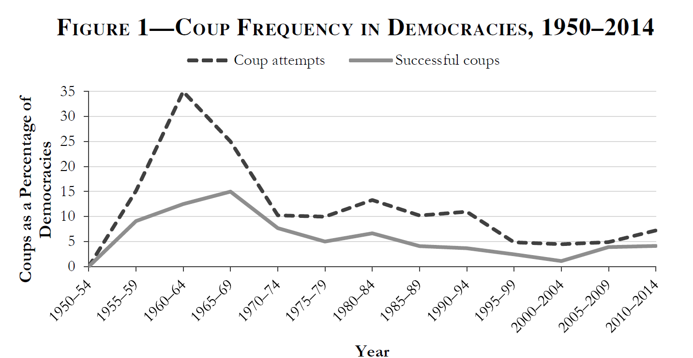
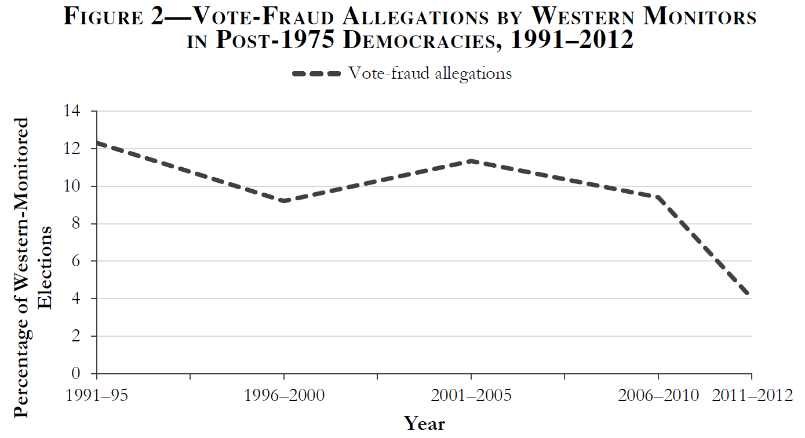

# Introduction

::: notes
~ 5 minutes
:::

## This session's goals

 

. . .

- Situate democratic backsliding in **historical perspective**

. . .

- Situate democratic backsliding in the **autocratization literature**

. . .

- Identify the **idiosyncratic characteristics** of democratic backsliding

. . .

- Set up the **analytical framework** for the rest of the course

::: notes
The session has four substantive blocks plus conclusion. The arc: historical context → conceptual debate → evidence and open questions → the course framework. .
:::

# The context of democratic backsliding

::: notes
~ 15 minutes
:::

## Democratization in waves  {.smaller}

 

. . .

Huntington (1991) identifies **three waves** of democratization

. . .

- The **first wave (1828–1926)**: gradual suffrage expansion in the West

    - USA, France, UK, Argentina, Switzerland, etc.
    
. . .

- The **second wave (1945–1962)**: Allied victory in WWII, decolonisation, Cold War

    - Italy, Japan, India, West Germany, etc.

. . .

- The **third wave (1974- 1990s)**: breakdown authoritarian regimes in Europe and the Americas, end of the COld War

    - Portugal, Spain, Brazil, Poland, etc.

::: notes
The first wave followed gradual suffrage expansion in the 19th-century West; the second followed Allied victory in WWII; the third began with the Carnation Revolution in Portugal in 1974 and accelerated through the 1980s and 1990s
:::

## The third wave of democratization

 

. . .

::: {.text-small}

- It started in **Southern Europe** (Portugal 1974, Greece 1974, Spain 1975)
:::

. . .

::: {.text-small}

- Spread through **Latin America** in the 1980s and ended with the fall of the communism in **Eastern Europe** after 1989

:::
. . .

::: {.text-small}

- By the mid-1990s, for the first time in history, **more than half** of all countries qualified as democratic
:::
. . .

But the wave did ***not always*** produce ***uniformly consolidated democracies***

## Hybrid regimes {.smaller}

 

. . .

The third wave gave rise to regimes that were **neither fully democratic nor clearly authoritarian**

. . .

- **Competitive authoritarianism** (Levitsky & Way, 2002): elections exist but playing field is heavily skewed in favour of incumbents (e.g., Russia 1990s-2000s)

. . .

- **Electoral authoritarianism** (Schedler, 2006): multiparty elections are held but are not genuinely competitive (e.g., Mexico's PRI-era)

. . .

- **Illiberal democracy** (Zakaria, 1997): elections are free and fair but civil liberties and rule of law are weak (e.g., Hungary post-2010)

. . .

- **Delegative democracy** (O'Donnell, 1994): elected presidents govern with few horizontal accountability constraints (e.g., Menem's Argentina)

::: notes
These categories emerged in direct response to the third-wave legacy. Note that they differ in what they emphasise: Levitsky & Way focus on the skewing of electoral competition; Schedler on the manipulation of elections while maintaining their facade; Zakaria on the mismatch between electoral legitimacy and liberal rights; O'Donnell on the weakness of horizontal accountability. All four are relevant to backsliding — each describes a possible destination when a democracy erodes.
:::

## How do hybrid regimes fit our definition? {.smaller}

 

::: {.columns}
::: {.column width="50%" .fragment}
**Dahl**

*Polyarchies are political systems where contestation and participation are institutionally guaranteed*
:::
::: {.column width="50%" .fragment}
**Przeworski**

*Democracies are political systems in which parties lose elections and alternation is possible*
:::
:::

. . .

{fig-align="center" width=50%}

## Hybrid regimes and democratic backsliding

 

. . .

The emergence of hybrid regimes opens a **conceptual space** between liberal democracy and classic autocracy

. . .

Not all regimes can be clearly distinguished as autocracies or democracies, **gradients exist**

. . .

> That means autocratization does ***not*** need to be a ***sudden regime change***; it can take **subtle** and **gradual forms**

# Autocratization and backsliding

::: notes
~ 40 minutes
:::

## The autocratization waves {.smaller}

 

. . .

Together with the democratization waves, Huntington identifies **two periods of democratic reversal** (or autocratization)

. . .

- The **first reversal (1922–1942)**: rise of fascism and authoritarianism, foreign invasions
    - Germany, Italy, Spain, Austria, Japan, etc.

. . .

- The **second reversal (1960–1975)**: Cold War military coups, especially in the Global South
    - Brazil, Argentina, Ghana, Pakistan, etc.

. . .

Both waves were dominated by **sudden, illegal power grabs**

## A third autocratization wave? {.smaller}

 

. . .

Today's debate focuses on whether we are witnessing a **third period of democratic reversal**

. . .

**Empirical studies** already point toward this possibility (e.g., Lührmann & Lindberg, 2019)

. . .

 

However, a **discussion** exists, motivated because contemporary autocratization looks **different** from the past:

- We no longer witness the **sudden regime changes** that characterized the former reversal periods

- Instead, it is argued that we are in a period of **gradual, subtle, and state-led** democratic debilitation

## Autocratization {.smaller}

. . .

 

Following Lührmann & Lindberg (2019), **autocratization** is the substantial decline of democratic regime attributes

. . .

It contrasts **democratization**, understood as the reverse process: any substantial move *toward* democracy

. . .

 

Three **autocratization subtypes**, depending on starting point and endpoint:

. . .

::: {.columns}
::: {.column width="33%"}
**Democratic recession**

Decline *within* a democracy, loses qualities but remains formally democratic

:::
::: {.column width="33%"}
**Democratic breakdown**

A democracy *crosses the threshold* into autocracy

:::
::: {.column width="33%"}
**Autocratic consolidation**

Decline *within* an already-autocratic regime

:::
:::

::: notes
This taxonomy is from Lührmann & Lindberg's Figure 1.Democratic recession stays in the democratic zone but moves left. Democratic breakdown crosses the threshold. Autocratic consolidation stays in the autocratic zone. Democratic backsliding (Bermeo's term) is closest to "democratic recession" — state-led erosion starting from a democratic position. Note that Lührmann & Lindberg prefer "autocratization" as the overarching term precisely because "backsliding" implies involuntary reversal and implies you end up where you started — neither of which is necessarily true.
:::

---

## Traditional forms of autocratization {.smaller}

. . .

 

Traditional forms of autocratization focus on sudden ruptures to democracy, leading to regime change, i.e. **democratic breakdown**

. . .

 

Bermeo (2016) identifies three **classic forms** of autocratization:

 

::: {.columns}
::: {.column width="33%" .fragment}
**Classic coups d'état**

Illegal military ouster of elected government; open-ended seizure of power
:::
::: {.column width="33%" .fragment}
**Executive coups** *(autogolpes)*

Elected executive *suspends the constitution* to concentrate power in one swift move

:::
::: {.column width="33%" .fragment}
**Election-day vote fraud**

Blatant manipulation of polling-day process: ballot stuffing, count falsification, station-level fraud
:::
:::

## Classic coups d'état

. . .

Illegal attempts by **military or state elites** to oust a sitting executive

. . .

- Hallmark of Cold War autocratization; generated long-lasting, brutal dictatorships

. . .

The probability of a *successful* coup reached **near-zero in the early 2000s**

. . .

- International community now sanctions coup-makers; aid conditionality; norms against illegal power transfer

---

{fig-align="center"}

## Executive coups *(autogolpes)*

. . .

An **elected executive** suspends the constitution; concentrates power in one sudden move

. . .

- **Five** executive **coups** in democracies during the **1990s** alone (e.g. *Peru 1992*)

. . .

- The elected executive retains office but **transforms the regime**: legislative suspension, emergency decrees, constitutional replacement

. . .

Only Niger (2010) between **2000 and 2013**

::: notes
Fujimori's 1992 autogolpe in Peru is the canonical case: democratically elected, then suspended Congress and the judiciary in April 1992, ruling by decree. What distinguishes this from executive aggrandizement (which we cover next) is speed and directness: the constitution is suspended outright rather than gradually hollowed out. Note that even Hitler's use of the Enabling Act in 1933 falls into this category — legal access to power followed by sudden abolition of constitutional constraints.
:::

## Election-day vote fraud

 

. . .

Blatant manipulation **on polling day**: ballot stuffing, count falsification, station-level fraud

 

. . .

Near-consensus that open, visible fraud has **declined** since the 1990s

. . .

- Rise of **international election monitoring** made obvious fraud more costly

---

{fig-align="center"}

## What is different now?

. . .

Autocratization today largely operates through **apparently legal or even pro-democratic channels**

. . .

Three **key features** that distinguish it from older forms:

. . .

1. **State-led**: incumbents, not militaries or outside forces, drive the process

2. **Incremental**: changes accumulate piece by piece; no single dramatic rupture

3. **Legitimated**: each step can be defended as lawful, democratic, or in the public interest

## Promissory coups 

. . .

Coups that **frame the ouster as a defence of democracy**, promising elections and restoration

. . .

Today: **85%** of successful coups are promissory (up from 35% before 1990)

. . .

- The promise is almost never kept in full: few promissory coups were followed quickly by competitive elections

. . .

- Post-coup elections **tend to favour** coup-makers or their allies

::: notes
Examples: Haiti 1991 (coup "correcting" the democratic process), Honduras 2009, Fiji 2006, Madagascar 2009, Mali 2012, Egypt 2013. Bermeo's detailed analysis of twelve successful promissory coups between 1990 and 2012 shows a dismal record: elections delayed, won by coup allies, or followed by renewed instability. The key analytical point: the *promissory* framing is itself a form of legitimation. Coup-makers have learned that international costs are lower if they claim to be restoring rather than destroying democracy.
:::

## Executive aggrandizement

. . .

Elected executives **weaken checks on executive power one by one** through legal channels

. . .

- Institutional changes are voted on, decreed, or passed by legislature, often framed as having democratic mandate

. . .

- Key targets inlcude the **courts, media, electoral commissions** and **civil society**

. . .

Each change, taken alone, might be defensible it is the **cumulative pattern** that reveals the intent

::: notes
Bermeo's Turkey case study is detailed and worth walking through briefly. AKP won in 2002, then used electoral mandates to: revise the penal code (criminalising certain speech, 2004), pass constitutional changes via referendum (packed the Constitutional Court, 2010), and pass legislation giving the justice minister direct control over judicial appointments (2014). Each step was legal, and some (challenging the old military establishment) even had a democratising veneer. But cumulatively they dismantled judicial independence. Note Bermeo: the irony is that these changes were "legitimated through the very institutions democracy promoters have prioritised."
:::

## Strategic electoral manipulation

. . .

Actions that **tilt the electoral playing field** without producing obvious fraud on polling day

. . .

 - Hampering media access, misusing public funds for incumbents, keeping opposition off ballots, etc.

. . .

- It differs from election-day fraud because it occurs **long before polling day** and rarely violates the letter of the law

. . .

It is partly a consequence of **better election monitoring**; politicians shifted manipulation earlier in the cycle

::: notes
Bermeo's Figure 3 shows opposition harassment and leader disqualification rising from the early 1990s to 2010. This is the flip side of declining election-day fraud: the manipulation hasn't gone away, it has moved upstream. Note the strategic logic: by the time the international monitors arrive for election day, the damage is done. The media landscape has been captured, opposition candidates have been disqualified or harassed, voter registration has been manipulated. Elections are "clean" on the day — but the context makes them meaningless.
:::

## New vs. old forms of autocratization

 

. . .

::: {.text-small}

| Old form | New form | Key difference |
|---|---|---|
| **Classic coup d'état** | **Promissory coup** | Framed as democratic restoration; promises elections |
| **Executive coup** *(autogolpe)* | **Executive aggrandizement** | Gradual and legal; no single constitutional rupture |
| **Election-day vote fraud** | **Strategic electoral manipulation** | Moves before polling day; rarely violates the letter of the law |

:::

## What is then democratic backsliding? 

 

. . .

Democratic backsliding is a **contested concept**...

. . .

**Bermeo (2016)**:  *"state-led debilitation or elimination of any of the political institutions that sustain an existing democracy"*

. . .

**Waldner & Lust (2018)**: *"deterioration of qualities associated with democratic governance,* ***within any regime"***

. . .

**Lührmann & Lindberg (2019)**: prefers to talk of ***democratic erosion*** as a *state-led form of* ***democratic recession*** that happens *subtly an incrementally*

## Democratic backsliding

 

But there are some **points of agreement**:

. . . 

- It is **state-led**: driven by incumbents, not opposition or civil society

. . .

- It operates through **legal channels**: it uses and abuses existing rules and institutions

. . .

- It is **incremental**: a process, not a single event

::: notes
Waldner & Lust go further than Bermeo: they allow backsliding to occur in non-democracies too (erosion of whatever democratic qualities a hybrid regime has). For this course, we follow Bermeo's state-led, democracy-focused definition, while keeping Waldner & Lust's emphasis on incrementalism and intraregime change.
:::

# Questions and debates

::: notes
~ 10 minutes
:::

## The extent of democratic backsliding

. . .

 

Backsliding is **difficult to measure**: gradual and incremental

. . .

 

Efforts are growing, but **the debate is ongoing**

. . .

- How many countries are really affected?

. . .

- How severe is the decline?

. . .

> *Session 12*

## The Breadth of Backsliding

. . .

 

The **consequences** of democratic backsliding also remains **unclear**:

. . .

- How likely is it to lead to democratic breakdown?

. . .

- How likely is it to result in hybrid regimes?

. . .

- Is reversal possible? Can be contained or resisted?

. . .

> *Session 13*

## The Politics of Backsliding

 

. . .

To answer the previous questions, it is first necessary to understand **how** and **why** democratic backsliding occurs in the first place

. . .

- What are the **mechanisms** through which leaders erode democracy?

. . .

- What **conditions** enable backsliding?

. . .

> *Sessions 4 to 11*

# Our analytical framework

::: notes
~ 10 minutes
:::

---

 

::: {style="display: flex; justify-content: center; align-items: flex-start; gap: 4em; font-family: sans-serif; font-size: 0.7em;"}

::: {style="text-align: center; display: flex; flex-direction: column; gap: 0.5em;"}
::: {style="background: #2980b9; color: white; padding: 0.4em 0.8em; border-radius: 4px; font-weight: bold; font-size: 0.95em;"}
Supply side (Elites)
:::

::: {.fragment fragment-index=1}
::: {style="background: #d6eaf8; padding: 0.4em 0.5em; border-radius: 4px; font-size: 0.85em; text-align: center;"}
**Mechanisms**
:::
::: {style="display: grid; grid-template-columns: 1fr 1fr; gap: 0.4em;"}
::: {style="background: #d6eaf8; padding: 0.4em 0.5em; border-radius: 4px; font-size: 0.85em; text-align: center;"}
Horizontal accountability *(S04)*
:::
::: {style="background: #d6eaf8; padding: 0.4em 0.5em; border-radius: 4px; font-size: 0.85em; text-align: center;"}
Vertical accountability *(S05)*
:::
:::
:::

::: {.fragment fragment-index=2}
::: {style="background: #d6eaf8; padding: 0.4em 0.5em; border-radius: 4px; font-size: 0.85em; text-align: center;"}
**Conditions**
:::
::: {style="display: grid; grid-template-columns: 1fr 1fr; gap: 0.4em;"}
::: {style="background: #d6eaf8; padding: 0.4em 0.5em; border-radius: 4px; font-size: 0.85em; text-align: center;"}
Democratic norms *(S06)*
:::
::: {style="background: #d6eaf8; padding: 0.4em 0.5em; border-radius: 4px; font-size: 0.85em; text-align: center;"}
Populism & parties *(S07)*
:::
:::
:::

:::

::: {style="display: flex; align-items: center; justify-content: center; padding-top: 1.5em;"}
::: {.fragment fragment-index=5 style="font-size: 3em; color: #2c3e50; margin-top: 2em;"}
⇄
:::
:::

::: {style="text-align: center; display: flex; flex-direction: column; gap: 0.5em;"}
::: {style="background: #c0392b; color: white; padding: 0.4em 0.8em; border-radius: 4px; font-weight: bold; font-size: 0.95em;"}
Demand side (Citizens)
:::

::: {.fragment fragment-index=3}
::: {style="background: #fadbd8; padding: 0.4em 0.5em; border-radius: 4px; font-size: 0.85em; text-align: center;"}
**Mechanisms**
:::
::: {style="display: grid; grid-template-columns: 1fr 1fr; gap: 0.4em;"}
::: {style="background: #fadbd8; padding: 0.4em 0.5em; border-radius: 4px; font-size: 0.85em; text-align: center;"}
Support for democracy *(S08)*
:::
::: {style="background: #fadbd8; padding: 0.4em 0.5em; border-radius: 4px; font-size: 0.85em; text-align: center;"}
Democratic hypocrisy *(S09)*
:::
:::
:::

::: {.fragment fragment-index=4}
::: {style="background: #fadbd8; padding: 0.4em 0.5em; border-radius: 4px; font-size: 0.85em; text-align: center;"}
**Conditions**
:::
::: {style="display: grid; grid-template-columns: 1fr 1fr; gap: 0.4em;"}
::: {style="background: #fadbd8; padding: 0.4em 0.5em; border-radius: 4px; font-size: 0.85em; text-align: center;"}
Structural factors *(S10)*
:::
::: {style="background: #fadbd8; padding: 0.4em 0.5em; border-radius: 4px; font-size: 0.85em; text-align: center;"}
Media environment *(S11)*
:::
:::
:::

:::

:::

::: notes
This section introduces the analytical framework structuring the rest of the course. Supply side: elites initiate backsliding through two mechanisms — weakening horizontal accountability (checks and balances, courts, Session 04) and vertical accountability (elections, civil rights, Session 05) — enabled by two background conditions: erosion of democratic norms (Session 06) and populism/hollowing of party democracy à la Mair (Session 07). Demand side: citizens tolerate or support backsliding — we examine support for democracy and political trust (Session 08), democratic hypocrisy and understanding of democracy (Session 09), structural background conditions (Session 10), and the media environment as connective tissue between supply and demand (Session 11). The interaction between the two sides is the core analytical puzzle: backsliding rarely succeeds without at least passive citizen acceptance.
:::

## The case studies

 

. . .

The goal is to apply this theoretical framework to a specific country's backsliding episode

. . .

- Connect **theoretical mechanisms** to **empirical cases**

. . .

- Observe **variation**: not all backsliding looks the same

. . .

- Identify **gaps**: where does the theory not fit?

::: notes
Remind students of the case study assignment from Session 01. The presentation schedule was distributed earlier. The case studies are designed to test the theoretical arguments against empirical reality — and to surface anomalies and scope conditions that the lectures may not capture. Students should be reading their country's literature alongside the mandatory course readings.
:::

# Conclusion

::: notes
~ 10 minutes
:::

## Democratic backsliding: a new phenomenon?

 

. . .

Autocratization exists since demcoracies appeared

. . .

**What is new** about democratic backsliding:

. . .

- It is **state-led**
- It has a **legal façade**
- It is **subtle and incremental**

## The international context

 

. . .

Democracy has become the **global most legitimate form of government** since 1989

. . .

International monitoring and aid conditionality **reduced blatant fraud and coups** but created incentives to shift to subtler forms

. . .

Backsliding is, paradoxically, evidence of democracy promotion's **partial success**

::: notes
This Bermeo point is counterintuitive and worth dwelling on. Because the international community sanctioned clear violations (coups, obvious fraud), politicians adapted. The shift from election-day fraud to strategic pre-election manipulation, and from executive coups to executive aggrandizement, reflects rational adaptation to external constraints. Backsliders play by the rules *just enough* to avoid triggering the most severe international responses.
:::

## How long does a wave last?

. . .

 

According to Lührmann & Lindberg (2019):

- **First wave of autocratisation**: approximately 16 years (1926–1942)
- **Second wave**: approximately 16 years (1961–1977)
- **Third wave**: began in **1994**; already over **30 years** ago :thinking:

. . .

> **Is this a wave or a new equilibrium? What would "recovery" look like?**

---

## Class activity

 

::: {.columns}
::: {.column width="60%"}

**Pair up and discuss:**

> Based on what we have reviewed today, where do you see democratic backsliding going *globally*?

:::
::: {.text-small .column width="40%" .fragment}

- What gives you **reason to expect more** backsliding or breakdown?
- What gives you **reason to expect recovery**?
- Come up with a shared **position and argument**

:::
:::

::: notes
Give students 5 minutes in pairs, then 3 minutes for two or three pairs to share briefly. Do not adjudicate. Note explicitly: "We will return to this exact question in Session 14. I want to see whether your views have changed, and why." This creates a narrative thread through the whole course.
:::

---

{fig-align="center"}

## Next block (13.03.2026)

. . .

**Block II: The Supply-Side of Democratic Backsliding**

 

- **Session 04**: Weakening Horizontal Accountability

- **Session 05**: Weakening Vertical Accountability

- **Sessions 06**: Weakening Democratic Norms

- **Sessions 07**: Populism and the Weakening of 'Party Democracy'

## Thanks! :slightly_smiling_face:

 

 

 

[alvaro.canalejo@unilu.ch](mailto:alvaro.canalejo@unilu.ch)

