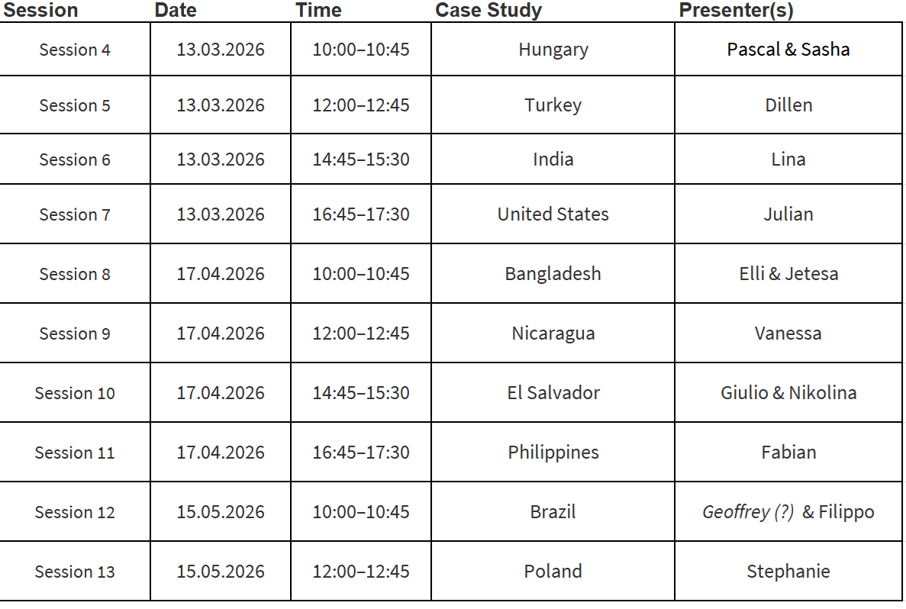
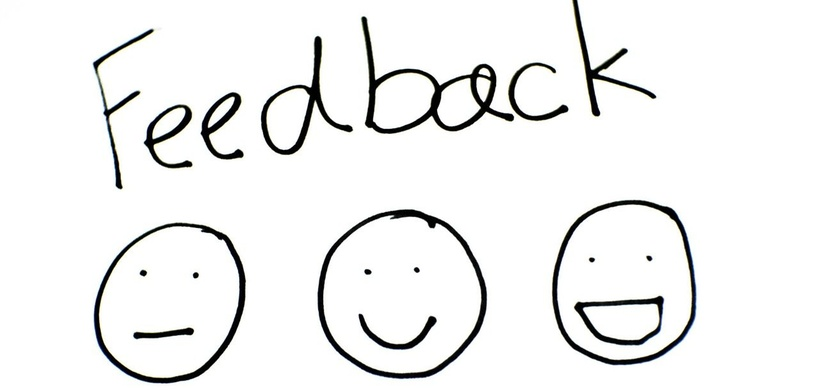
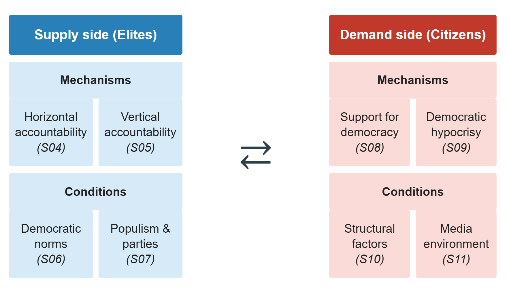
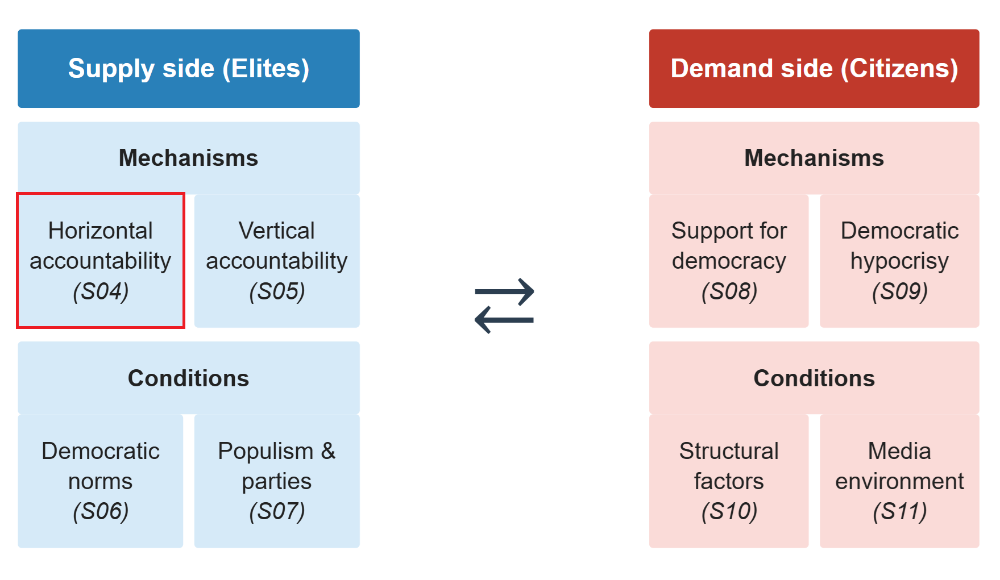
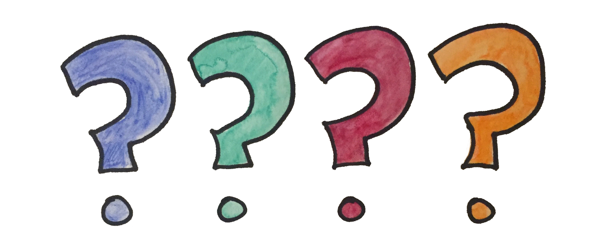

# Organization and feedback

::: notes
~ 5 minutes
:::

## Presentations' calendar review

. . .

{fig-align="center" width="70%"}

## Feedback round

 

 

. . .

::: {.columns}
::: {.column width="40%"}

- Readings

- Response papers

- Presentations

- Slides

:::
::: {.text-small .column width="60%"}

{fig-align="center" width="90%"}
:::
:::

# Introduction to the session

::: notes
~ 5 minutes
:::

## Democracy & backsliding

. . .

 

 

**Democracy**: a political system in which citizens elect the government through *free and fair elections*, and where there are protections for *civil liberties and political rights*

. . .

 

**Democratic backsliding**: *state-led subtle and incremental* erosion of *democratic qualities and institutions*

## Our analytical framework

  

  

## This session's goals

 

. . .

- Define *accountability*: **vertical** and **horizontal**

. . .

- Explore how would-be autocrats **weakens horizontal accountability**

. . .

- Discuss the **implications** of weakening horizontal accountability for **democratic backsliding**

. . .

- Students' presentation: the case of **Hungary**

# Democracy and accountability

::: notes
~ 10 minutes
:::

## The political outcomes of democracy {.smaller}

 

. . .

So far: democracy as **competition among elites** *(Przeworski)* and as **participation rights** for citizens *(Dahl)*

. . .

But democracies also *produce* **political outcomes**: decisions that organise collective life

. . .

 

Normatively, democracy channels outcomes toward **citizens' preferences** via two mechanisms:

. . .

- **Representation**

. . .

- **Accountability**

## What is accountability?  {.smaller}

.  . .

 

Accountability is traditionally understood as **the capacity of citizens to punish or reward politicians for their performance**

. . .

- Vast empirical implications (e.g. economic voting)

. . .

 

**Mechanisms**:

. . .

- Elections

. . .

- Petitions, protest, etc.

. . .

- Media

## Vertical vs. horizontal accountability {.smaller}

 

. . .

This definition of accountability coincides with what Guillermo O'Donnell (1994) calls **vertical accountability**

. . .

 

In institutionalised democracies, accountability also runs **horizontally**

. . .

> "[...] existence of state agencies that are legally empowered---and factually willing and able---to take actions ranging from routine oversight to criminal sanctions or impeachment in relation to possibly unlawful actions or omissions by other agents or agencies of the state" (O'Donnell, 1998)
 
. . .

 

Thus, horizontal accountability means that **elites hold other elites** (i.e., the *government*) **responsible for their actions**

## Accountability as a principal-agent problem {.smaller}

 

. . .

::: {.columns}
::: {.column width="50%"}

**Principal**

Citizens / other state institutions

*Delegate authority, set goals*

:::
::: {.column width="50%"}

**Agent**

Government / executive

*Acts on behalf of the principal*

:::
:::

. . .

 

**The problem**: agents hold informational advantages and may pursue their own interests

. . .

Accountability mechanisms are designed to **reduce this gap**

::: notes
The PA frame unifies vertical and horizontal accountability: both solve the same delegation problem, but through different principals.
:::

## Accountability and democracy {.smaller}

 

. . .

Remember Przeworski's notion of **democracy**:

> Democracy is a **self-enforcing equilibrium**: actors expect **future opportunities** to compete and win; defeats are understood as **temporary**; the rules appear **fair and effective**; abandoning democracy would worsen their situation

> Ultimately, the stakes of elections should not be so high that losers prefer to fight rather than accept defeat

 

. . .

How does **accountability** relate to this conception of **democracy**?

::: notes
Pose as an open question to students.
:::

# Weakening horizontal accountability

::: notes
~ 20 minutes
:::

## Stealth authoritarianism (Varol, 2015) {.smaller}

 

. . .

Legal and rational-choice perspective on how **authoritarian practices** operate *through* **legal mechanisms designed for democracy**

. . .

 

Delineate some of the main **mechanisms** through which would-be autocrats **weaken horizontal accountability**

- Judicial Review

- Libel lawsuits & non-political crimes

- Surveillance law and institutions

. . .

Highlights a **key paradox of backsliding:** democracy-promotion mechanisms  may **provide cover** to backsliding practices

::: notes
Varol targets hybrid regimes but the mechanisms apply directly to backsliding democracies.
:::

## Judicial review {.smaller}

 

. . .

Courts designed to check the executive are repurposed to **augment it**

. . .

 

Three strategies:

. . .

- **Consolidating power**: structure appointment processes to install loyalists (Turkey's Constitutional Court structured after 1960 coup to favour the military; Hungary: Orban expanded court from 8 to 15, all new seats filled by Fidesz allies)

. . .

- **Bolstering credentials**: use courts to give constitutional imprimatur to anti-democratic acts

. . .

- **Avoiding accountability**: judicial review shields incumbents from challenge while appearing neutral

## Libel lawsuits & non-political crimes {.smaller}

 

. . .

**Libel suits** target media and civil society, and raise the cost of dissent without overt censorship

. . .

- Even unsuccessful suits create a **chilling effect** on critical commentary and lead to self-censhorhip

Ecuador: Correa won a 40M$ libel suit against a newspaper; Turkey: Dogan media group fined 2.5B for "tax evasion," forced to sell to pro-government buyers

. . .

**Non-political crimes** (tax evasion, fraud, money laundering) applied selectively to political opponents

. . .

- Prosecution is often legally accurate making the **political motive** hard to detect

Russia: Khodorkovsky prosecuted for tax evasion after funding opposition parties and announcing he would enter politics

::: notes
Libel refers to a written statement that defames someone by injuring their reputation. Deployed by incumbents against journalists, editors, and civil society organizations, libel suits raise the cost of critical commentary even without a conviction -- the litigation itself drains resources and intimidates. The effect is self-censorship: watchdogs stop watching. The mechanism works on the supply of information that citizens need to hold rulers accountable.

Non-political crimes target political competitors directly -- opposition politicians, business leaders who fund the opposition, civil society figures. The charge is something like tax evasion, fraud, or money laundering: crimes that exist in all legal systems and carry no explicit political content. Crucially, the prosecution is often legally accurate -- there is real evidence. This is what distinguishes it from fabricated charges and makes it so hard to contest: the regime is not lying, it is selectively enforcing the law. The political motive is hidden behind a legitimate legal act, and international courts may even validate the conviction (as in Khodorkovsky's case before the ECHR).
:::

## Surveillance law and institutions {.smaller}

. . .

 

Focus on the US: post-9/11 security frameworks gave incumbents expanded **legal surveillance authority**

. . .

 

Used for two anti-democratic purposes:

. . .

- **Chilling civil liberties**: under pervasive surveillance, individuals conform to mainstream expectations and self-censor

. . .

- **Blackmail and discrediting**: intelligence on politicians, judges, journalists used to coerce compliance

. . .

Peru: Montesinos videotaped hundreds of officials, then used recordings as leverage; kept supreme court justices on monthly cash payments while the justice system appeared to function normally

## The Implications of Stealth Authoritarianism {.smaller}

 

. . .

Incumbents deploy **democratic rhetoric** and invoke **rule-of-law language** to deflect criticism of anti-democratic practices

. . .

- Allow limited space for discontent: **enough to signal pluralism, insufficient to threaten power**

. . .

- The appearance of openness bolsters **democratic legitimacy** and makes single actions difficult to identify as authoritarian

## How democracies die (Levitsky & Ziblatt, 2018, ch. 4) {.smaller}

 

. . .

Greatly influential book by political scientists from Harvard University 

. . .

- Empirically-driven but oriented for the general public

. . .

- Focusing primarily on the US case, but with a broad comparative sweep

. . .

 

In Chapter 4, it delineates **mechanisms** of backsliding with *a soccer game* metaphor

. . .

- To consolidate power, would-be autocrats must capture the **referees**, sideline the **star players**, and rewrite the **rules** to lock in their advantage

## Capturing the referees {.smaller}

 

. . .

**Who** are they?

. . .

- Courts, prosecutors, intelligence agencies, and tax authorities designed as neutral arbiters

. . .

Captured referees become a **shield** against constitutional challenges and a **weapon** to legally assault opponents

. . .

**Methods:**

- Quiet **purges** of civil servants replaced by loyalists (Hungary: Orban packed the Prosecution Service, State Audit Office, Ombudsman's office, Constitutional Court)
- **Court packing** (Poland's PiS blocked sitting justices and imposed its own)
- **Impeachment** of resistant judges (Peron in 1946, Fujimori in 1997)

::: notes
Quiet purges are the most common method -- simply firing nonpartisan civil servants and agency heads and replacing them with party loyalists. Orban did this systematically after 2010, packing not just the Constitutional Court but the entire architecture of oversight: the Prosecution Service (which controls criminal charges), the State Audit Office (public finances), and the Ombudsman (citizens' rights complaints). Each appointment is individually unremarkable; the cumulative effect is that every institution capable of checking the executive is staffed by allies.

Court packing is used when judges cannot be easily removed. Hungary again: the Constitutional Court was expanded from 8 to 15 seats, with the new seats filled by Fidesz loyalists under new nomination rules that gave the ruling party unilateral appointment power. Poland's PiS used a different variant -- there were vacancies and three outgoing-parliament-approved justices waiting to be sworn in; PiS refused to swear them in and imposed five of its own instead, then passed a law requiring a two-thirds majority for binding rulings, effectively giving government allies a veto inside the tribunal.

Impeachment is the most aggressive method, used when the other two are unavailable. Perón in 1946 faced a conservative supreme court that had called him a fascist; his allies in congress impeached three of the five justices on malfeasance grounds, a fourth resigned, and Perón appointed four loyalists. Fujimori's allies impeached three Constitutional Tribunal members in 1997 specifically because they had ruled his bid for a third term unconstitutional -- framing the impeachment, paradoxically, as a constitutional act.
:::

## Capturing opponents  {.smaller}

 

. . .

Start by **buying off** key political, media, and business figures through positions, contracts, bribes

. . .

Peru: by late 1990s, every major TV network and several newspapers were on Fujimori's payroll; Montesinos personally managed the evening news

. . .

 

Players who cannot be bought can be **legally sidelined** using captured referees

. . .

- Criminal charges against opposition leaders
- Tax investigations and regulatory pressure on critical media

 

. . .

The result is captured opposition and media landscape **without formal censorship or repression** 

## Institutional consequences {.smaller}
*Adapted from Haggard & Kaufman 2021*

 

 

. . .

Attacking and capturing opponents have consequences **beyond** individual rivals

. . .

- **Parliamentary oversight collapses**: legislators stop scrutinising the executive

. . .

- **Intra-party competition weakens**: internal dissent is suppressed; the party becomes a vehicle for the leader

. . .

- **Party system erosion**: opposition parties lose resources, media access, and credibility; coordination failures multiply

::: notes
Haggard & Kaufman: 15 of 16 backsliding cases saw legislative oversight decline. The party system effects are compounded by disproportional electoral systems -- opposition parties may fail to clear thresholds entirely, as in Turkey 2002. Intra-party capture means that even if the ruling party later turns against the leader, the internal mechanisms for doing so have been dismantled.
:::

## Rewriting the rules {.smaller}

 

. . .

Once referees are captured and opponents sidelined, autocrats **lock in their advantage** by changing the rules of the game itself

. . .

- **Constitutional revision** (in 12 of 16 backsliding cases analyzed by Haggard & Kaufman, 2021)

. . .

- **Term limit removal** (Bolivia, Dominican Republic, Ecuador, Nicaragua, Russia, Turkey, Venezuela)

. . .

- **Electoral system manipulation** to convert pluralities into supermajorities (Turkey 2002: AKP 34% votes → 66% seats; Hungary 2010: Fidesz 53% → 68%)

. . .

- **Referenda** to bypass normal legislative channels and make direct majoritarian appeals

::: notes
Haggard & Kaufman: legislatures enable this by defaulting on oversight, confirming loyalist appointments, and ratifying constitutional revisions. In seven cases all presidential systems, term limits were lifted outright. Referenda are particularly useful: they expose governments to the risk of defeat but allow charismatic executives to go directly to the people, bypassing institutional constraints -- and governments can use public resources to tilt the odds.
:::

## Your responses {.smaller}

. . .

 

"In my view the authors do **focus too much on leaders/autocrats**, institutions and do neglect the other economic and structural causes such as inequality, party-system collapses, media transformations or the public support for authoritarianism" *(Jean-Philippe Heusser)*

. . .

 

"Even though Levitsky, and Ziblatt elaborate on how democracies are subverted, they do not situate the development in a **historical context** regarding interlinked aspects such as predecessor political or economic powers" *(Stephanie Lindegger)*

. . .

 

"Levitsky and Ziblatt highlight that slow erosions of democracy by elected leaders is a post-Cold War pattern [...], however, they **support their claims with case studies as far back as American Reconstruction** in the 1860s" *(Elli Brown)*

## Weakening horizontal accountability {.smaller}

 

. . .

**Courts and oversight agencies captured** (judicial review, purges, packing, impeachment)

. . .

↓

**Opponents prosecuted and sidelined** (libel suits, non-political crimes, surveillance, buyouts)

. . .

↓

**Parliament, media, and parties lose autonomy** (oversight collapses, intra-party dissent suppressed, opposition fragmented)

. . .

↓

**No effective check on the executive**

O'Donnell's (1994) *delegative democracy*: "the president governs as he sees fit"

# Conclusion

::: notes
~ 5 minutes
:::

## Democracy & horizontal accountability 

 

 

. . .

How does **horizontal accountability** relate to democracy?

. . .

 

And what does it mean the **weakening of horizontal accountability** for **democratic backsliding**?

## Summary  {.smaller}

 

. . .

- **(Vertical) accountability**: the capacity to punish or reward political agents for their performance

. . .

- **Horizontal accountability**: state institutions checking each other; courts, legislatures, oversight agencies

. . .

- Horizontal accountability erodes through *apparently* **legal, legitimized and incremental steps**: capturing courts, prosecuting opponents, dismantling legislative oversight, changing the rules of the game

. . .

- The result: **executive power concentrates**, and the playing field tilts

---

{fig-align="center"}

## Next session (11:00)

 

. . .

**Session 05: Weakening Vertical Accountability**

Case study: Turkey

 

. . .

**Before...**

 

Presentation by **Pascal & Sasha**:

*Hungary*

## Thanks! :slightly_smiling_face:

 

 

 

[alvaro.canalejo@unilu.ch](alvaro.canalejo@unilu.ch)

