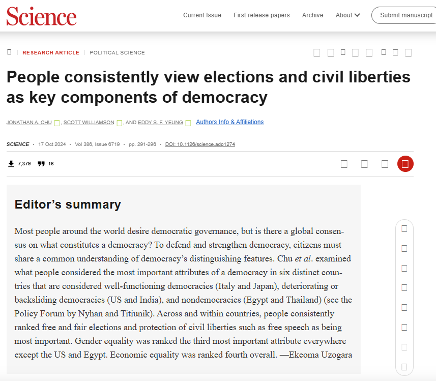

# Introduction

::: notes
~ 5 minutes
:::

## Elections and democracy

. . . 

{fig-align="center" width="55%"}

::: notes
The point is that elections are not just one institution among many -- they are the institution through which most citizens understand democracy to work.
:::

## Backsliding and accountability {.smaller}

 

. . .

- **Horizontal accountability**: state institutions checking each other; courts, legislatures, oversight agencies

. . .

- Horizontal accountability erodes through *apparently* **legal, legitimized and incremental steps**: capturing courts, prosecuting opponents, dismantling legislative oversight, changing the rules of the game

. . .

- The result is that the **executive power concentrates** and the playing field tilts

. . .

 

But this picture leaves out the role of **citizens**... so what about **vertical accountability**?

## This session's goals

 

. . .

- Understand **vertical accountability** and its mechanisms

. . .

- Explore how would-be autocrats **weaken** vertical accountability

. . .

- Discuss the **implications** for democratic backsliding

. . .

- Students' presentation: the case of **Turkey**

# Vertical accountability

::: notes
~ 10 minutes
:::

## Defining vertical accountability {.smaller}

 

. . .

**Vertical accountability**: the capacity of citizens to punish or reward politicians for their performance

. . .

 

The dominant mechanism is **voting**, but not the only one:

. . .

- Elections (retrospective and prospective)

. . .

- Protest and collective action

. . .

- Civil society organizations

. . .

- Media scrutiny

::: notes
O'Donnell coined the vertical/horizontal distinction. Vertical runs bottom-up: citizens → government. It is the principal-agent relationship in its most direct form. Voting is the paradigmatic mechanism, but between elections citizens also hold governments to account through protest, through the media's role in transmitting information, and through organized civil society acting as a watchdog. The session covers all of these, because backsliding attacks all of them -- not just elections.
:::

## Economic voting theory {.smaller}

 

. . .

If elections work as an accountability mechanism, **voters should sanction** governments for poor performance

. . .

 

**Retrospective voting**: citizens evaluate incumbents on past record; above all, **economic conditions**

. . .

> *"It's the economy, stupid"*

. . .

 

**Indirect effects**: the threat of electoral punishment gives governments incentives to **perform competently**, **select capable candidates** and **choose policies that satisfies the median voter**

::: notes
Vertical accountability has disciplining function beyond the electoral moment itself. But this only works if the electoral mechanism is not manipulated, and the opposition plays in equal terms.
:::

## Mechanisms of vertical accountability {.smaller}

 

. . .

*Voting*

**Select and sanction** politicians at regular intervals

. . .

*Protest and collective action*

**Express dissent and pressure** governments *between* elections

. . .

*Civil society organizations*

**Monitor, advocate, and organize** on behalf of citizens

. . .

*Media scrutiny*

**Inform** citizens and **expose** government performance and wrongdoing

## The conditions vertical accountability {.smaller}

 

. . .

Vertical accountability depends on a broader **institutional ecosystem**

. . .

 

::: {.columns}
::: {.column width="50%"}

**Political rights**

- Freedom of speech
- Freedom of assembly
- Freedom of organization

:::
::: {.column width="50%"}

**Media**

- Freedom of the press
- Diversity of ownership
- Access to information

:::
:::

. . .

 

Only under these conditions, citizens can **meaningfully** hold governments accountable

::: notes
The point here is that vertical accountability is not reducible to elections alone. Citizens need political rights to express preferences between elections, organize collectively, and put pressure on governments. They need a free and diverse media to receive accurate information and to have their concerns amplified in the public sphere. Each of these can be degraded without touching the formal electoral rules -- and often is. The session covers this layered attack.
:::

## Vertical accountability and democracy {.smaller}

 

. . .

Remember Dahl's notion of **democracy**:

. . .

::: {.columns}

::: {.column width="50%" }

**Contestation**

*Can opposition meaningfully compete?*

:::

::: {.column width="50%"}

**Participation**

*Who gets to take part?*

:::
:::

 

 

. . .

How does **(vertical) accountability** relate to this conception of **democracy**?

::: notes
Pose as an open question to students.
:::

# Weakening vertical accountability

::: notes
~ 25 minutes
:::

## How to weaken vertical accountability? {.smaller}

 

. . .

A *non-exhaustive* list

. . .

- **Voter registration laws**: restrict who can access the ballot

. . .

- **Election integrity**: undermine the impartiality of electoral administration

. . .

- **Media capture**: control the information environment citizens rely on

. . .

- **Civil society repression**: restrict the capacity to organize, protest, and advocate

## Voter registration laws {.smaller}

 

. . .

A fundamental prerequisite for vertical accountability: **who can vote**

. . .

 

Registration laws determine access to the ballot:

. . .

- Photo identification requirements
- Proof of citizenship
- Registration requirements for non-residents
- Reduction of early voting and same-day registration
- Restrictions on voting by felons

. . .

 

Any **other example**?

::: notes
Controlling who is formally eligible to vote is the most upstream point at which vertical accountability can be weakened. Unlike outright fraud, registration restrictions operate through legal channels, are slow-moving, and can be defended on grounds of electoral integrity (fighting fraud).
:::

## Jim Crow 2.0? {.smaller}
*Bentele & O'Brien, 2013*

 

. . .

**Research question**: what drives the proposal and passage of restrictive voter access laws in US states (2006--2011)?

. . .

**Data**: all restrictive voter access provisions introduced in state legislatures across 50 states

**Method**: specialized regression models for count and passage outcomes

. . .

 

**Three competing explanations**:

. . .

- Voter fraud concerns

- Partisan advantage

- Targeted demobilization of minority voters

::: notes
The paper is explicitly framed as a contribution to an empirically underdeveloped debate that had until then been largely anecdotal and partisan. The dependent variables are (1) the number of restrictive provisions proposed in a state-year and (2) whether such legislation passed. The key innovation is separating proposal from passage, and testing all three explanations simultaneously with appropriate controls.
:::

## Findings: partisan, strategic, racialized {.smaller}
*Bentele & O'Brien, 2013*

 

. . .

**Fraud concerns**: do not predict proposal or passage

. . .

**Partisan control**: Republican-controlled legislatures are far more likely to *pass* restrictive legislation

. . .

**Minority turnout**: states with higher minority turnout -- especially African American -- see *more* restrictive proposals and passage

. . .

**Turnout gains**: states that saw increases in minority turnout between 2004 and 2008 also see more restrictive legislation

. . .

 

Findings are consistent with **targeted demobilization** as the central driver

## Your responses {.smaller}

. . .

 

"The evidence makes the partisan and racial associations difficult to dismiss, but it **does not fully prove the motives behind them**." *(Nikolina Djogova)*

. . .

 

"the paper sometimes treats too many **different policies as if they all follow one unified logic** [...] Some may be more symbolic, some more targeted, and some easier to defend publicly under the language of administrative integrity." *(Nikolina Djogova)* 

. . .

 

"the paper could go further in addressing the possibility that **some lawmakers may have sincerely understood these reforms as election-integrity measures**, even if those beliefs were politically selective, exaggerated, or ultimately harmful." *(Nikolina Djogova)*

## Implications beyond the US? {.smaller}

 

. . .

The US case illustrates a **general logic**: electoral rules are politically contested terrain

. . .

 

Across backsliding cases, incumbents manipulate **who** can vote and **how**:

. . .

- (Dis)enfranchisement of diaspora voters (Turkey: overseas votes excluded until 2014)

. . .

- Gerrymandering to dilute opposition strongholds

. . .

- Electoral system changes converting pluralities into supermajorities (Turkey 2002, Hungary 2010)

. . .

 

The key insight: **formal democratic procedures can be used to undermine accountability**

## Electoral integrity {.smaller}

 

. . .

Even if access to the vote is preserved, elections may not be **free and fair**

. . .

 

Recall Bermeo (2016): modern backsliding is *less* about blatant fraud, *more* about subtle manipulation

. . .

 

But **electoral integrity** -- the absence of irregularities in the conduct of elections -- remains a core dimension

. . .

- Vote buying, government intimidation, electoral violence
- Manipulation of electoral management bodies (EMBs)
- Selective enforcement of campaign finance rules

::: notes
The Birch & Van Ham paper picks up here. Electoral integrity is about the quality of elections beyond participation: are they administered impartially, are results trustworthy, are irregularities present? The key question is: what determines whether elections achieve integrity? Their answer shifts the focus from formal rules to the ecosystem of oversight institutions.
:::

## Getting away with foul play? {.smaller}
*Birch & Van Ham, 2017*

 

. . .

**Research question**: when are elections most likely to be free and fair?

. . .

**Data**: 1,047 national elections in 156 electoral regimes, 1990--2012

. . .

**Dependent variable**: V-Dem electoral integrity index

. . .

 

**Core argument**: independent EMB independence is *important* but *insufficient*

. . .

Deficiencies in electoral management can be *compensated* by alternative institutional checks:

. . .

- Independent judiciary
- Independent media
- Active civil society

::: notes
The paper is explicitly comparative and large-N. The dependent variable is a composite of expert-coded irregularities validated against V-Dem data (r = 0.86). The key theoretical contribution is the substitution argument: there is no single institutional fix for electoral manipulation. An independent EMB helps, but what really matters is the overall oversight ecosystem. This has direct implications for backsliding: a government that captures just one of these checks may still face constraints from the others -- which is why systematic backsliding typically attacks all of them.
:::

## Four checks on electoral conduct {.smaller}
*Birch & Van Ham, 2017*

 

. . .

Flawed elections are most likely when **all four checks fail simultaneously**:

. . .

::: {.columns}
::: {.column width="50%"}

**Formal**

Electoral Management Body (EMB)

*De jure* and *de facto* independence

:::
::: {.column width="50%"}

**Informal**

Independent judiciary

Independent media

Active civil society

:::
:::

. . .

 

Substitution effect: **strong informal checks can compensate** for weak formal ones -- and vice versa

::: notes
The substitution finding is the most important policy implication: strengthening one institution can partially offset weaknesses in another. But the converse is also true, and more relevant for backsliding: if a government systematically degrades all four simultaneously, there is no residual check. This is precisely the pattern in systematic backsliding -- courts, media, and civil society are all targeted in sequence, leaving elections formally intact but substantively hollow.
:::

## Media as a connector {.smaller}

 

. . .

Media is central to **both** sides of accountability:

. . .

- **Horizontal**: media reports on government performance, exposes wrongdoing, frames public debate

. . .

- **Vertical**: citizens rely on media to form preferences, assess politicians, coordinate action

. . .

 

Capturing or skewing media does not require censorship

. . .

**Ownership concentration** and **sidelining** suffices

## How the ultrarich use media ownership {.smaller}
*Grossman, Margalit & Mitts, 2022*

 

. . .

**Research question**: can the ultrarich shape electoral results by controlling media outlets?

. . .

 

**Argument**: slanted media can **persuade voters outside its ideological base** when easily accessible and in a concentrated media market

. . .

**Case**: Sheldon Adelson's *Israel Hayom* -- launched 2007, distributed **free of charge**, rapidly became the most widely read national newspaper

. . .

**Method**: local media exposure data matched to electoral returns since launch

::: notes
Standard media economics assumes owners maximise profit, which disciplines slant toward the median consumer. Ultra-wealthy owners break this constraint: they can absorb losses indefinitely and prioritise political influence over revenue. Distributing the paper for free is the clearest illustration -- no profit logic can explain it.
:::

## Findings: market capture and persuasion {.smaller}
*Grossman, Margalit & Mitts, 2022*

 

. . .

**Key findings**:

- *Israel Hayom* carried significantly stronger right-wing slant and more positive coverage of Netanyahu/Likud -- especially on **front pages**

. . .

- Exposure had a **significant causal effect on vote share** for the Likud and the right bloc

. . .

 

**Implication**: media capture does not require censorship; **ownership concentration** by politically motivated actors suffices

::: notes
The front page finding matters: slant is concentrated where casual readers are most exposed, not in the op-eds read by politically attentive audiences. The causal identification exploits geographic variation in readership since launch -- areas with higher exposure shifted measurably toward the right. The implication for backsliding is direct: formal press freedom can coexist with substantive media capture, making it hard to detect and contest.
:::

## Media capture and backsliding {.smaller}

 

 

. . .

The *Israel Hayom* case illustrates a **general mechanism** visible across backsliding cases:

. . .

- Turkey: Erdoğan allies acquired major media outlets; Doğan Media Group sold under regulatory pressure
- Hungary: pro-Orbán businessmen consolidated ~500 outlets into a single foundation (KESMA, 2018)
- Peru: Montesinos paid TV networks directly to control news content

. . .

 

The result: **formal press freedom preserved, substantive media diversity eliminated**

::: notes
The pattern is consistent: media capture does not require nationalisation or formal censorship. Regulatory pressure (tax investigations, advertising boycotts by state-owned enterprises), acquisition by politically connected businessmen, or direct payments all achieve the same result -- a nominally free press that functions as a political tool. The Grossman et al. finding quantifies the electoral consequences, which had previously been assumed but rarely demonstrated causally.
:::

## Other participation mechanisms {.smaller}

 

. . .

Vertical accountability operates **between elections** through:

. . .

- **Protest and collective action**: citizens mobilize to express dissent and pressure governments

. . .

- **Freedom of association**: civil society organizations monitor, advocate, and organize

. . .

- **Direct democracy**: referenda, citizens' initiatives (can be manipulated for plebiscitarian purposes; rare in most democracies)

. . .

 

These mechanisms depend on **civic space**:  the freedom to assemble, associate, and speak

::: notes
Civic space is the environment in which these participation mechanisms operate. It is not a single institution but a complex of rights, norms, and informal practices. The UN report documents how this space is being systematically restricted globally -- not through single dramatic acts but through an accumulation of legal, administrative, and coercive measures that make organised civil society increasingly costly and risky.
:::

## Global attack on civic space {.smaller}

*UN Human Rights Council, 2024*

. . .

Report of the Special Rapporteur on freedom of peaceful assembly and association (Voule, 2024)

. . .

 

Documents a **systematic and global** assault on civic space, particularly since 2010:

. . .

- **Restrictive laws**: broad and ambiguous definitions used to silence civil society organizations; justified through national security frameworks

. . .

- **"Foreign agent" laws**: associations receiving foreign funding required to register as foreign agents, face burdensome reporting and stigmatization (Russia, Georgia, Kyrgyzstan, Hungary)

. . .

- **Digital repression**: surveillance, internet shutdowns, misuse of technology to monitor and deter protest

::: notes
The report covers 133 communications to states in one year (April 2023--April 2024), of which only 62 received responses. The foreign agent law pattern is particularly important: these laws are modeled on Russian legislation and are spreading. They work by stigmatizing civil society organizations as tools of foreign interference, delegitimizing their domestic standing, and imposing compliance costs that many smaller organizations cannot bear. The counter-terrorism and anti-money-laundering justifications are especially effective because they are internationally credible -- the Financial Action Task Force framework gives states cover to impose restrictions that in practice target dissent rather than terrorism.
:::

# Conclusion

::: notes
~ 5 minutes
:::

## Vertical and horizontal accountability

 

 

. . .

How does **weakening vertical accountability** differ from weakening **horizontal accountability**?

. . .

 

How may they **interact**?

. . .

 

And what does it mean for **democratic backsliding**?

::: notes
Open discussion. Push students to think about feedback loops between the two. 
:::

## Summary {.smaller}

 

. . .

- **Vertical accountability**: citizens hold governments to account through elections, protest, media, and civil society

. . .

- **Elections alone are insufficient**: the full ecosystem of political rights, media freedom, and civic space is required

. . .

- Vertical accountability can be **weakened through any of its mechanisms**: voter access laws, electoral management bodies, media capture, and civil society repression

. . .

- **Vertical and horizontal** accountability **erode together and in interaction**, incrementally hollowing out democracy

---

{fig-align="center"}

## Next session (13:45)

 

. . .

**Session 06: Weakening Democratic Norms**

Case study: India

 

. . .

**Before...**

 

Presentation by **Dillen**:

*Turkey*

## Thanks! :slightly_smiling_face:

 

 

 

[alvaro.canalejo@unilu.ch](alvaro.canalejo@unilu.ch)
