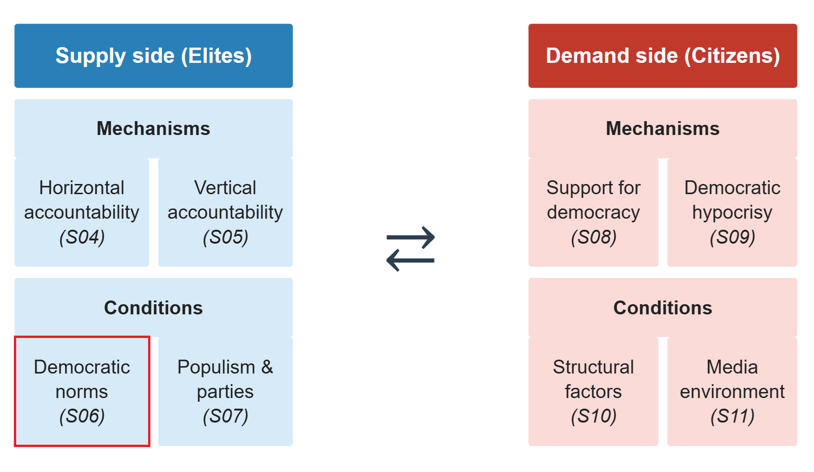

# Introduction

::: notes
~ 5 minutes
:::

## Our analytical framework

  

  

## This session's goals

 

. . .

- Define **social** and **democratic norms**

. . .

- Explore how democratic norms may **change and erode**

. . .

- Discuss the **implications** of weakening democratic norms for **democratic backsliding**

. . .

- Students' presentation: the case of **India**

# Social and democratic norms

::: notes
~ 15 minutes
:::

## Social norms {.smaller}

 

. . .

So far, focus on **formal institutions**: written rules and enforcement mechanisms

. . .

 

But political behaviour is also shaped by **informal institutions**: unwritten rules that shape patterns of behaviour

. . .

- Norms can be as constraining as formal rules -- sometimes more so

. . .

- They operate through **social sanctions**: the threat of disapproval, ostracism, or reputational harm

. . .

 

Some of these informal institutions help sustain **democratic politics**

## What are social norms? {.smaller}
*Bicchieri, 2017*

 

. . .

A social norm exists when individuals have:

. . .

- **Empirical expectations**: beliefs about what *others do*

. . .

- **Normative expectations**: beliefs about what *others think one should do*

. . .

- **Expected social sanction**: anticipated disapproval or punishment for deviation

. . .

 

Norms shape behaviour even when preferences differ: individuals **conform** to avoid sanctions

. . .

This can produce **preference falsification** (Kuran 1991): behaving differently from one's true preferences to appear compliant

::: notes
Bicchieri's framework is the standard in the sociology and political science of norms. The key insight is that norms are sustained by expectations, not just by internalized values, which is why they can change suddenly when expectations shift. Preference falsification (Kuran 1991) is the key downstream consequence: individuals publicly conform to a norm they privately reject, which makes the norm appear more robust than it actually is.
:::

## Democratic norms {.smaller}

. . .

Expectations of what people *do* and *should do* in **democracies** -- and anticipation of a *sanction* if behaviour deviates

. . .

 

{fig-align="center" width="35%"}

::: notes
Open question to the class before revealing the next slide. Let students name examples -- accepting election results, tolerating the opposition, not using state power against rivals, press freedom. Then move to the next slide to show what the empirical literature has focused on.
:::

## Incipient evidence on democratic norms {.smaller}

. . .

 

- **Respect for election outcomes**: differs from Przeworski's rational calculus -- opponents may accept results not only because it is in their interest, but simply because it is *expected*

. . .

- **Protection of minority rights** (anti-prejudice norm): citizens may publicly support it against their true preferences, simply because it is *perceived as widely shared*

. . .

 

But democratic norms also include many of the behaviours associated with **accountability**: independence of courts, parliamentary oversight, press freedom...

::: notes
The distinction from Przeworski is important: his self-enforcing equilibrium is purely strategic -- actors accept defeat because the expected future payoff of staying in the game exceeds the benefit of defecting. Norm-based compliance adds a separate mechanism: people conform because deviation would be socially costly, regardless of strategic calculation. Both can operate simultaneously, but they have different implications for when compliance breaks down.
:::

## Social norm change {.smaller}

 

. . .

Norms change when individuals **update beliefs** about what others around them do and think

. . .

 

**The pluralistic ignorance**: most people privately reject a behaviour but *believe others support it* -- so they keep *conforming*

. . .

When the true distribution of views becomes known, conformity collapses and **the norm breaks**

. . .

 

But a question remains: **who are the first movers, and under what circumstances?**

::: notes
Kuran (1991) on the collapse of Eastern European communism is the classic case. The norm against publicly opposing the regime looked robust until it suddenly wasn't -- because everyone was preference falsifying simultaneously. The first mover question is key: someone has to break the norm first for others to update their beliefs.
:::

# Weakening democratic norms

::: notes
~ 20 minutes
:::

## What do we know about democratic norms? {.smaller}

. . .

The argument about a **democratic culture** is old:

- Almond & Verba (1963): civic culture as a prerequisite for stable democracy
- Inglehart (1971): culture as a vehicle of modernization and democratization
- Easton (1975): diffuse support for the political system as a stabilizing force

. . .

 

Yet, the systematic empirical analysis of a **democratic norms** is recent; **still a lot to be theorized and tested**

. . .

The emerging idea: norms may be **as important as institutions** in *sustaining* -- or *undermining* -- democracy

. . .

Whether norm erosion **enables** institutional erosion or is **reinforced by** it remains an open question

## From extreme to mainstream {.smaller}
*Bursztyn, Egorov & Fiorin, 2020*

 

. . .

**Research question**: can political shocks -- like an election outcome -- shift social norms?

. . .

**Argument**: elections aggregate private opinions publicly; when voters update beliefs about what others think, the stigma cost of expressing previously taboo views falls

. . .

 

**Case**: Donald Trump's rise and 2016 victory in the US

. . .

**Method**: two revealed-preference experiments measuring willingness to publicly express xenophobic views, and willingness to sanction others for doing so

::: notes
Experiment 1: subjects are offered a chance to donate to an anti-immigration organization; some are told Trump's support is high in their area, others are not. They are also told that their decision will be public or private. Experiment 2: other respondents play a dictator game with experiment 1 playes, being informed about their experimental conditions.
:::

## Findings: elections shift norms {.smaller}
*Bursztyn, Egorov & Fiorin, 2020*

 

. . .

- Trump's electoral success **increased willingness to publicly express xenophobic views**

. . .

- Individuals who expressed such views in a high-Trump-support environment were **sanctioned less negatively** by others

. . .

 

**Implication**: norms can erode rapidly -- not because private attitudes changed, but because the *perceived social consensus* shifted

::: notes
This has direct implications for backsliding: you do not need to convert people to anti-democratic views to produce anti-democratic behaviour. You just need to shift the perceived consensus enough that actors stop sanctioning violations.
:::

## Elite rhetoric and democratic norms {.smaller}
*Clayton et al., 2021*

 

. . .

**Research question**: can elite rhetoric undermine democratic norms among citizens?

. . .

**Argument**: elites can shift the perceived legitimacy of norm violations among their supporters, eroding the normative foundations of democratic stability

. . .

 

**Case**: Trump's repeated attacks on the legitimacy of the 2020 US presidential election

. . .

**Method**: panel survey experiment -- repeated exposure to Trump tweets attacking electoral legitimacy, measured over multiple waves

## Findings: attitude change {.smaller}
*Clayton et al., 2021*

 

. . .

Exposure to Trump's rhetoric **erodes trust and confidence in elections** and **increases belief the election was rigged**

. . .

- But only among **Trump approvers** -- co-partisans, not the general population

. . .

- Effects do **not** extend to general support for democracy or support for political violence

. . .

 

Importantly, there is **no direct evidence of norm shift**, but of **belief and attitude change**

. . .

Yet, elite norm-violating rhetoric may **normalize** anti-democratic preferences with potential **behavioral implications**

::: notes
Importantly, the paper measures stated preferences -- it does not distinguish between public and private expression, nor does it measure perceptions of social acceptance. So it is not really tapping into norms directly; alternative mechanisms could be elite cueing. Still important for the democratic norms literature: it identifies acceptance of election losses as a norm and documents changes in factual beliefs -- so an updating of perceptions is confirmed, which could drive norm change even if not measured here.
:::

## Your responses {.smaller}

. . .

 

"**People might not always be honest** about supporting things like violence in a survey, even if their respect for democratic rules has actually started to fade." *(Jetesa Huskaj)*

. . .

 

"the sample comes from Amazon Mechanical Turk [...] **the findings may not fully generalize** to the broader American public, especially ones that are less online or more politically disengaged citizens." *(Moses Emmanuel Saba)* 

. . .

 

"the **experimental design context is artificial**, the participants saw tweets inside of a survey, [...] . This can be addressed by examining more realistic information environments, including exposure to the rebuttals or even partisan media reinforcement." *(Moses Emmanuel Saba)*

## Beyond the US case? {.smaller}

 

. . .

What other cases of **normalization of anti-democratic views or behaviour** can you think of?

. . .

Some potential cases:

- **Hungary**: Orbán's rejection of liberal democratic norms -- making "illiberal democracy" a legitimate political position
- **Germany**: AfD's mainstreaming of anti-immigration stances previously confined to the political fringe
- **Spain & Portugal**: Vox and Chega normalizing positive references to the authoritarian past

. . .

In each case: **formal institutions intact**, previously **unaccepted views now publicly expressed**

::: notes
Let students answer first.
:::

## Beyond extreme candidates: mainstream parties {.smaller}
*Valentim, Dinas & Ziblatt, 2025*

 

. . .

**Research question**: how does anti-immigrant rhetoric by mainstream politicians affect norms of tolerance -- compared to the same rhetoric by radical-right politicians?

. . .

**Argument**: mainstream politicians erode norms *more* than radical-right politicians, because they represent a larger share of the population and enjoy higher status as guardians of democratic norms

. . .

**Case**: near-identical anti-immigrant statements by real mainstream-right and radical-right politicians in Germany

. . .

**Method**: survey experiment manipulating the *source* of the statement while holding content constant

::: notes
The methodological innovation here is important: by using real statements that are near-identical in content but come from different sources, the authors avoid the ethical problem of fabricating quotes while still achieving experimental control over the source variable. This allows a clean test of whether it is the content or the sender that drives norm erosion.
:::

## Findings: mainstream parties as norm erosion agents {.smaller}
*Valentim, Dinas & Ziblatt, 2025*

 

. . .

Mainstream-right politicians erode anti-prejudice norms **more** than radical-right politicians

. . .

- Radical-right statements generate **backlash on the left** -- but this backlash disappears when similar statements come from mainstream politicians

. . .

- Effect is strongest among **left-wing individuals** -- who are most sensitive to who is crossing the normative line

. . .

**Implication**: when mainstream parties accommodate radical-right rhetoric, they do not neutralize it -- they amplify its norm-eroding effect

::: notes
The backlash finding is theoretically important: radical-right statements actually harden norms among opponents, which partially offsets their erosive effect. Mainstream statements do not generate this compensating backlash. The practical implication is counter-intuitive: mainstream parties that adopt radical-right rhetoric to steal votes from the right may end up doing more damage to democratic norms than the radical right itself would have done.
:::

## A norms-based theory of political supply and demand {.smaller}
*Valentim, 2024*

 

. . .

**Puzzle**: radical-right *behaviour* increases rapidly -- but underlying *attitudes* do not change that fast

. . .

**Argument**: social norms suppress the public expression of privately held radical-right views -- **preference falsification**

. . .

- Voters with radical-right views do not act on them because they think those views are socially unacceptable

. . .

- Politicians underestimate latent demand → recruit less skilled leaders → fail to mobilize even sympathetic voters

::: notes
The key insight is that observable political behaviour -- voting, public statements, protest participation -- systematically understates the true distribution of radical-right preferences because the norm against expressing them suppresses their public manifestation. This creates an information problem for politicians.
:::

## The normalization process {.smaller}
*Valentim, 2024*

 

. . .

**Phase 1 -- Latency equilibrium**: radical-right preferences exist but are suppressed; norm against expressing them is strong; radical-right politicians are unskilled and fail to mobilize

. . .

 

**Phase 2 -- Activation stage**: an exogenous shock signals that the norm is weaker than believed; some voters begin expressing views publicly; more skilled politicians enter

. . .

 

**Phase 3 -- Surfacing equilibrium**: expressing radical-right views becomes socially acceptable; the norm has shifted; a new, lower-norm equilibrium is stable

::: notes
Portugal (Chega), Spain (Vox), Germany (AfD), and UK (UKIP) are the empirical cases.
:::

## What triggers normalization? {.smaller}
*Valentim, 2024*

 

. . .

Normalization follows a **sequential process**, not a single cause:

. . .

1. **Exogenous shock** -- a crisis or event loosens the norm temporarily, making preference falsification briefly visible (e.g. terrorist attacks, economic crises)

. . .

2. **Political entrepreneur** -- a skilled politician recognizes the latent demand and acts as first mover, mobilizing previously silent views electorally

. . .

3. **Electoral breakthrough** -- success signals to voters that a critical mass of like-minded others exists; public expression of radical-right views surges

. . .

Each step is **necessary but not sufficient**: the shock alone fades; without an entrepreneur, latent demand stays silent; without electoral success, the norm rebounds

::: notes
Portugal illustrates the sequence well: the Salazar poll (shock) revealed latent demand; Ventura (entrepreneur) recognized it and mobilized it; Chega's 2019 entry into parliament (breakthrough) triggered the surfacing phase. Germany: refugee crisis (shock) → AfD leadership (entrepreneur) → 2017 Bundestag entry (breakthrough).
:::

## Supply and demand of norms {.smaller}
*Valentim, 2024*

. . .

::: {.columns}
::: {.column width="50%"}

**Demand side**

Voters update beliefs about social consensus

↓

Stigma cost of expressing views falls

↓

More public expression of radical-right preferences

:::
::: {.column width="50%"}

**Supply side**

Politicians observe latent demand becoming visible

↓

Incentive to run on radical-right platform grows

↓

More skilled candidates enter; electoral success follows

:::
:::

. . .

The two sides **reinforce each other**: electoral success further normalizes views, impelling more politicians to join

::: notes
This creates a self-reinforcing dynamic that can move quickly once started -- which explains why radical-right growth often looks sudden even when the underlying preferences were always there.
:::

# Conclusion

::: notes
~ 5 minutes
:::

## Democratic norms and backsliding

 

 

. . .

What do we know about **democratic norms** and their erosion?

. . .

 

How does norm erosion relate to the **weakening of accountability** mechanisms we studied?

. . .

 

How does norm erosion relate to **backsliding** more generally?

::: notes
Open discussion. The third question is the most generative: push students to think about whether norm erosion is a precondition or a consequence.
:::

## Summary {.smaller}

 

. . .

- **Social norms** shape behaviour through empirical and normative expectations and the threat of social sanctions

. . .

- **Democratic norms** define what is deemed acceptable in democracies, interacting with formal rules in sustaining the democratic process -- although empirical evidence remains limited

. . .

- **Norms can erode rapidly** when the **perceived social consensus shifts**: elections, crises, and elite rhetoric can all act as triggering shocks

. . .

- **Weakened democratic norms** mean anti-democratic behaviour becomes normalized and goes unsanctioned, potentially **sustaining backsliding**

---

{fig-align="center"}

## Next session (15:45)

 

. . .

**Session 07: Populism and the Weakening of ‘Party Democracy’**

Case study: United States

 

. . .

**Before...**

 

Presentation by **Lina**:

*India*

## Thanks! :slightly_smiling_face:

 

 

 

[alvaro.canalejo@unilu.ch](alvaro.canalejo@unilu.ch)
