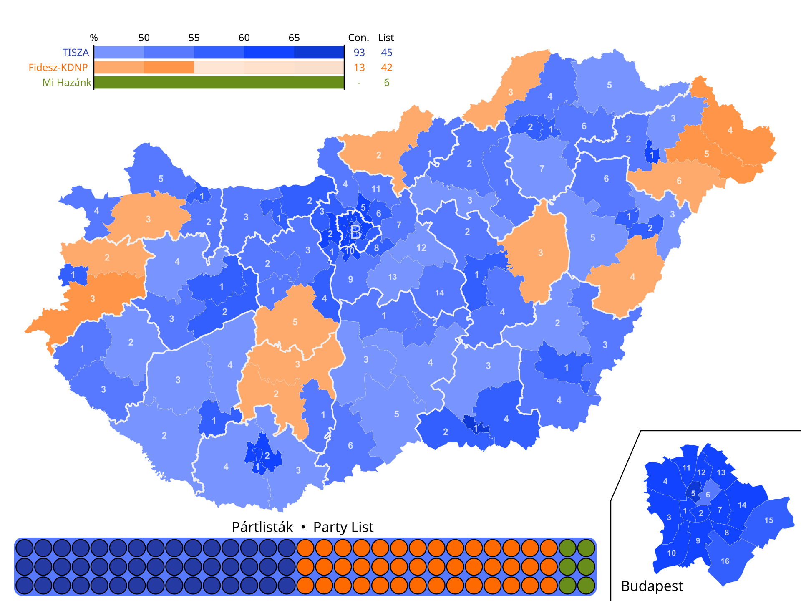
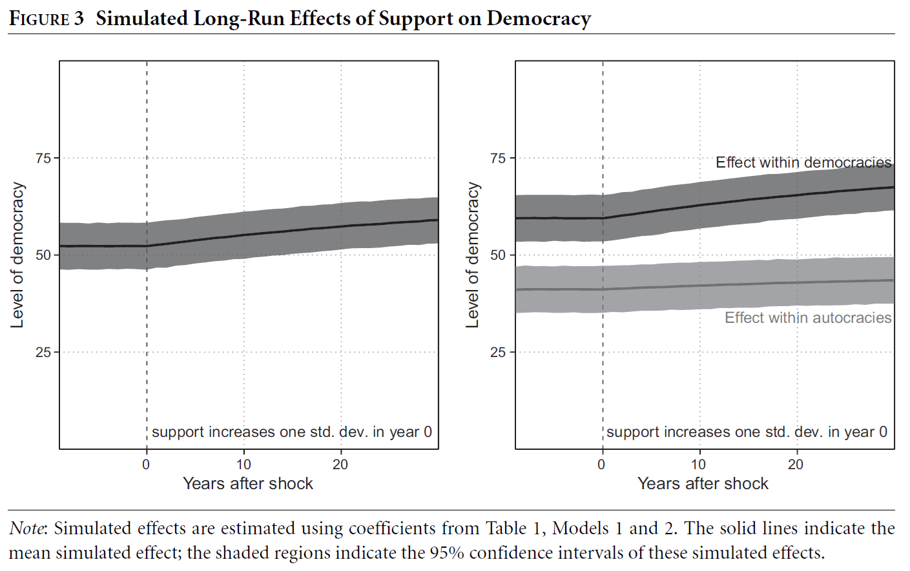
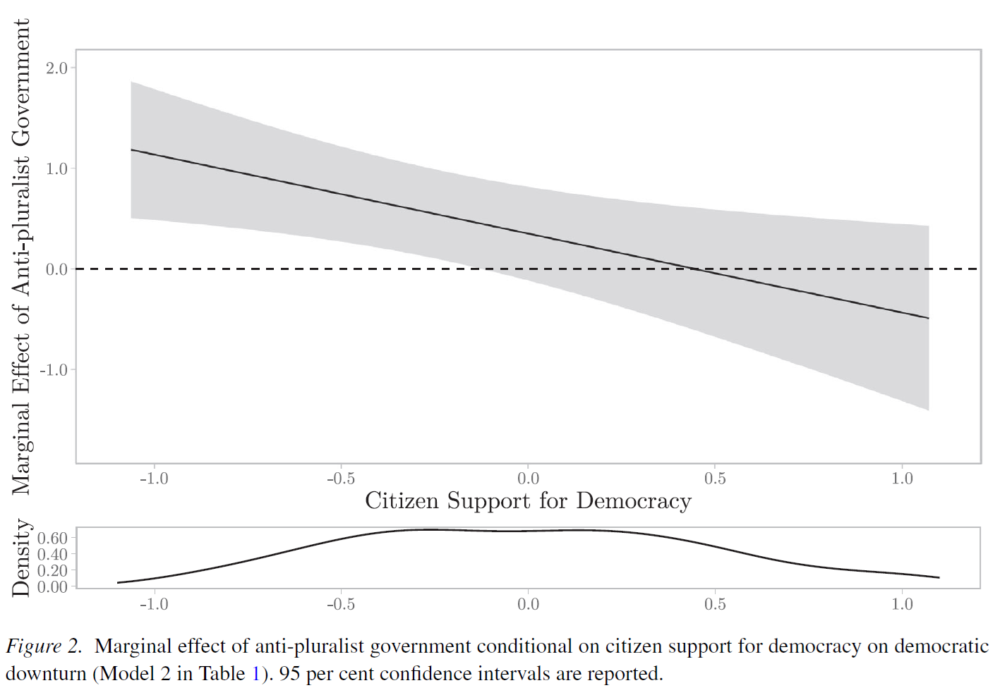
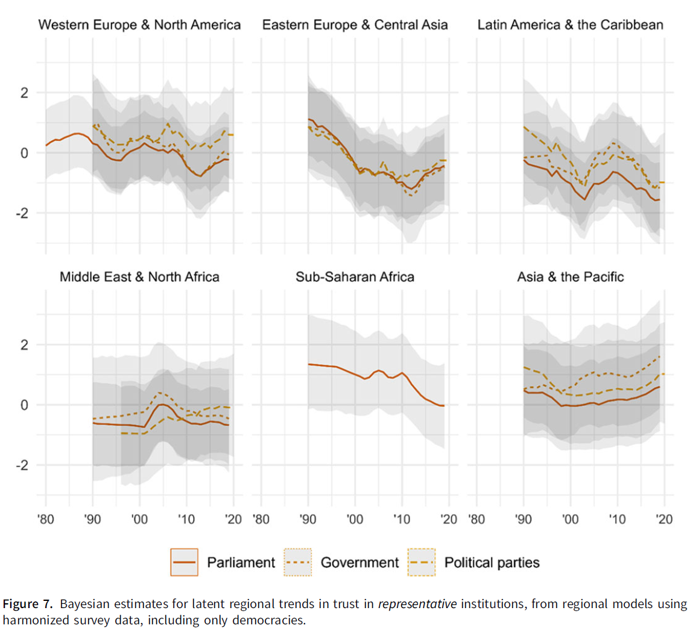

# Introduction

::: notes
~ 10 minutes
:::

## Note on the response papers

 

. . .

- They are **mandatory**, i.e., needed to pass the course

- Some of you have have not submitted them for the correct block, or at all 

 

. . .

If this applies to you, **talk with me** during the lunch break

. . .

*PS.* The Block IV response papers *cannot be about session 14*, only sessions 12 and 13

## 2026 Hungarian elections {.smaller}
 
 
 
. . .
 
- Held on **12 April 2026** with Orbán seeking a fifth consecutive term after 16 years in power
 
 
- Record-breaking **turnout** over **77%**, the highest in post-Communist Hungarian history

 
- Péter Magyar's centre-right **Tisza party** won a landslide with **138 seats** (53.6% of the vote), a two-thirds supermajority; Fidesz collapsed to 55 seats (37.8%)
 
. . .
 
**Implications**

. . .

Magyar can amend Hungary's constitution; expected reversal of Orbán's dismantling of judicial independence, media freedom, and checks and balances; realignment with the EU
 
. . .
 
- Despite (or thanks to?) Orbán's **tilted playing field**: control of media, judiciary, and electoral rules

---

{fig-align="center"}

. . .

 

**What is the role of citizens in democratic backsliding?**

 

## This session's goals
 
 
 
. . .
 
- Define the concept of **democratic support**
 
. . .
 
- Understand the relationship between democratic support and **democratic backsliding**
 
. . .
 
- Review **trends** in specific support and **measurement issues**
 
. . .
 
- Students' presentation: the case of **Bangladesh**

# Support for democracy
 
::: notes
~ 5 minutes
:::
 
## Seymour M. Lipset and David Easton {.smaller}
 
::: {.columns}
::: {.column width="55%" .text-small  .fragment}
 
 
 
**Seymour Martin Lipset** (1922–2006)
 
- American political sociologist; professor at Columbia, Harvard, Stanford
- Introduced the concept of **political legitimacy** as a foundation for regime stability
 
 
 
**David Easton** (1917–2014)
 
- Canadian-American political scientist; University of Chicago
- *A Systems Analysis of Political Life* (1965): developed the most influential framework for **public support** for political systems
 
:::
 
::: {.column width="5%"}
 
:::
 
::: {.column width="40%"}
 
{width="40%"}
 
{width="85%"}
 
:::
:::

## The concept of democratic legitimacy {.smaller}
*Lipset, 1960*
 
 
 
. . .
 
**Political legitimacy**: the belief that existing political institutions are the most appropriate or proper ones for society
 
. . .
 
 
 
Lipset's core hypothesis:
 
 
> Democracies require **legitimacy** to survive; without it, they are vulnerable to breakdown in times of crisis
 
. . .

- Legitimacy is distinct from **effectiveness** (how well government performs)
- A regime may be effective but illegitimate, or legitimate but ineffective
- In the long run, **legitimacy** is what sustains regimes through crises
 

## David Easton's framework of support {.smaller}
*Easton, 1965*
 
 
 
. . .
 
Three **objects** of support:
 
- **Political community**: the nation or group of people sharing a political system
- **Regime**: the constitutional order, rules of the game, institutions
- **Authorities**: incumbent governments and officials
 
. . .
 
Two **types** of support:
 
 
::: {.columns}
::: {.column width="50%"}
 
**Specific support**
 
Satisfaction with outputs
 
Instrumental and conditional
 
Tied to performance
 
:::
::: {.column width="50%"}
 
**Diffuse support**
 
Principled attachment
 
Normative and durable
 
Independent of performance
 
:::
:::
 
# Support for democracy and democratic backsliding

::: notes
~ 15 minutes
:::

## The democratic legitimacy hypothesis {.smaller}
*Claassen, 2020*
 
 
 
. . .
 
The **Lipset-Easton theory** of democratic support has been broadly accepted since the 1960s
 
. . .
 
But empirical evidence has been **weak and contradictory**:
 
- Existing tests relied on **small cross-sectional samples** (a few dozen countries, one point in time)
- Cross-sectional designs cannot account for **country-specific confounders**
- Contradictory results: some find a positive effect, others find null effects
 
. . .
 
The core problem: **survey data on democratic support is fragmented** across time, space, and question wording
 

## Claassen's empirical test {.smaller}
*Claassen, 2020*
 
 
 
. . .
 
- **Data**: 3,765 national survey items on democratic support from 1,390 surveys, 14 survey projects, 150 countries, up to 30 years
 
- **Method**: Bayesian dynamic **latent variable model**; estimates a smooth country-year panel of democratic support from fragmented survey items
 
. . .
 
- **Estimation strategy**: dynamic panel TSCS models; support at $t-1$ predicts democracy at $t$, controlling for lags of democracy and country fixed effects
 
- **Outcome**: V-Dem Liberal Democracy Index
 
::: notes
The Bayesian dynamic latent variable model assumes that all available survey questions — despite different wording and sources — are noisy reflections of a single underlying quantity, true democratic support, which cannot be observed directly. The model learns how informative each question is from the data itself, uses the dynamic structure to smooth estimates over time and interpolate missing years, and produces for each country-year a posterior distribution of plausible support values rather than a single point estimate, honestly reflecting uncertainty. The mean of that distribution becomes one clean, comparable number per country per year, turning thousands of messy survey items into a usable panel that can then be plugged into standard regression models to estimate the effect of support on democratic survival
:::
 
## Findings: support helps democracy survive {.smaller}
*Claassen, 2020*
 
 
 
. . .
 
**Main finding**: higher democratic support predicts **subsequent improvement in democracy** (positive and significant, OLS and GMM)
 
. . .
 
**Key asymmetry**: support matters more for **democratic survival** than for democratic emergence
 
- Within **democracies**: support is positively and significantly linked to democratic change
- Within **autocracies**: effect is positive but **insignificant**
 
. . .
 
Long-run effect: a one-standard-deviation increase in support predicts **+7.67 V-Dem units** after 30 years within democracies

---

{fig-align="center"}

## Your responses {.smaller}

. . .

 

"[...] it remains unclear whether “democracy” means the same thing in all countries and contexts." *(Filippo Brambilla)*

. . .

"[...] the article convincingly demonstrates that support is effective but is less clear about the specific mechanisms through which it operates." *(Filippo Brambilla)*

 

. . .

"While Claassen’s study is highly effective in identifying a large dataset covering many countries, it remains, as already noted, limited in its ability to show the causal mechanisms" *(Vanessa Rölli)*

. . .

"A small-N design, focusing on a selected set of cases, would allow for a more detailed analysis" *(Vanessa Rölli)*
 
## The elite-citizen interaction {.smaller}
*Jacob, 2025*
 
 
 
. . .
 
Empirical evidence shows that support matters, but the **mechanisms** are underspecified
 
. . .
 
 
 
This paper's argument: democratic support constrains **anti-pluralist governments** through two mechanisms:

 
1. **Electoral punishment**: citizens committed to democracy vote out incumbents who undermine it
 
2. **Backlash threat**: high support raises the costs of backsliding (protests, opposition mobilization)
 
. . .

 
**Elite-citizen interaction hypothesis**: backsliding is most likely when anti-pluralist governments face *low* citizen support for democracy, otherwise, they moderate due to expected backslash
 
 
## Evidence from dynamic TSCS, 1990-2019 {.smaller}
*Jacob, 2025*
 
 
 
. . .
 
**Data**: longitudinal panel of ~100 democracies, 1990-2019

 
**Key variables**:
 
- *Anti-pluralist government*: V-Party anti-pluralism scores, weighted by seat share
- *Citizen support*: Claassen (2020) latent estimates, extended to 2019
 
. . .
 
**Model**: dynamic TSCS with OLS (Beck-Katz SEs) and System GMM; controls for polarization, clientelism, democratic stock, GDP, region trends
 
**Key test**: interaction between anti-pluralist government x citizen support
 

## Findings: citizen support constrains backsliding {.smaller}
*Jacob, 2025*
 
 
 
. . .
 
**Interaction term**: negative and significant; anti-pluralist governments produce more backsliding when citizen support is **low**
 
 
- Anti-pluralist parties in power + **low citizen support** = substantial democratic decline
 
- Anti-pluralist parties in power + **high citizen support** = backsliding effect is **attenuated**
 
. . .
 
 
 
**No reverse effect**: citizen support does not predict subsequent anti-pluralist government orientation; the causal arrow runs one way
 
::: notes
The null reverse effect is reassuring. Citizen support does not predict subsequent anti-pluralist government orientation, and anti-pluralist governments do not systematically reduce subsequent citizen support. The causal arrow in Jacob's story — support moderates what anti-pluralist governments do to democratic institutions — is therefore not simply a reflection of reverse processes. This does not fully resolve endogeneity, but it meaningfully rules out the two most obvious alternative interpretations and strengthens confidence in the interaction finding.
:::

---

{fig-align="center"}

# Trends and measurement issues

::: notes
~ 10 minutes
:::

## If support is generally high, why backsliding? {.smaller}
 
 
 
. . .
 
A puzzle emerges from Claassen's data: **democratic support is generally high** across countries and regions, and **support is associated with democratic survival**
 
 

. . . 

Yet **backsliding is widespread and accelerating**
 
. . .

 
Several possible resolutions:

- It is **specific** rather than **diffuse support** what declines
- **Diffuse support measures** are flawed
- Support is **high but shallow** *(Session 09)*
 
 
## A crisis of political trust? {.smaller}
*Valgarðsson et al., 2025*
 
 
 
. . .
 
A long-running debate: is there a **structural decline** in political trust, or just **trendless fluctuations**?
 
. . .

- The disagreement may partly reflects **analytical confusion**; whether trust is declining depends on *which institution*, *which country*, and *which period*

 

. . .
 
**Data**: Bayesian latent variable models applied to 3,377 surveys from 50 projects in 143 countries, 1958-2019
 
 
**Key distinction**: *representative institutions* (parliament, government, parties) vs. *implementing institutions* (civil service, police, legal system)
 
 
## Trends: a split picture {.smaller}
*Valgarðsson et al., 2025*
 
 
 
. . .
 
**Representative institutions** (parliament, government, parties): **declining globally**
 
- Trust in parliament: estimated decline of ~**8.4 percentage points**, 1990-2019
- Trust in government: ~**7.3 percentage points** decline over the same period
- Decline is significant and consistent across WENA, EECA, and LAC regions
 
. . .
 
**Implementing institutions** (civil service, police): **stable or rising**
 
. . .
 
 
 
Citizens are not losing faith in the *state* broadly; they are losing faith in **representative democracy specifically**

---

{fig-align="center"}
 
## Measuring support for democracy: a new approach {.smaller}
*Claassen et al., 2025*
 
 
 
. . .
 
Existing survey items on democratic support have **validity problems**:
 
- Most items are **vague** ("democracy is preferable to any other form of government")
- They are **normatively desiderable**
- They do not capture **which aspects** of democracy citizens value
 
. . .
 
New battery anchored in V-Dem's definition of **liberal democracy**:
 
- 8 components: electoral democracy (5) + liberal component (3)
 
 
## What the new battery reveals {.smaller}
*Claassen et al., 2025*
 
 
 
. . .
 
The battery shows **variation within democracy support** that blunt items miss:
 
- Citizens generally support **electoral** components more than **liberal** components
- E.g., support for **judicial constraints** on the executive is often weaker than support for elections
 
. . .
 
 
 
**Implication**: aggregate "support for democracy" may mask specific **vulnerabilities**
 
- Citizens may endorse democracy in principle while being indifferent to the very institutions backsliders target first
 

# Conclusion

::: notes
~ 5 minutes
:::

---
 
 

 

What is citizens' support for democracy?

. . .

 
 
Does citizen support for democracy *actually* protect it?
 
. . .

 
 
 
Given what we have seen in Hungary, do you think citizen support matters to to stop backsliding?
 
 
## Summary

. . .

- Democratic support can be distinguished between **diffuse** and **specific**; only the former is believed to *sustain democracy*

. . .

- The available evidence suggests that democratic support matters for **democratic survival**, but debates remain about the *extent and mechanisms*

. . .

- Most importantly, high support and increasing backsliding co-occur, a seeming **paradox** *not yet resolved*
 
 
---

{fig-align="center"}

## Next session (11:00)

 

**Session 09: Democratic Values and Hypocrisy**

Case study: Nicaragua

 

. . .

**Before...**

 

Presentation by **Elli & Jetesa**:

*Bangladesh*

## Thanks! :slightly_smiling_face:

 

 

 

[alvaro.canalejo@unilu.ch](alvaro.canalejo@unilu.ch)

