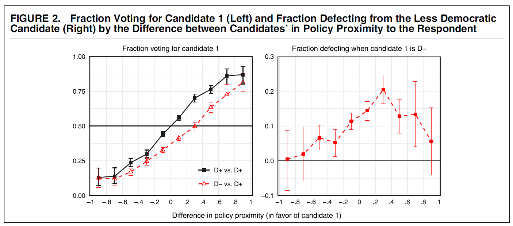
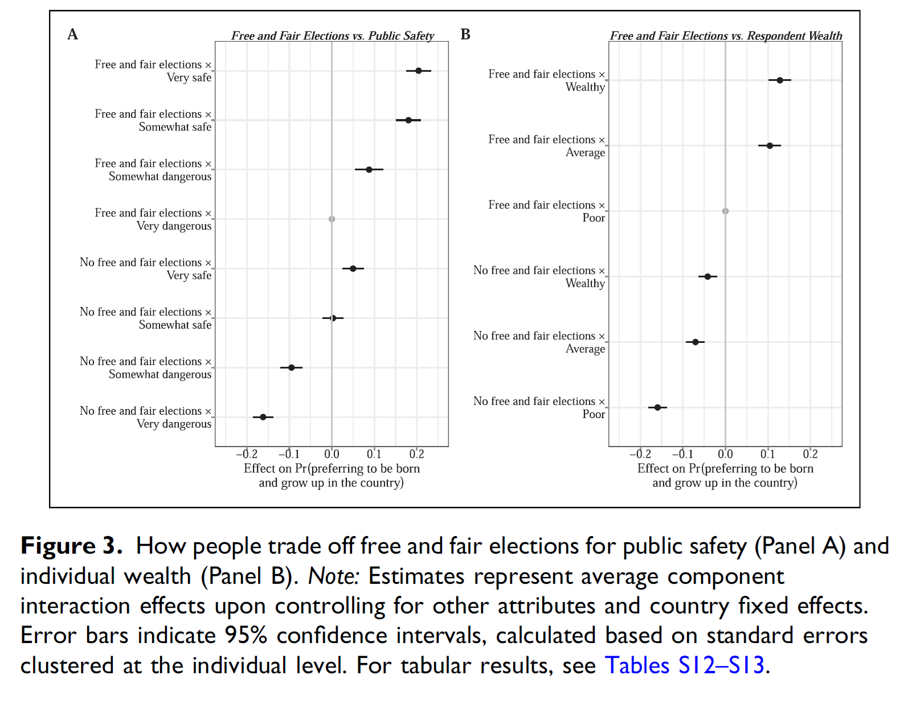
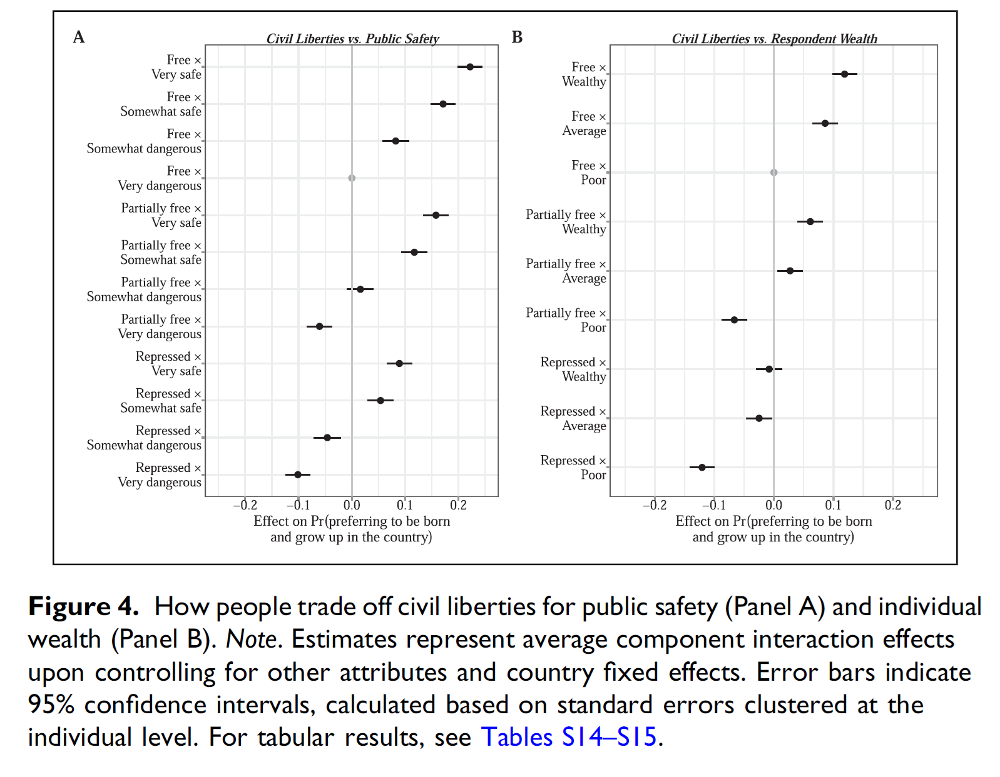
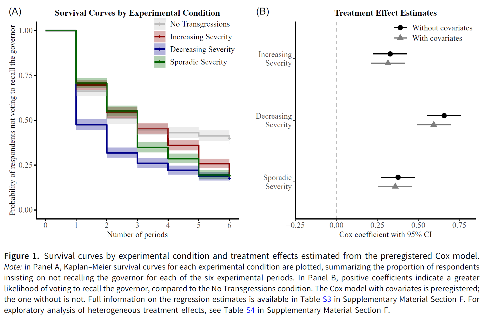
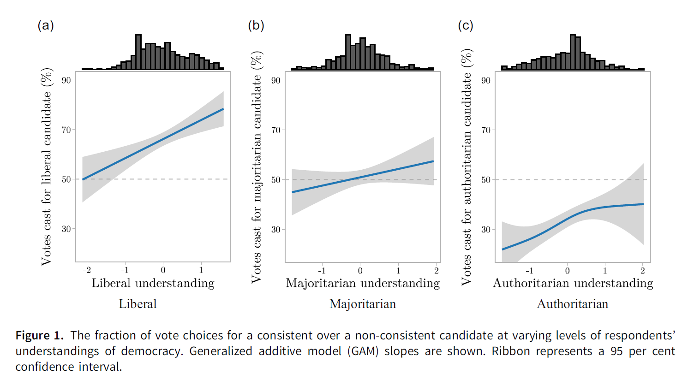

# Introduction
 
::: notes
~ 10 minutes
:::
 
## The democratic support paradox
 
> Citizens display **overwhelming support for democracy** while **democracy is on retreat**
 
. . .

 

In session 08, we discussed how support can sustain democracy by **moderating backsliding** attempts by anti-pluralist **incumbents**

. . .
 
But how do citizens come to **support authoritarian politicians** in the first place?

## Situating the paradox {.smaller}

 
. . .

 

**Demand side** 

- **Declining trust** in representative institutions and weaker support for the **liberal components of democracy** (session 08)

. . .

**Supply side** 

- **Weakening of traditional party ties** and detachment from mainstream parties (session 07)
 
. . .

These conditions may help understand why **populist anti-establishment candidates** have become more successful

. . .

Yet, we remain uncertain about the mechanisms driving **support** for these candidates when **they openly attack democratic institutions**

## This session's goals
 
. . .
 
- Understand the phenomenon of **democratic hypocrisy** and democratic trade-offs
 
. . .
 
- Explore whether **divergent understandings of democracy** explain support for backsliding leaders
 
. . .
 
- Discuss both mechanisms in relation to **democratic backsliding**
 
. . .
 
- Students' presentation: the case of **Nicaragua**

# Democratic hypocrisy

::: notes
~ 20 minutes
:::

## Milan Svolik {.smaller}
 
::: {.columns}
::: {.column width="50%"  .fragment}
 
 
 
- Slovak-American political scientist; Professor of Political Science at **Yale University**
 
- Research on authoritarian rule, electoral accountability and democratic backsliding
 
- Developed the most influential framework for studying **citizens' support for democratic backsliding**
 
:::
 
::: {.column width="5%"}
 
:::
 
::: {.column width="45%"}
 
{width="77%"}
 
:::
:::

## Democracy in America? {.smaller}
*Graham & Svolik, 2020*
 
 
 
. . .
 
The key mechanism of democratic self-defense: **elections**
 
 
Beyond *abstract support for democracy*, citizens can stop politicians who violate democratic principles by **defeating them at the polls**
 
. . .
 
 

But this check has a fundamental vulnerability: elections force voters to choose between **conflicting** considerations

 
::: {.columns}
::: {.column width="50%"}
 
**Democratic principles**
 
Free elections, civil liberties, checks and balances
 
:::
::: {.column width="50%"}
 
**Partisan interests**
 
Party loyalty, policy preferences, ideology
 
:::
:::
 
. . .
 
**Implication:** *polarization raises the price* of choosing democracy over partisanship
 
::: notes
When a co-partisan candidate violates democratic principles, voting against them requires crossing party lines, i.e. the "price" of democratic commitment. Polarization raises this price. Three types of polarization each independently undermine the democratic check: intense individual preferences, polarized electorates without cross-cutting cleavages, and divergent candidate platforms.
:::
 
## The candidate-choice experiment {.smaller}
*Graham & Svolik, 2020*
 
 
 
. . .
 
**Sample**: 1,691 nationally representative US voters; 16 choices each (21,604 total); August-September 2018
 
. . .

 
 
Each respondent chooses between two candidates for **state legislature**, described by: age, gender, race, profession, experience, **party**, **two policy platforms**, and a **democracy position**
 
. . .
 
Democracy position is either **neutral** (generic, inconsequential statement; D1 treatment) or **undemocratic** (D2 treatment)
 

::: notes
(1) positions are incremental and partisan-balanced, mirroring real-world backsliding; (2) normatively neutral language used throughout (e.g., no word "gerrymandering"); (3) respondents pre-rated policies and pre-evaluated democratic/undemocratic practices before the experiment, enabling precise computation of policy distance and validation that D2 positions are seen as undemocratic.
:::
 
## The undemocratic positions {.smaller}
*Graham & Svolik, 2020*
 
 

::: {style="font-size: 0.65em;"}

| Position | Democratic principle |
|---|---|
| Supported a redistricting plan giving own party 2 or 10 extra seats | Electoral fairness |
| Supported reducing polling stations in opposition areas | Electoral fairness |
| Said governor should rule by executive order if opposition does not cooperate | Checks and balances |
| Said governor should ignore unfavorable court rulings by opposition-appointed judges | Checks and balances |
| Said governor should prosecute journalists who accuse him without revealing sources | Civil liberties |
| Said governor should ban far-left or far-right group rallies | Civil liberties |

:::

::: notes
The framing is always partisan: "own party governor" and "opposite party" are filled in randomly as Democrat or Republican. Experiment structure: 16 choices per respondent; 11 follow the core design. Four scenarios are D1 vs D1 (both candidates hold neutral, inconsequential positions, e.g. "Served on a committee that establishes the state legislature's schedule"). Seven scenarios are D2 vs D1 (one candidate holds an undemocratic position, the other a neutral one).
:::
 
## Findings I: Americans value democracy, but not much {.smaller}
*Graham & Svolik, 2020*
 
 
 
. . .
 
An undemocratic candidate loses only **~11.7%** of overall vote share
 
 
- In realistic partisan conditions (actual party and policy alignment), punishment drops to **~3.5%**

- Democracy weight estimated at **18%** of the systematic variation in vote choice; party and policy jointly dominate
 
. . .
 
**Benchmark**: voters punish extramarital affairs and tax underpayment more severely than violations of democratic principles
 
::: notes
The 3.5% figure is the headline number for real-world implications. In an election where the margin is likely to be a few percentage points, a 3.5% sanction is meaningful but not decisive.
:::
 
## Findings II: partisans first, democrats second {.smaller}
*Graham & Svolik, 2020*
 
 
 
. . .
 
Only **~13.1%** defect from a co-partisan candidate for violating democratic principles
 
- Only **independents and leaners** support democratic candidates enough to defeat undemocratic ones regardless of partisanship
 
. . .
 
**Partisan double standard**: both Republicans and Democrats punish the other party's violations more than their own (co-partisan bias estimated at **48.4%**)
 
. . .

- **Centrists are the pro-democratic force**: punish undemocratic behavior at **4x the rate** of strong partisans
 
- **Platform polarization** independently worsens the problem: greater distance between candidate platforms further reduces punishment
 
::: notes
The double standard is symmetric: it is not that one party is more hypocritical, both are equally so. The centrist finding echoes Dahl and Lipset on cross-cutting cleavages.
:::

---

 

{fig-align="center"}
 
## Findings III: natural experiment in Montana {.smaller}
*Graham & Svolik, 2020*
 

 

. . .
 
 
 
**Natural experiment**: 2017 Montana special election; candidate assaulted journalist on election eve
 
- Only **day-of voters** saw the signal; absentee voters (majority) had already voted; difference-in-differences design
 
. . .
 
Only **moderate precincts** punished the assault; in heavily partisan precincts, **partisan loyalty trumped** valence considerations

## Your responses {.smaller}

 

. . .

"The construction of this experiment is only suited to a two party system, like the one of United States [...] further research on this topic needs to develop a mathematical possibility to put in multiple parties." *(Pascal Tarnowski)*

 

. . .

"The research design offers the respondents two options [...] However, in multi-party democracies the options are not dichotomous. Not only have people the option to vote for different parties that align more, but it also allows for punishing anti-democratic behaviour." *(Stephanie Lindegger)*

. . .

"Generally, voters are supposed to act as control mechanism to protect democratic principles. However, a coalition government could act as a second-tier mechanism to punish undemocratic behaviour." *(Stephanie Lindegger)*

## Replications and extensions {.smaller}

 

. . .

Graham and Svolik's findings have been **widely replicated and extended**, and renamed as democratic hypocrisy *(Simonovits, McCoy and Littvay, 2022)* 

. . .

 

The **candidate-choice conjoint** became the standard paradigm for studying democratic trade-offs:

- Partisan loyalty overrides democratic principles in candidate choice **across contexts**, despite voters recognizing violations *(Frederiksen, 2022, 2024)*

- Partisan **effects are mixed** or asymmetric across parties *(Carey et al., 2019, 2020; Gidengil et al., 2022)*

- **Affective polarization** may matter less than expected *(Broockman, Kalla & Westwood, 2023)*

## Democratic trade-offs beyond partisanship and the US {.smaller}
*Chu, Williamson & Yeung, 2025*
 
 
 
. . .
 
RQ: What would people **trade democratic governance for** across different countries and dimensions?
 
. . .
 
**Design**: cross-national conjoint experiment in **6 countries** (Egypt, India, Italy, Japan, Thailand, US)
 
. . .
 
Respondents choose between hypothetical countries varying on **10 attributes**:
 
- 3 democratic: *leadership selection* (free elections), *civil liberties*, *institutional checks*
- 7 other: *national wealth, personal wealth, public safety, healthcare, corruption, minority status, equality*
 
 
## What people value and what they trade away {.smaller}
*Chu, Williamson & Yeung, 2025*
 
. . .
 
**Consistent across all 6 countries**: people most strongly value **free and fair elections**
 
. . .
 
- **Civil liberties** and **institutional checks** valued less than elections; and less than several non-democratic attributes
 
. . .
 
- **Public safety** is the most important non-democratic attribute globally
 
. . .
 

**Tradeoffs**:
 
- Many would forfeit **elections** to avoid a very dangerous country, but **not** to gain personal wealth
- Even more willing to abandon **civil liberties** and **institutional checks** for safety or corruption reduction
 
---
 
{fig-align="center"}

---
 
{fig-align="center"}

## Dynamic backsliding and accountability {.smaller}
*Yeung, 2025*
 

. . .
 
Most of the literature treats democratic trade-offs as **static**: a single choice between two candidates
 
. . .
 
- But backsliding is **incremental**: democratic transgressions accumulate over time, so voters may react fiercely against the accumulation rather than single transgressions
 
. . .

 
**Design**: preregistered experiment (N=4,234, US); respondents observe a governor committing **6 sequential transgressions** and decide whether to **recall** them after each one
 

- Four conditions: *increasing severity*, *decreasing severity*, *sporadic severity*, *no transgressions*
 
 
::: notes
Importantly: unlike Graham and Svolik, there is no partisan alternative to choose; so no trade-off.
:::

## Findings: sequence matters {.smaller}
*Yeung, 2025*
 
 
 
. . .
 
A **majority** of respondents were willing to recall the incumbent as transgressions accumulated
 
. . .

 

More optimistic than static experiments, but **timing matters**: delayed accountability can not be as effective as pre-emptive vote choice
 
. . .

 
 
**Important variation**: incumbents who **decrease severity** are held accountable earlier than those increasing severity or committing sporadic transgressions

---
 
{fig-align="center"}

# Divergent understandings of democracy

::: notes
~ 10 minutes
:::

## An alternative explanation {.smaller}
 
 
 
. . .
 
The hypocrisy literature assumes citizens have **a stable liberal democratic understanding** that they then trade away, but *what if many citizens never held that understanding* to begin with?
 
. . .
 
 
 
Recall from Session 08: Claassen et al. (2025) showed that aggregate support **masks internal variation**

 
- Citizens support electoral components more than liberal components; support for **judicial constraints** and **minority rights** is often weaker
 
. . .
 
This raises the question: do different citizens hold **fundamentally different conceptions** of what democracy means and **vote differently** as a result?

## Divergent understandings and political choice {.smaller}
*Wunsch, Jacob & Derksen, 2025*
 
 
 
. . .
 
**Argument**: responses to democratic violations are shaped not only by partisan loyalty but by citizens' **underlying understanding of democracy**

 
- Citizens with a **liberal democratic understanding** will recognize all violations as such and punish them
 

- Citizens with a **majoritarian or 'authoritarian' understanding** may not recognize transgressions of liberal principles as violations, and not punish them
 
. . .
 
**Design**: conjoint experiment in **Poland**; democratic attitudes measured before the experiment; candidates vary on democratic and non-democratic attributes
 
::: notes
To be discussed whether the "authoritarian" understanding just taps into authoritarianism rather than a different understanding of democracy.
:::
 
## Findings: democratic understandings shape accountability {.smaller}
*Wunsch, Jacob & Derksen, 2025*
 
 
 
. . .
 
**Main finding**: the more strongly voters are committed to liberal democratic norms, the more harshly they **punish non-liberal candidates**
 
. . .

 
 
The **liberal democracy hypothesis** dominates the **congruence hypothesis**; it is support for liberal democracy what matters
 
. . .
 
 
 
**Implication**: the **lack of attitudinal consolidation** around liberal democracy is a missing variable in backsliding research
 

---
 
{fig-align="center"}

# Conclusion

::: notes
~ 5 minutes
:::

---

 

 

How many citizens are *truly committed* to liberal democratic principles?
 
. . .

 

Do we need a majority of true democrats to *safeguard* democracy?
 
. . .

 
 
What would ***you*** trade off for democratic principles?

## Summary

. . .

- **Democratic hypocrisy**: citizens hold democratic values but trade them off for partisan or material gains

. . .

- **Divergent understandings**: beyond partisan trade-offs, heterogeneous democratic attitudes mean that some citizens never held a liberal commitment strong enough to act as a democratic check

. . .

- A question remains about the **substantive conditions** driving **democratic trade-offs** (session 10)

---

{fig-align="center"}

## Next session (13:45)

 

**Session 10: Grievances and Resentment**

Case study: El Salvador

 

. . .

**Before...**

 

Presentation by **Vanessa**:

*Nicaragua*

## Thanks! :slightly_smiling_face:

 

 

 

[alvaro.canalejo@unilu.ch](alvaro.canalejo@unilu.ch)

