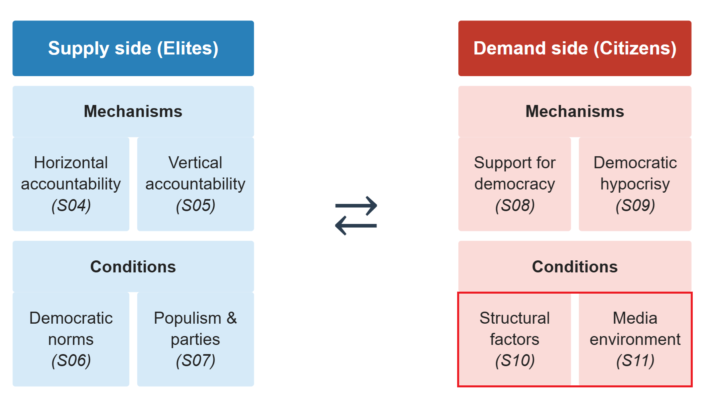
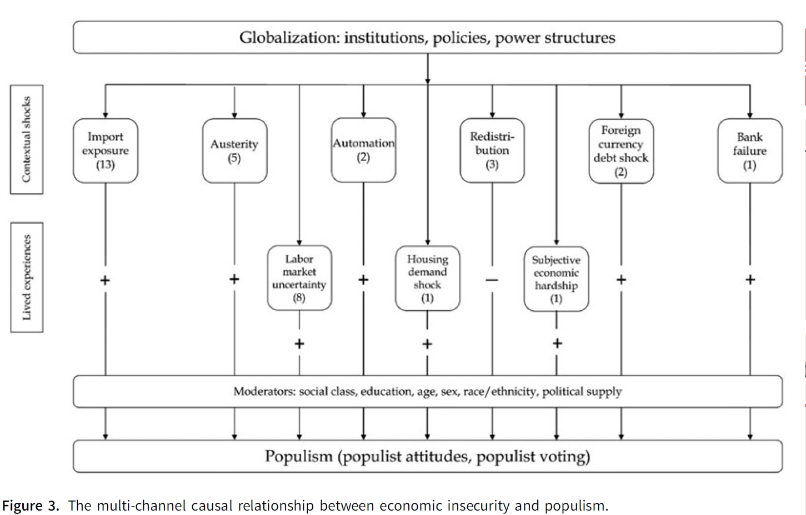
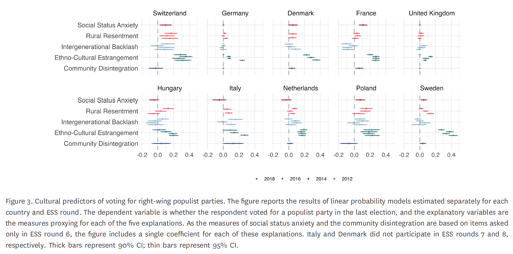
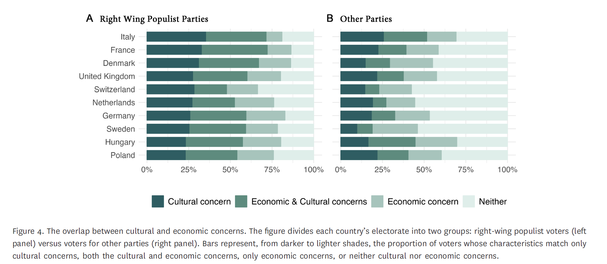

# Introduction

::: notes
~ 5 minutes
:::

---

{fig-align="center"}

## Social and political change {.smaller}
 
 

. . .
 
In the previous sessions, we examined three processes behind **citizens' support for undemocratic politicians**:
 
- **Weakening of traditional party ties** and detachment from mainstream parties (Session 07)

- **Declining trust** in representative institutions (Session 08)

- **Democratic hypocrisy**: citizens trading democratic principles for partisan or policy gains (Session 09)

. . .
 

But what are the **societal transformations underpinning** these political processes?
 
 
- I.e., what **structural transformations** are putting democracy under pressure in the first place?
 
 
## This session's goals

. . .
 
- Introduce the concept of **political resentment** and its micro-foundations

. . .
 
- Explore the role of **economic and cultural grievances** for the rise of populism

. . .
 
- Discuss the impact of **societal transformations** on democratic backsliding processes

. . .
 
- Students' presentation: the case of **El Salvador**

# The politics of resentment
 
::: notes
~ 10 minutes
:::
 
## Katherine Cramer {.smaller}

 
 
::: {.columns}
::: {.column width="55%"  .fragment}
 
- American political scientist; Professor at the **University of Wisconsin-Madison**

- Research on public opinion, political communication, and rural politics

- *The Politics of Resentment* (2016): years of ethnographic fieldwork in small-town Wisconsin community groups

- Highly influential for subsequent work on the **"left behind"**, rural-urban divides, and the social psychology of populist support
:::
 
::: {.column width="5%"}
 
:::
 
::: {.column width="40%"}
 
{width="90%"}
 
:::
:::
 
 
## Rural consciousness and resentment {.smaller}
*Cramer, 2016*
 
 

. . .
 
**Rural consciousness**: a lens through which people make sense of politics, composed of three elements:
 
. . .
 
1. A perception that **rural areas lack political power** and are ignored by decision-makers in cities

2. A sense that **rural culture and lifestyle are disrespected** by urban and suburban elites

3. A perception that **rural areas do not receive their fair share** of public resources and tax money

. . .
 
This is not an ideology: it is an **identity-based interpretive framework** through which politics is understood
 
 
## Politics through identity, not ideology {.smaller}
*Cramer, 2016*
 
 

. . .
 
**RQ**: Why do rural residents support candidates and policies that may not serve their material interests?
 
. . .
 
- Support for small government is not based on libertarian principle

- It is based on **resentment toward perceived undeserving others**: urban public employees, welfare recipients, university elites

- The question is not "what does this policy do?" but "who does this benefit, and do they deserve it?"

. . .

**Deservingness**, rooted in perceptions of hard work and place identity, does the work that ideology is supposed to do
 
 
## Resentment and political mobilization {.smaller}
*Cramer, 2016*

. . .
 
The case of **Scott Walker** in Wisconsin
 

- Walker campaigned on **cutting public employee benefits**, framing public workers as over-paid, under-worked urbanites living off rural taxpayers
 
. . .

- This resonated precisely because it mapped onto **existing rural consciousness**: the perception that cities extract rural resources and return nothing
 
. . .

- Walker arrived at the right time: the **Great Recession** sharpened resentment toward public employees as private-sector workers felt squeezed
 
. . .
 
Politicians do not (only) create resentment; they **tap into it** and direct it
 
# The causes of populism in the West
 
::: notes
~ 25 minutes
:::
 
## Explaining populism {.smaller}
*Berman, 2021*
 
 

. . .
 
We studied the rise of populism from a **supply-side perspective**, linked to the weakening of traditional party ties
 
. . .
 
However, the supply-side must be connected with **demand-side explanations**
 
. . .

 
 
::: {.columns}
::: {.column width="50%"}
 
**Economic grievances**
 
Inequality, deindustrialization, financial crisis, globalization losers
 
:::
::: {.column width="50%"}
 
**Sociocultural grievances**
 
Immigration, status threat, cultural change, racial resentment
 
:::

:::
 

 
## Economic grievances {.smaller}
*Berman, 2021*
 
 

. . .
 
At the **macro level**: clear correlation between rising inequality, financial crises, and populism
 
. . .
 
- Right-wing populist parties rise after financial **crises**

- **Globalization** has created winners and losers; losers blame elites and immigrants

. . .
 
However, the evidence is weaker at the **individual level**
 
- **Fear of future insecurity** and **sociotropic perceptions** of national decline may matter more than current personal circumstances
 
 
## Sociocultural grievances {.smaller}
*Berman, 2021*
 
 

. . .
 
Cultural explanations are stronger **at the individual level**: immigration attitudes, status threat, and racial resentment are robust predictors of populist voting

 
 
. . .
 
However, preferences for immigration restriction change **slowly**, while populist voting surges **rapidly**
 
- Stable cultural attitudes may be **activated**, rather than fueled, by economic shocks and political entrepreneurs, 

## Your responses {.smaller}

 

. . .

"[...] although the author emphasizes that multiple factors interact, she does not provide a clear framework for how this interaction works in practice." *(Moses Emmanuel Saba)*

. . .

 

"[...] the article focuses primarily on western democracies, which limits its generalizability." *(Moses Emmanuel Saba)*

 
## Economic insecurity as a causal driver {.smaller}
*Scheiring et al., 2024*
 
 

. . .
 

**RQ**: Do **economic insecurity** produce **changes in populist voting**?

. . .

 
 
**Method**: systematic review and meta-analysis of **36 quasi-experimental studies** (IV, DiD, RD, survey experiments); 144 point estimates

 

. . .
 
Focus on economic insecurity triggered by **external shocks**, rather than macro- or micro-economic circumstances

---

{fig-align="center"}
 
## Economic insecurity matters {.smaller}
*Scheiring et al., 2024*
 
 

. . .
 
**All 36 studies** report a significant **positive causal association** between economic insecurity and populism
 
. . .
 
- **67%** of 144 individual estimates are significant and positive
 
 
- Economic insecurity explains around **one-third of recent surges in populism**
 
. . .
 
- Evidence of **publication bias** confirmed; but the association remains significant after correction
 
. . .
 
- Effect is more robust for **right-wing** than left-wing populism
 
 
## What drives the effect? {.smaller}
*Scheiring et al., 2024*
 
 

. . .
 
- Most studied treatment: **import exposure / China shock** (13 studies); robust across Western Europe and US
 
. . .
 
- Most robust individual treatments: **housing demand shocks**, **subjective hardship**, **austerity**, **foreign currency debt shocks**
 
. . .
 
- Important **moderators**: class, education, sex, race/ethnicity, and **political supply**
 
. . .
 

**Six studies** define cultural factors not as *alternative explanations* but as **mediators**
 
 
## The five cultural storylines {.smaller}
*Margalit, Raviv & Solodoch, 2025*
 
 

. . .

Economic explanations appear juxtaposed to **cultural factors**

. . .

 

Overall, the idea of "cultural backlash" is often invoked as an umbrella term covering **very different processes**
 
. . .

 
 
Margalit et al. distinguish *five distinct cultural storylines*, delineating distinct social processes and **observable implications**
 
---

<small>

| Storyline | Social Process | Observable Implications |
|---|---|---|
| Intergenerational backlash | Materialist to postmaterialist value shift | Older, socially conservative voters |
| Ethnocultural estrangement | Immigration and low native birth rates | Native whites feeling culturally threatened |
| Rural resentment | Urbanization altering rural life | Rural residents alienated from urban elites |
| Social status anxiety | Job loss and declining social esteem | Lower-middle-class protecting social standing |
| Community disintegration | De-industrialization eroding communal life | Isolated people outside large cities |

*Note: Adapted from Margalit, Raviv & Solodoch, 2025*

</small>

## Which storylines explain the populist vote? {.smaller}
*Margalit, Raviv & Solodoch, 2025*
 
 

. . .
 
**Data**: European Social Survey, 10 countries, 2012-2018; ANES 2016

 

. . .
 
**Method**: assessing each storyline's *prevalence* in the populist electorate and its *distinctiveness* from non-populist voters

 

. . .
 
**Key finding**: *ethnocultural estrangement* is the most consistent and powerful predictor across countries
 
---

 

{fig-align="center"}

## Cultural and economic grievances {.smaller}
*Margalit, Raviv & Solodoch, 2025*
 
 

. . .
 
A key finding is that **economic and cultural concerns** overlap but **are not identical**

 

. . .
 
Most populist voters match *either* cultural *or* economic concern profiles, and they **overlap** most often than for other parties

 

. . .
 
This suggests a **heterogeneous coalition** underpinning the rise of populist parties 

---

 

{fig-align="center"}
 
# Conclusion
 
::: notes
~ 5 minutes
:::
 
---
 
 

 
How do economic and cultural factors *interact* to explain the rise of populist parties?

. . .

  

How can we place the role of societal grievances in *backsliding* processes?
 
. . .
 
 

How do grievances match with *other factors*, such as decreasing political trust and democratic hypocrisy?
 
 
## Summary

. . .
 
- **Political resentment** is rooted in grievances and expressed through social identities and perceptions of (un)deservingness

. . .
 
- These grievances appear as a result of **economic** and **sociocultural transformations** that impact political behaviour

. . .
 
- **Populist and authoritarian-oriented leaders** exploit this resentment for political gains

---

{fig-align="center"}

## Next session (15:45)

 

**Session 11: Media Change and Disinformation**

Case study: Philippines

 

. . .

**Before...**

 

Presentation by **Giulio & Nikolina**:

*El Salvador*

## Thanks! :slightly_smiling_face:

 

 

 

[alvaro.canalejo@unilu.ch](alvaro.canalejo@unilu.ch)

