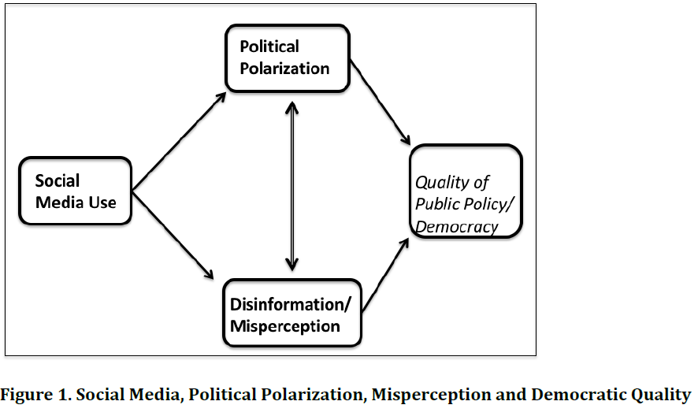
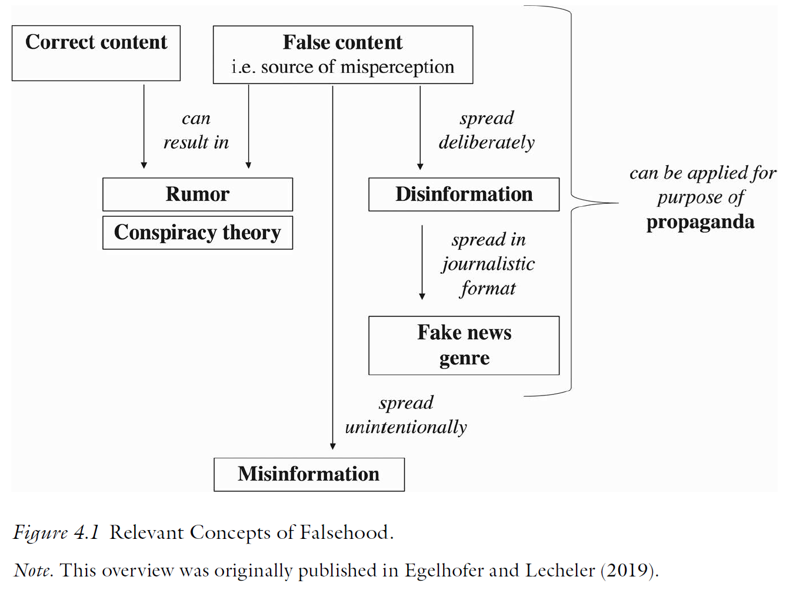
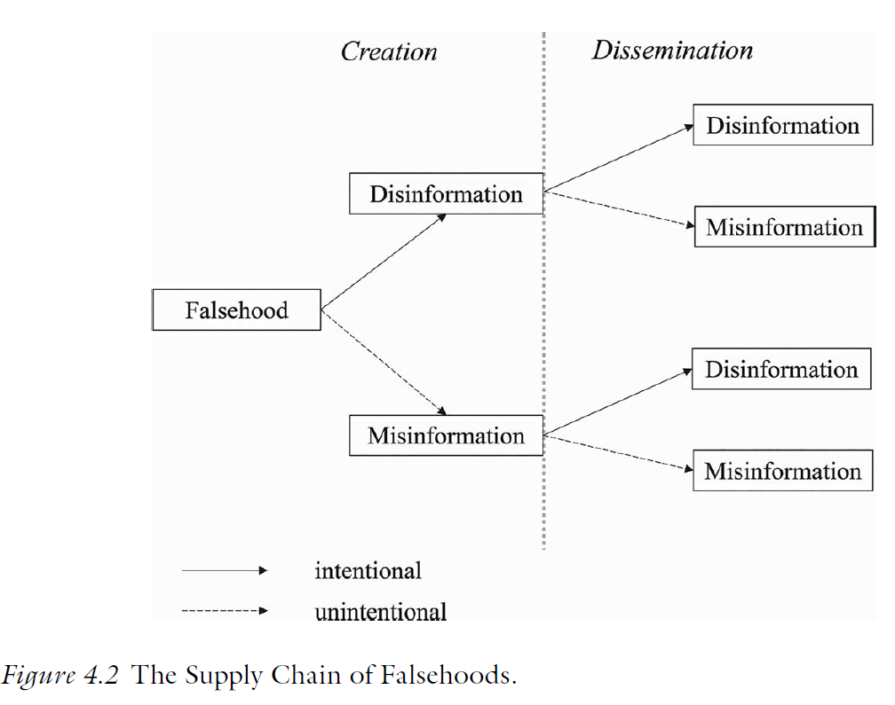
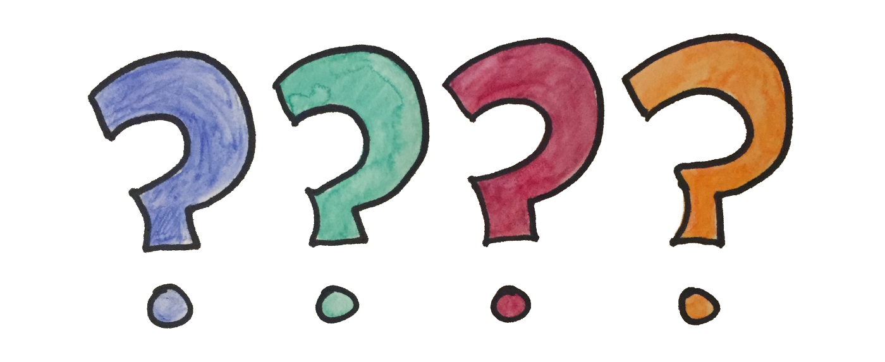

# Introduction

::: notes
~ 5 minutes
:::

## The role of the media environment {.smaller}
 
 

. . .
 
Democratic backsliding can be theorized as the result of **supply-side (politicians)** and **demand-side (citizens)** interactions
 
. . .
 
- The **media environment** is not purely supply- or demand-side, but rather shapes these **interactions**

 

. . .
 
From a **supply-side perspective**: media ownership concentration as a tool of backsliding (Session 05)

. . .

 
From a **demand-side perspective**: the shift to online and social media environments has grown concerns about citizens' political information, beliefs, and behavior

## This session's goals
 

. . .
 
- Understand the **shift in the media environment** and the new challenges it poses

. . .
 
- Clarify the notions of **misinformation, disinformation, and fake news**

. . .
 
- Debate the **role of media change** for democratic backsliding

. . .
 
- Students' presentation: the case of the **Philippines**

# The media environment shift
 
::: notes
~ 10 minutes
:::
 
## From offline to online media {.smaller}
*Tucker et al., 2018*
 
 

. . .
 
The rise of **social media** has fundamentally transformed how citizens encounter political information
 
. . .
 
- Anyone can now broadcast to large audiences at near-zero cost; **traditional gatekeepers (editors, broadcasters) have lost their monopoly** on political communication

. . .
 
- This creates *new opportunities* for **political engagement** but also for the spread of **misinformation**, **propaganda**, and **polarizing content**

. . .

Tucker et al. (2018) review and summarize a series of **contested research topics** on **social media and democracy**

::: notes
The key point about the triangle is that there is no direct arrow from social media to democratic quality — the effects are all mediated. Social media is an arena, not inherently democratic or undemocratic. This matters for policy: you cannot simply regulate social media and expect democratic quality to improve unless you also address polarization and misinformation.
:::
 
---
 
{fig-align="center"}
 
## 1. Online political conversations {.smaller}
*Tucker et al., 2018*
 
 

. . .
 
**What it is**: political discussion and information sharing on social media platforms
 
  
 
 
**What we know**: exposure to diverse viewpoints online is higher than often assumed; **echo chambers** are **less prevalent** than the conventional narrative suggests
 

 
 
**What we don't know**: whether *cross-cutting exposure* improves political reasoning or simply produces more negative, uncivil interactions; how platform design shapes conversation quality
 
::: notes
The echo chamber finding is important. The popular narrative overstates ideological self-segregation. Most users have diverse networks. The problem is not that people only encounter like-minded views — it is that the political content they do encounter tends to be negative and extreme, and that this negativity drives affective polarization even without ideological polarization.
:::
 
## 2. Disinformation and propaganda {.smaller}
*Tucker et al., 2018*
 
 

. . .
 
**What it is**: false or **misleading political content** spread online; includes fake news, rumors, hyperpartisan content, and foreign-state-sponsored propaganda *(more on definitions later)*
 
 
 
**What we know**: misinformation was widely shared during the 2016 US election; fake news reached large audiences; exposure is concentrated among **heavy partisan media consumers**

 

**What we don't know**: the **causal effect** of exposure on political knowledge, attitudes, and vote choice; effect sizes are likely smaller than journalistic accounts suggest
 
::: notes
The 2016 election was the catalyst for this literature. But the causal question is harder than the descriptive one. The question is about the cumulative and interactive effects with other factors, including the weaponization of the "fake news" label by politicians to undermine trust in all media.
:::
 
## 3. Producers of disinformation {.smaller}
*Tucker et al., 2018*
 
 

. . .
 
**What it is**: the actors who create and spread false political content, including politicians, **foreign states**, partisan media outlets, bots, and ordinary citizens

 

 
**What we know**: **automated accounts** (bots) amplify disinformation; foreign actors (Russia, others) have actively spread divisive content; politicians themselves create and amplify disinformation

 
 
 
**What we don't know**: the **proportion** of disinformation produced by each actor type; actual electoral impact of foreign interference; most data held by private platforms
 
::: notes
The producers landscape is more diverse than "Russian bots" — domestic actors, partisan outlets, and politicians themselves play a major role.
:::
 
## 4. Strategies and tactics {.smaller}
*Tucker et al., 2018*
 
 

. . .
 
**What it is**: how disinformation is **spread**; amplification via bots, **coordinated** inauthentic behavior, astroturfing, emotional framing, platform algorithm exploitation

 
 
 
**What we know**: bots amplify content to **make fringe views appear mainstream**; emotional (especially outrage) content spreads faster and further; social fact-checking by citizens is generally ineffective

 
 
**What we don't know**: relative **effectiveness of different tactics**; how much coordination is required for large-scale effects; how tactics differ across platforms
 
::: notes
The amplification function of bots is particularly important: the goal is often not to convince but to create the appearance of consensus — shifting perceived social norms rather than changing individual beliefs.
:::

# Political misinformation
 
::: notes
~ 15 minutes
:::
 
## Misinformation is not new {.smaller}
 
 

. . .
 
**False political beliefs** predate social media; the phenomenon is **old**, the scale and speed are new
 
. . .
 
- There are concerns about the role of **systematic political misperceptions** for democracy since the early 2000s: whether citizens held **confidently wrong** beliefs that shaped their **policy preferences** and **behaviour**
 
. . .

What has changed with **social media**:
 
- **Speed and scale** of dissemination 
- **Intentional production** at industrial scale, including by state actors
- The **weaponization** of the "fake news" label to undermine trust in all information

::: notes
Kuklinski et al. stress "not just wrong, but confidently wrong".  The confidence component matters because confident misperceptions are harder to correct and more likely to shape behavior. Ignorance (wrong but uncertain) is more amenable to updating.
:::
 
## Defining the terms {.smaller}
*Lecheler & Egelhofer, 2022*
 
 

. . .
 
**Misinformation**: incorrect or misleading information disseminated **unintentionally**; the actor does not need to know it is false
 
. . .

 
 
**Disinformation**: incorrect or misleading information disseminated **intentionally**; the actor knows it is false and intends to deceive
 
. . .

 
 
**Fake news genre**: a specific form of disinformation that **mimics journalistic format** using digital technologies; not just false, but designed to look like legitimate news
 

::: notes
The terminological clarity matters for research and policy. You cannot design effective countermeasures if you conflate these three things. Debunking a specific fake news article is different from addressing the general erosion of media trust caused by the fake news label. And understanding who created disinformation (and why) requires separating creation from dissemination.
:::
 
---
 
{fig-align="center"}
 
## The supply chain of falsehoods {.smaller}
*Lecheler & Egelhofer, 2022*
 
 

. . .
 
The supply chain has two stages: **creation** and **dissemination**; actors at each stage may have different intentions
 
. . .
 
Three main actor types involved in the supply:
 
- **Political actors**: use disinformation strategically; populists weaponize "fake news" label to delegitimize legacy media
- **Media actors**: can spread misinformation through sloppy journalism or sensationalism; some deliberately produce false content
- **Citizens**: unintentionally share false content

. . .

Importantly, disinformation can be **re-shared unintentionally**, turning it into misinformation at the point of dissemination
 
 
---
 
{fig-align="center"}

## Your responses I {.smaller}

 

. . .

"[The paper] does not provide solid empirical data on the actual amount of false information in circulation." *(Jean-Philippe Heusser)*

. . .

"[It] does also not show which actors (politicians, media, citizens) matter most in practice." *(Jean-Philippe Heusser)*

. . .

"[It] offers only limited evidence about the real impact of false information on citizens and on democratic processes. " *(Jean-Philippe Heusser)*

. . .

"The paper does not examine sufficiently how false information differs across countries, political regimes, and media systems." *(Jean-Philippe Heusser)*

. . .

 

"Much of the empirical literature on misinformation is based on the United States and other Western democracies." *(Giulio Paraboni)*

## Your responses II

 

"Observing and measuring intent is a challenge [...] This ambiguity makes it challenging to operationalize the concepts in empirical research and to assess the relative importance of intentional deception.  " *(Giulio Paraboni)*

## Why misinformation persists {.smaller}
*Jerit & Zhao, 2020*
 
 

. . .
 
Political misinformation is **exceedingly difficult to correct**
 
. . .

 
 
The root cause: citizens bring **directional motives** to political information processing

 
- **Accuracy motives**: the desire to be correct

- **Directional motives**: the desire to arrive at a conclusion consistent with one's prior beliefs (e.g., partisan motivated reasoning)

. . .

 
As a result people **assimilate congruent evidence uncritically** and **counterargue incongruent evidence**, even when that evidence is a factual correction
 
::: notes
The Lodge & Taber "hot cognition" model is the underlying mechanism: all political objects (parties, candidates, issues) are affectively tagged from the moment of first encounter. Subsequent information processing is biased in the direction of that initial affect. This means that corrections can backfire not because of irrationality per se, but because the person is following a different goal — consistency, not accuracy.
:::
 
## Correcting misinformation: what works? {.smaller}
*Jerit & Zhao, 2020*
 
 

. . .
 
Corrections **do** work in some circumstances:

 
- **Apolitical sources** are more effective 
- **Specific misinformation** (about a single event) is easier to correct than **general misinformation** (about a party or group)
- **Co-partisan correction** can work 

. . .
 
The evidence suggests that a *"backfire effect"* (corrections strengthening misbelief), despite rare, can happen

# Media change and democracy
 
::: notes
~ 10 minutes
:::
 
## Social media and polarization {.smaller}
*Tucker et al., 2018*
 
 

. . .
 
The dominant narrative —social media as an **echo chamber machine** driving mass polarization— is *not well-supported by the evidence*
 
. . .
 
- Ideological polarization has grown most among **older citizens** who use social media least

- Cross-cutting exposure online is **higher** than assumed

. . .
 
However, social media **does** contribute to **affective polarization**: negative interactions increase hostility toward opponents even without shifting issue positions

. . .

 

Overall, the impact of **social media** on democracy through **polarization** is **contested**

::: notes
This is the key distinction between ideological and affective polarization that runs through the Tucker review. Social media may be less responsible for people moving to the ideological extremes than commonly thought. But it clearly contributes to people disliking and distrusting those on the other side more intensely. For backsliding, affective polarization matters more: it is the mechanism through which citizens are more willing to tolerate democratic violations by their own side.
:::

## Your responses III

 

. . .

"The relationship between motivation, preference and belief is unclear. This has far-reaching implications [...] holding on to false beliefs can also be explained by the desire to reaffirm one’s own position and by strong attachment to a political party’s stance. If a significant portion of misinformation [...] can be traced back to these factors, then the root of the problem lies in polarization. Greater polarisation therefore leads to a greater prevalence of misinformation." *(Lina Goldschmidt)*
 
## The "fake news" label as a weapon {.smaller}
*Lecheler & Egelhofer, 2022*
 
 

. . .
 
Beyond the spread of actual false information, the **"fake news" label** itself is a democratic threat
 
. . .
 
Populist politicians systematically apply the label to **legitimate journalism** to delegitimize criticism and erode media trust
 
. . .

There are **concerns** that the "fake news" label...
 
- Decreases **trust in legacy media** across partisan lines
- Leads to **polarized media diets**: conservatives and liberals increasingly associate different outlets with fake news
- Citizens who perceive high levels of disinformation may **disengage** from political information altogether

::: notes
This is one of the most politically important findings in the chapter. The fake news label is not just rhetoric — it has measurable consequences for media trust and media consumption. And it follows a populist logic: elites (journalists) are corrupt and cannot be trusted; only the leader tells the truth. This maps perfectly onto the populist anti-elitist frame from Session 07.
:::
 
## Should we correct misinformation? {.smaller}
*Ecker et al., 2024*
 
 

. . .
 
A growing scholarly debate questions whether misinformation countermeasures are **legitimate and effective**
 
. . .
 
::: {.columns}
::: {.column width="50%"}
 
**The "moral panic" critique**
 
- The threat is **overstated**
- Classifying information as false is **epistemically problematic**
- Interventions are **paternalistic** and curtail freedom of expression
:::
::: {.column width="50%"}
 
**The counter-argument**
 
- Many facts are **incontrovertible**; election fraud, vaccine safety, the Holocaust
- False beliefs have **documented real-world consequences**
- Misinformation itself **violates** democratic deliberation; correcting it **upholds** democracy
:::
:::

## Your responses IV

 

. . .

"On a societal level, citizens should be better educated so they can identify misleading content more effectively. Media organisations should strengthen fact-checking, improve journalists’ verification skills, and provide more time and resources for careful reporting. Platforms and media companies could also be subject to clearer legal responsibilities and sanctions when they systematically enable the spread of falsehoods." *(Jean-Philippe Heusser)*

 
# Conclusion
 
::: notes
~ 5 minutes
:::
 
---
 
 

 
How does the media environment connect to the other *demand-side factors* we have discussed?
 
. . .
 
 

What's the importance of the *media for democratic backsliding*?

. . .

 

Should platforms and governments intervene to prevent *disinformation* and *polarization*? How?
 
## Summary
 
. . .
 
- The shift to online media as a new **information environment** has changed the **arena**, but its impact on democracy is unclear

. . .
 
- **Misinformation** can spread more rapidly, the **"fake news"** label can be weaponized, and social media allegedly fuels **polarization**

. . .
 
- Correcting misinformation is **difficult** due to directional political motives and the legitimacy of such interventions remains **contested**

---

{fig-align="center"}

## Next block (15.05.2026)

 

**Block IV: Trends and Debates on Democratic Backsliding**

 

. . .

**Before...**

 

Presentation by **Fabian**:

*Philippines*

## Thanks! :slightly_smiling_face:

 

 

 

[alvaro.canalejo@unilu.ch](alvaro.canalejo@unilu.ch)

