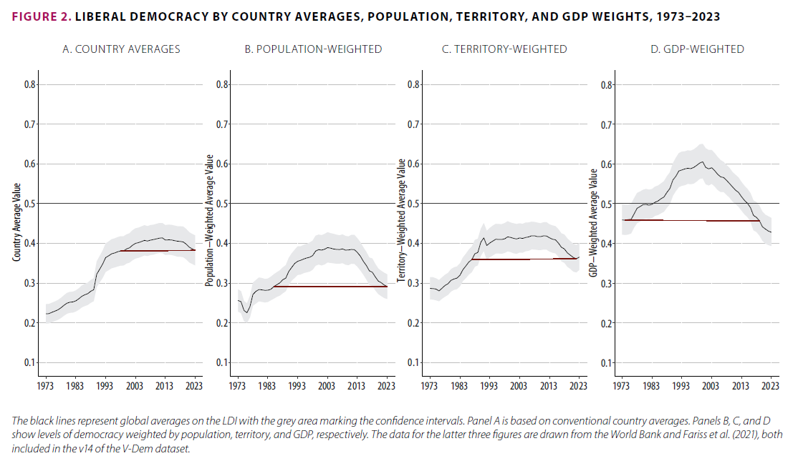
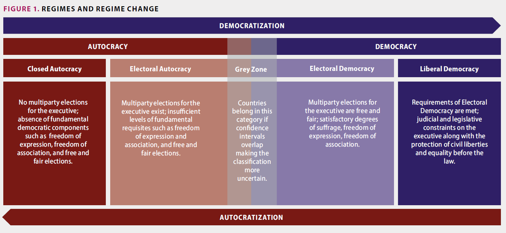
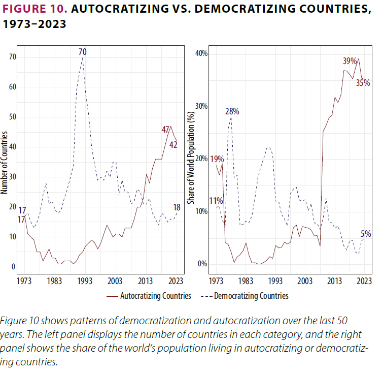
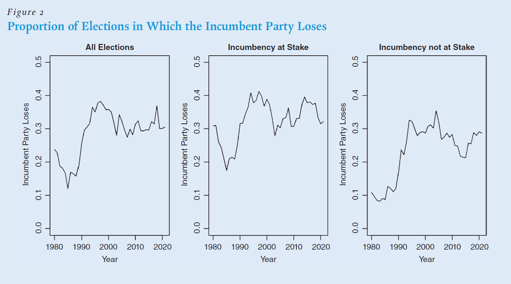
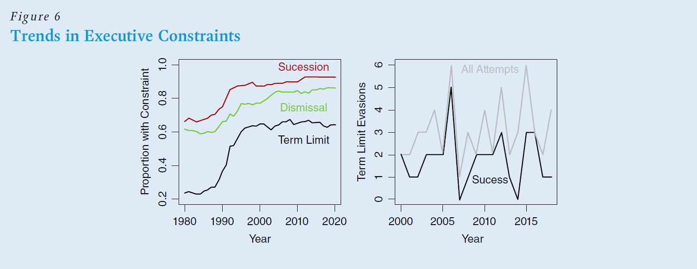
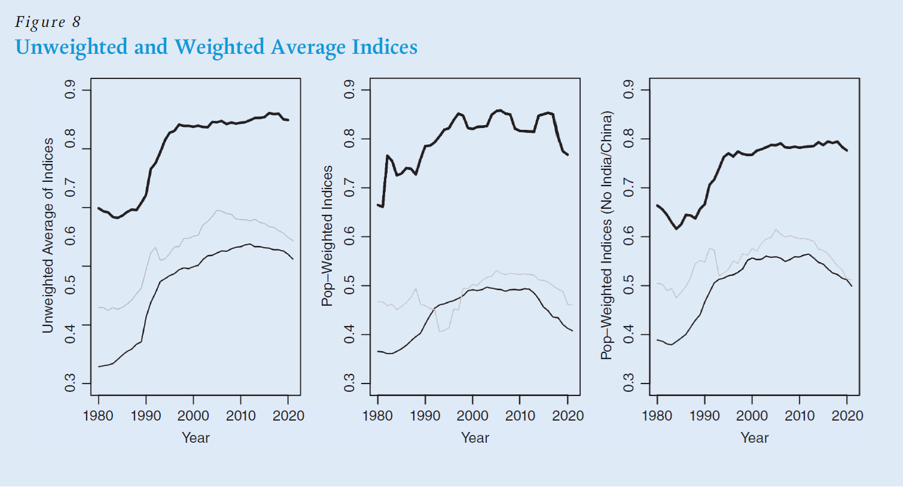
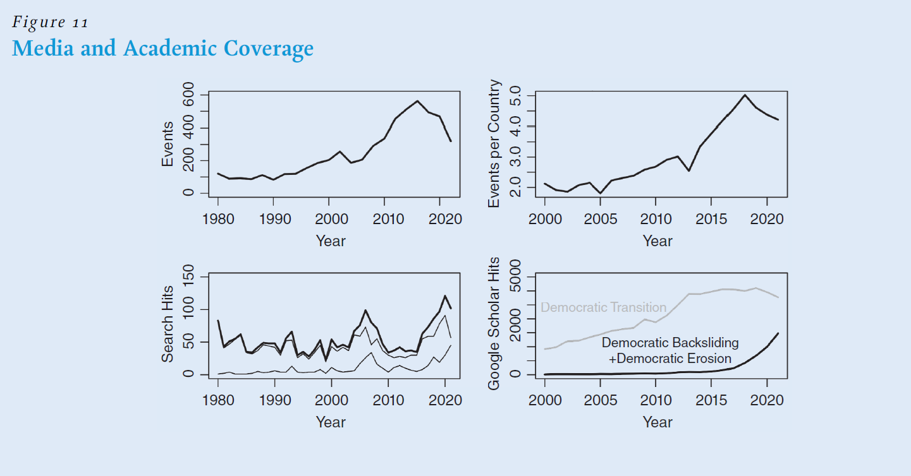
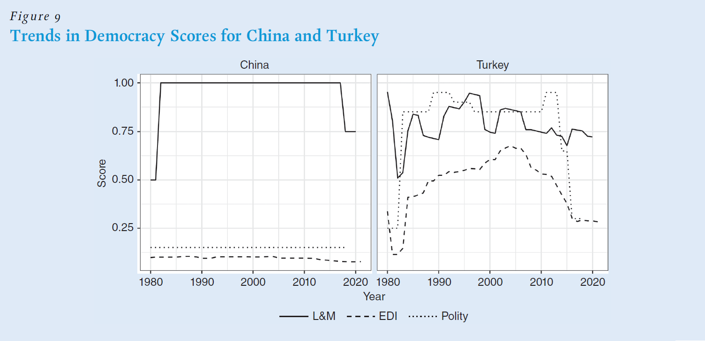
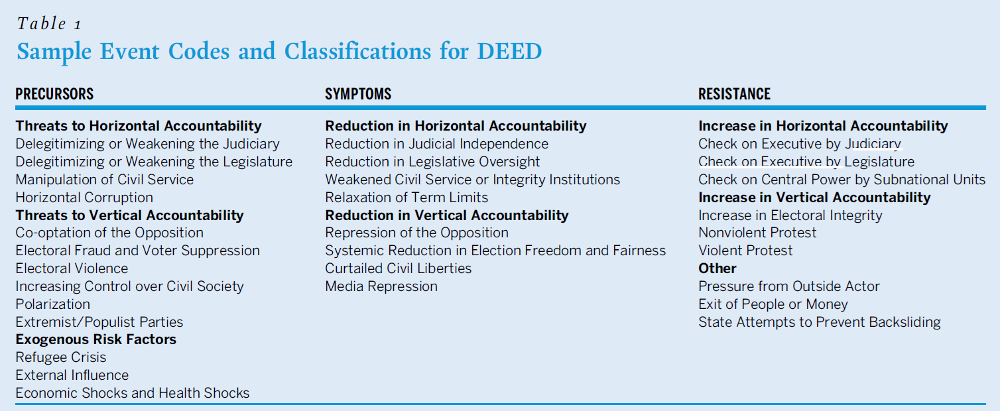
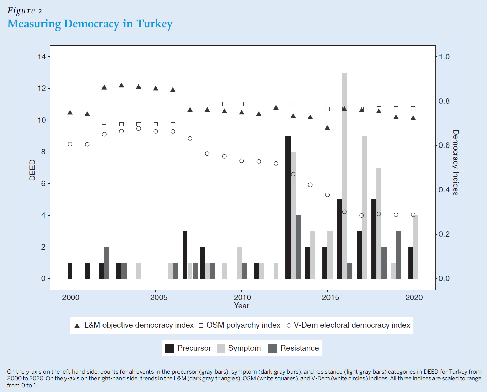

# Introduction

::: notes
~ 5 minutes
:::

## This session's goals

 

. . .

- Review **global trends** in democratic backsliding

. . .

- Discuss **debates on measurement**

. . .

- Debate the **extent** of democratic backsliding and the impact of measurement issues

. . .

- Students' presentation: the case of **Brazil**

# Democratic backsliding trends

::: notes
~ 10 minutes
:::

## The 2024 V-Dem report {.smaller}

*Marina et al., 2024*

 

. . .

Annual report by the **V-Dem Institute** at the University of Gothenburg

- Covers **179 countries** using expert-coded and factual indicators

- Uses **Bayesian IRT** to aggregate expert judgements into continuous indices with **credible intervals**

. . .

Focus on two main indices:

- **Electoral Democracy Index (EDI)**: measures the degree to which political power is obtained through free and fair elections

- **Liberal Democracy Index (LDI)**: extends EDI by adding protection of civil liberties, rule of law, and constraints on executive power

::: notes
Students have encountered V-Dem in Session 2. Briefly remind them of the methodology before the figures.
:::

## LDI trends

{fig-align="center"}

::: notes
Global trends in liberal democracy, unweighted and population-weighted. The population-weighted line is more pessimistic due to large-country backsliding (e.g., India).
:::

## Regime types and regime change

{fig-align="center"}

::: notes
Regime typology and regime change classification. Four regime types along the EDI; changes identified via statistically significant 10-year shifts.
:::

## Fine-grained findings {.smaller}

*Marina et al., 2024*

 

. . .

**Autocratization**: ~42 countries affected; ~2.8 billion people living under autocratizing regimes

- Most common destination: **electoral autocracy**; outright democratic breakdowns remain rare

- Key mechanism: **electoral manipulation**; incumbents use elections to legitimise power while eroding their competitiveness

. . .

**Democratization**: ~18 countries show significant progress; but gains are **smaller and more fragile** than losses

---

{fig-align="center"}

::: notes
Number of countries autocratizing and democratizing. Autocratizing countries clearly outnumber democratizing ones over the past decade.
:::

## V-Dem methodological remarks {.smaller}

*Coppedge, Gerring, Knutsen & Teorell, in Marina et al., 2024*

 

. . .

1. **Population weighting inflates decline**: India alone drives much of the trend; unweighted, global EDI fell only **0.03 points** over 10 years

. . .

2. **Crisp categorisations are arbitrary**: RoW cutoffs on continuous indices produce misleading regime labels

. . .

3. **Uncertainty is under-communicated**: trends presented without CIs may reflect **measurement error**, not real change

. . .

4. **Backsliding is modest**: the vast majority of countries have had **stable** democracy scores in recent years

::: notes
This slide is key to setting up the L&M debate; the PIs themselves call for a "more measured tone." They do not dispute V-Dem data quality but question the report's interpretive framing.
:::

# The L&M critique

::: notes
~ 10 minutes
:::

## The core argument {.smaller}

*Little & Meng, 2024*

 

. . .

V-Dem relies on **subjective expert judgements**, and experts may be systematically biased

. . .

**"Bad-vibes" hypothesis**: in a pessimistic media environment, experts rate countries more negatively over time regardless of actual democratic change on the ground

> Apparent global backsliding may be an **artefact of measurement**, not a real trend

. . .

Their solution: assess **"objective" indicators** that can be verified without expert interpretation

## The L&M indicators {.smaller}

*Little & Meng, 2024*

 

. . .

15 indicators from three sources:

. . .

- **NELDA**: incumbent party loss and electoral competitiveness

. . .

- **DPI**: *de iure* executive constraints,  succession and dismissal rules, term-limit evasion attempts

. . .

- **Journalist threats**: journalists killed and imprisoned, term-limit evasion attempts

::: notes
L&M note their index is not meant to replace V-Dem but to "summarise aggregate trends." However, they compare it to V-Dem across all countries, which Knutsen et al. contest.
:::

## Incumbent losses

{fig-align="center"}

::: notes
At stake: incumbency contested or not contested.
:::

## Change in excutive constraints

 

{fig-align="center"}

::: notes
Proportion of countries that have constitutional rules designating (1) term limits, (2) succession procedures, and (3) rules for dismissing the leader.
:::

## Aggregate "objective" index

{fig-align="center"}

::: notes
A simple aggregate objective index by normalizing all individual variables between 0 and 1 when we can do so and taking the average for each country-year.
:::

## "Bad vibes" bias evidence?

. . .

{fig-align="center"}

::: notes
L&M's media coverage figure; their evidence that a pessimistic media environment preceded or accompanied V-Dem's decline.
:::

# The responses to L&M

::: notes
~ 10 minutes
:::

## Your responses I {.smaller}

 

. . .

"[...] the point of the modern backsliding of democracy is the more subtle/gradual form, in comparison to previous waves of autocracy." *(Sasha Niklaus)*

. . .

"Elections, term limits, and executive rules are important, but democracy can also weaken through slower and less visible processes." *(Fabian Wolff)*

. . .

 

"The gradual undermining of judicial independence, the weakening of civil society or the systematic intimidation of political opponents can take place over many years without ever visibly influencing who wins at the ballot box." *(Vanessa Rölli)*

. . .

"Subtle shifts such as changes in political norms and culture may be risk factors for future erosion of free and fair elections, even when they do not directly or immediately show up objective indicators." *(Elli Brown)*

## Your responses II {.smaller}

 

"[...] absence of evidence does not automatically constitute proof of non-existence. [...] the authors would strengthen their argument if they were to seriously consider what a world of ‘covert authoritarianism’ would look like in their chosen indicators and whether these measures would even be capable of detecting it." *(Vanessa Rölli)*

 

. . .

"Ozan Varol (2015) has shown in his paper about stealth authoritarianism that there is not a need to imprison or kill a journalist to supress their coverage of certain news and thus further democratic backsliding. There is also the possibility of a strategic lawsuit against public participation (SLAPP lawsuit)" *(Pascal Tarnowski)*

## Your responses III {.smaller}

 

. . .

"[...] it treats broad global trends as if they can be captured through aggregate averages. This might be useful for showing overall patterns, but it also risks hiding important differences across countries and regime types." *(Fabian Wolff)*

 

. . .

"Their reliance on global aggregation is effective for the paper's central argument [...] (but) it is not sufficiently explored whether countries showing backsliding tendencies in recent years have different characteristics than those further in the past" *(Elli Brown)*

## Your responses IV {.smaller}

 

. . .

"[...] the V-Dem and the Freedom House Index can, with there more maximalist definition, pick up more nuanced and subtle changes in the stability of the democratic regimes around the world." *(Pascal Tarnowski)*

 

. . .

"[...] as there are over 4200 country experts, who give Information about all the countries, I find the argument about the biases quite weak." *(Pascal Tarnowski)*

 

. . .

"[...] the increased mentioning of “democratic erosion/backsliding” could just as well mean that there actually are more problems when it comes to democracies all over the world." *(Sasha Niklaus)*

## Response by the V-Dem team {.smaller}

*Knutsen et al., 2024*

 

. . .

**The objective/subjective distinction is overstated**

- All human-coded data involve judgement; L&M's indicators too

. . .

**V-Dem's design limits bad-vibes bias**

- Experts code *specific low-level concepts*, not "democracy" broadly
- Coder revision analysis (V9 → V13): <1.4% changed scores, **no pessimistic drift**

. . .

**Conceptual coverage matters**

- Modern backsliding targets **expression, civil society, rule of law**; what electoral indicators miss

## Assessing face validity

{fig-align="center"}

::: notes
Trends in democracy scores for China and Turkey across L&M, EDI, and Polity. L&M produces counterintuitive results in well-documented backsliding cases. China scores perfectly in 1989; Turkey's highest score is in 1980, the year of the military coup.

L&M include only four indicators in their analyses of China, all of which have low thresholds for perfect scores.
:::

## Complementary approaches: event datasets {.smaller}

*Baron et al., 2024*

 

. . .

A third approach: **focus on events**, not aggregated indices

. . .

**DEED** (Democratic Erosion Event Dataset) codes specific political events (precursors, symptoms, and resistance) with source documentation for each

. . .

Key finding from Turkey and Brazil: **objective indices underestimate** erosion; **subjective indices may overestimate** it

. . .

DEED reveals dynamics both miss: **sequencing, gradual escalation, and resistance**

---

 

{fig-align="center"}

---

{fig-align="center"}

::: notes
Turkey vs. Brazil case comparison. In Turkey, L&M misses the post-2012 erosion captured by V-Dem and DEED (Gezi Park, media repression). In Brazil, L&M shows improvement after 2016 because Bolsonaro was not an incumbent; an artefact of its own indicator logic.
:::

## Your responses {.smaller}

 

. . .

"it should be noted that DEED also requires subjective judgements during data collection and cannot escape the dichotomy of subjective versus objective." *(Lina Goldschmidt)*

 

. . .

"[...] student-led data collection is likely to be subject to varying assessments [...] In addition to the distortion caused by the similarity of students’ situations, bias may also arise from factors such as linguistic constraints." *(Lina Goldschmidt)*

 

. . .

"The authors themselves admit that the distinction between precursor, symptom and resistance is conceptually vague; it lacks a theoretical foundation." *(Lina Goldschmidt)*

# Conclusion

::: notes
~ 10 minutes
:::

## Is global democratic backsliding **overstated**?

. . .

 

- Can any index be truly **"objective"**? 

. . .

- Does it matter if backsliding is concentrated in a **few large countries**?

. . .

- What would it take to **falsify** the claim that democracy is in global decline?

---

## Summary 

. . .

- V-Dem's **2024 report** documents significant autocratization globally, though magnitude depends

. . .

- L&M argue **expert bias** ("bad vibes") may inflate the apparent decline

. . .

- Knutsen et al. show the **objective/subjective distinction is overstated** and find no evidence of pessimistic drift

. . .

- The debate is ultimately also **conceptual**: what counts as backsliding depends on what we think democracy requires

---

{fig-align="center"}

## Next session (11:00)

 

**Session 13: Institutional and Civil Resistance**

Case study: Poland

 

. . .

**Before...**

 

Presentation by **Jean-Philippe & Filippo**:

*Brazil*

## Thanks! :slightly_smiling_face:

 

 

 

[alvaro.canalejo@unilu.ch](alvaro.canalejo@unilu.ch)

