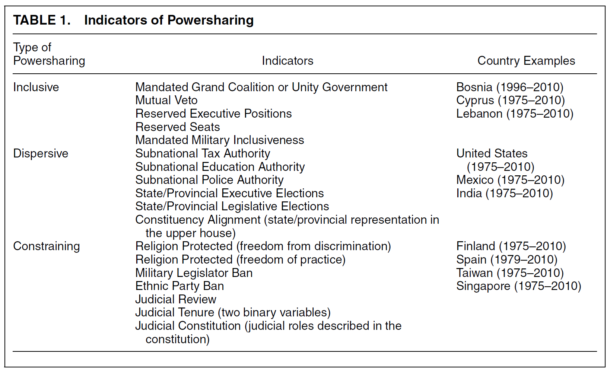
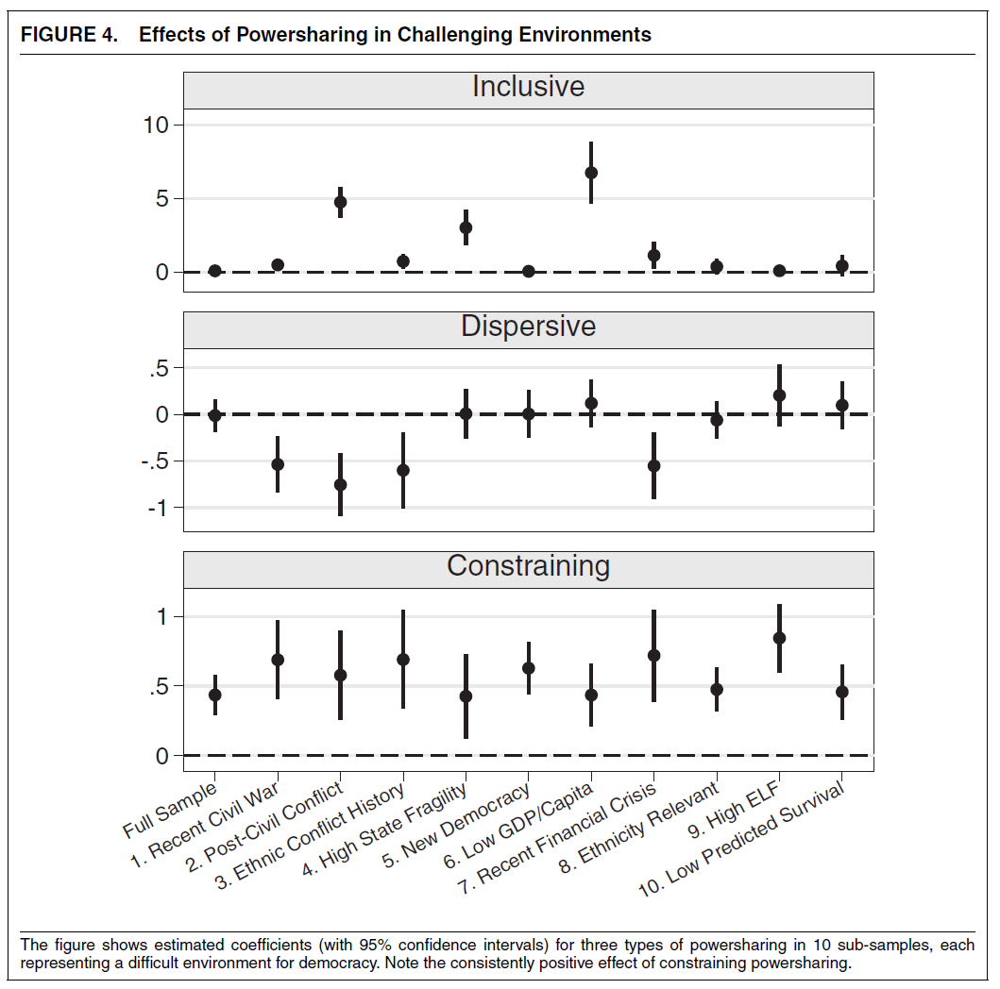
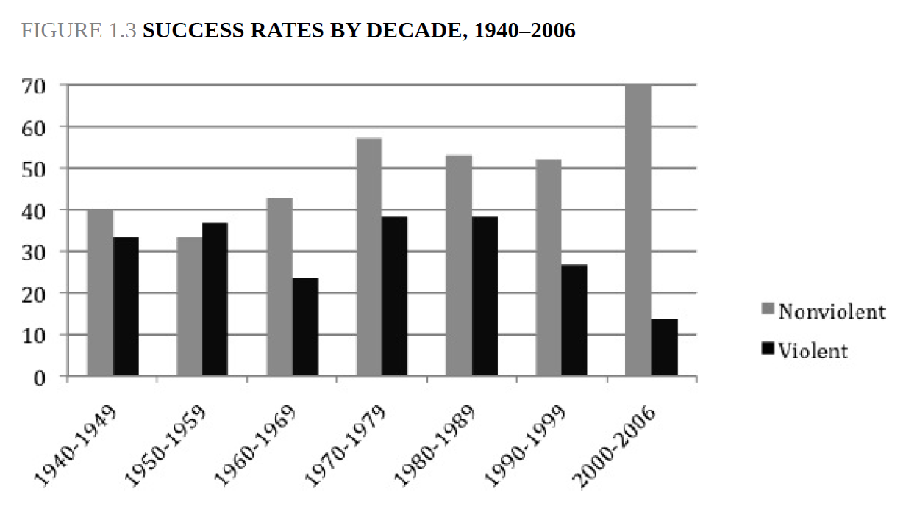
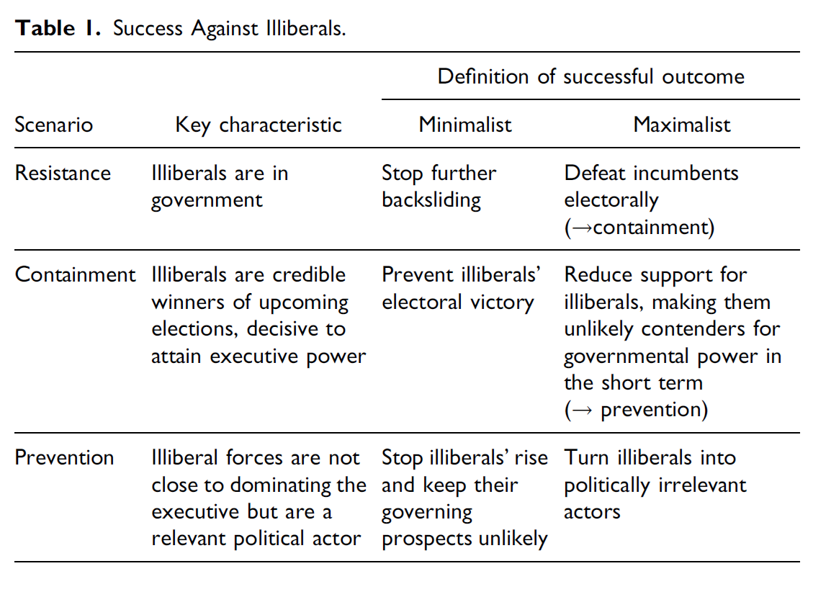
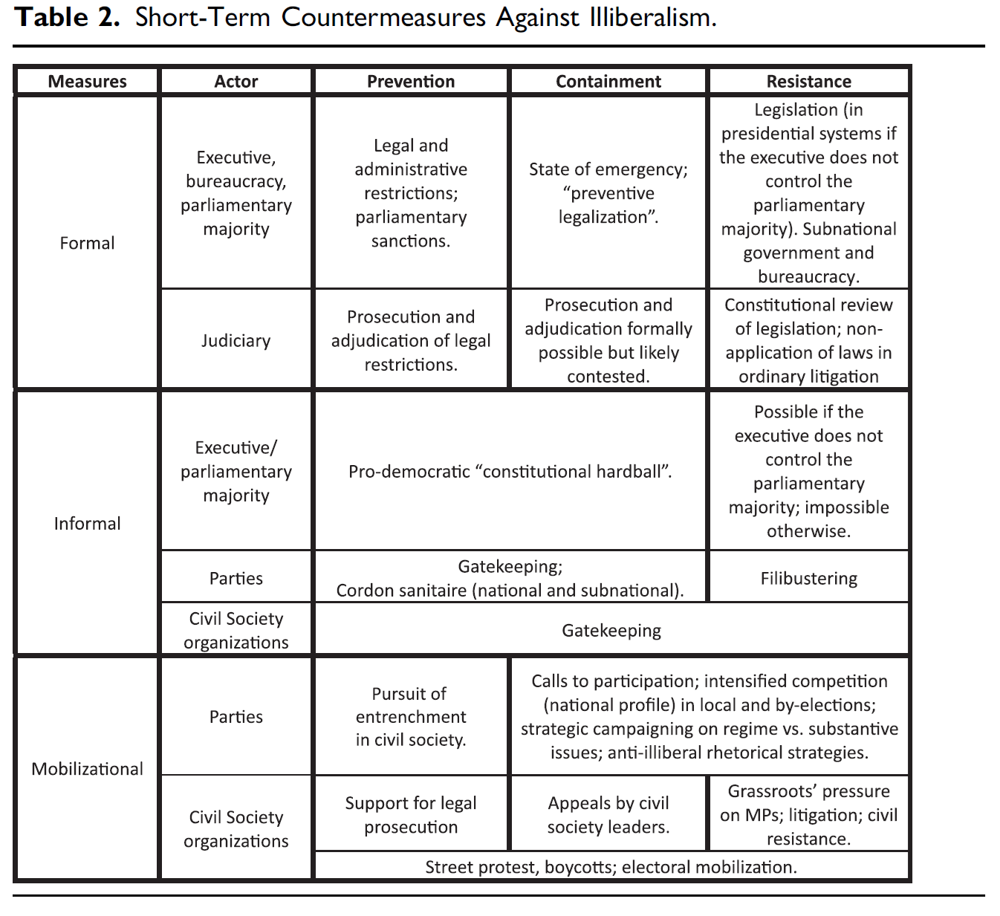

# Introduction

::: notes
~ 5 minutes
:::

## This session's goals

. . .

- Understand how **institutional design** can protect democracy from breakdown

. . .

- Examine the **strategic logic of nonviolent resistance** and why it can work

. . .

- Discuss the challenges of **countering backsliding**

. . .

- Students' presentation: the case of **Poland**

# Institutional Design

::: notes
~ 10 minutes
:::

## Powersharing and democratic survival {.smaller}

*Graham, Miller & Strøm, 2017*

 

. . .

**RQ**: can institutional design protect democracy? Which institutions, and under what conditions?

. . .

Three **powersharing institutions**:

- **Inclusive**: group representation, ethnic quotas, grand coalitions

- **Dispersive**: federalism, territorial decentralisation

- **Constraining**: independent judiciaries, civilian control of the military, civil rights protections

::: notes
The key contribution of this paper is the disaggregation. The prior literature treated powersharing as a single thing. Graham et al. show the effects differ sharply by type and context.
:::

---

{fig-align="center"}

## Data and methods {.smaller}

*Graham, Miller & Strøm, 2017*

 

. . .

- **Sample**: all democracies globally, **1975–2015** (N ≈ 2,259 country-years)

- **Outcome**: democratic survival, i.e., whether a democracy remains democratic **5 years later**

- **Method**: dynamic probit regressions (Markov transition models) with a **5-year lag** on all independent variables to reduce reverse causation risk

. . .

- **Key controls**: GDP per capita, regional democracy, ethno-linguistic fractionalization, fuel dependence, past democratic breakdowns, *polity*, *freedom house index*

- **Robustness**: replication with 1–10 year lag specifications, across 10 "hard case" sub-samples, and with an instrumental variables analysis

## Findings: what protects democracy? {.smaller}

*Graham, Miller & Strøm, 2017*

 

. . .

**Constraining powersharing** consistently increases the likelihood of democratic survival; in all contexts and all hard-case sub-samples

- Cutting the risk of democratic failure in half when increased by one standard deviation

. . .

**Inclusive powersharing** helps, but *only* in post-civil war settings; null or negative effects otherwise

. . .

**Dispersive powersharing** (federalism) *destabilises* post-conflict democracies

. . .

 

Policy implication: prioritise **institutions that constrain leaders**, not ethnic quotas or federalism

---

{fig-align="center"}

## Why constraints work {.smaller}

*Graham, Miller & Strøm, 2017*

 

. . .

Three mechanisms:

1. **Electoral winners** have less opportunities to abuse power

2. **Electoral losers** have less incentives to renege on democratic commitments

3. **Third parties** do not suffer discrimination that undermines their regime support

. . .

 

**Constraining institutions** address all three by *restricting* power rather than by allocating it

::: notes
This connects directly to Przeworski's conception of democracy as a self-enforcing equilibrium. The logic of constraints is not to give everyone a seat at the table but to make abuse costly for whoever wins.
:::

## Your responses {.smaller}

 

. . .

"The authors fail to fully explain why constraining institutions succeed and fail in certain contexts [...] in numerous states, formal safeguards are unable to function effectively due to informal patronage networks, corruption, or executive interference." *(Giulio Paraboni)*

. . .

"The discussion of inclusive arrangements is also limited. [...] Systems that guarantee representation may also reinforce polarization, weaken accountability, and strengthen political elites." *(Giulio Paraboni)*

. . .

"If a system accumulates too many formal constraints, too many veto points, and too much bureaucracy, it may become rigid and ineffective. [...] Governments may find it harder to respond to crises, implement reforms, invest in infrastructure, or pursue long-term development. [...] A democracy needs barriers against abuse, but it also needs room for collective decision-making, reform, and development." *(Filippo Brambilla)*

# Civil Resistance

::: notes
~ 10 minutes
:::

## The strategic logic of nonviolent conflict {.smaller}

*Chenoweth & Stephan, 2011*

 

. . .

Conventional wisdom: **armed resistance** is more effective against authoritarian regimes

. . .

Chenoweth & Stephan challenge this, drawing on an **original (NAVCO) dataset** (323 campaigns, 1900–2006):

. . .

- Nonviolent campaigns *(strikes, boycotts, mass protests, civil disobedience)* succeed roughly **twice as often** as violent ones (~53% vs ~26%)

- Post-success outcomes are **better**: nonviolent success is more likely to lead to durable democracy

::: notes
The NAVCO dataset is the main empirical contribution alongside the argument. The 2:1 ratio is striking and robust across different specifications.
:::

---

{fig-align="center"}

## Why nonviolent resistance works {.smaller}

*Chenoweth & Stephan, 2011*

. . .

The key mechanism is **participation**

- Nonviolent campaigns can recruit **larger and more diverse coalitions**, including risk-averse citizens who would not take up arms

. . .

This produces *three downstream effects*:

- **Loyalty shifts**: security forces and economic elites are more likely to defect or withhold support when facing unarmed civilians

- **Resilience**: larger coalitions are harder to repress wholesale; repression of nonviolent movements tends to **backfire**, generating sympathy and new recruits

- **Tactical innovation**: diverse coalitions enable a wider repertoire of actions making campaigns harder to fully suppress

::: notes
The backfire mechanism is crucial. Violent repression of armed insurgents reads as legitimate self-defence. Violent repression of nonviolent protesters delegitimises the regime and accelerates defections.
:::

## Recent findings {.smaller}

*Chenoweth, 2020*

 

. . .

Success rates have **dropped sharply**; from ~70% in the 1990s to under 30% in the 2010s

. . .

- **Authoritarian learning**: regimes now use preemptive repression, co-optation, and counter-mobilisation more effectively

- **Digital surveillance**: easier to monitor and disrupt campaigns before they scale

- **Shifting international environment**: less external pressure on autocrats and fewer pro-democracy incentives from major powers

## Your responses {.smaller}

 

. . .

"The book (...) sometimes leans too heavily on participation as the key explanation for success [...] Leadership, organization, discipline, timing, international pressure, and regime vulnerability are also important." *(Nikolina Djogova)*

. . .

"[...] the book is better at identifying a broad historical pattern than at proving a single causal explanation for it. [...] variation suggests that the strategic logic of nonviolent success may not travel equally well across all forms of conflict" *(Nikolina Djogova)*

. . .

"[...] the distinction between violent and nonviolent campaigns is useful analytically, but it can also smooth over a messier reality." *(Nikolina Djogova)*

. . .

"Some questions may remain less explored in academia not because they matter less, but because they are harder to study in clean, measurable, and publishable ways." *(Nikolina Djogova)*

# Countering Backsliding

::: notes
~ 10 minutes
:::

## A distinct challenge {.smaller}

 

. . .

Graham et al. (2017) and Chenoweth & Stephan (2011) address **democratic survival** and **resistance to autocracy**, respectively

. . .

 

Backsliding has specific features that may limit the lessons we can extract from this work:

- **State-led and incremental**: backsliders retain legal and democratic legitimacy throughout

 

. . .

So, how can we **counter democratic backsliding** specifically?

## Capoccia's framework {.smaller}

*Capoccia, 2026*

 

. . .

Three **scenarios** of confrontation with illiberals:

- **Prevention**: a new illiberal opposition is rising but has not yet become a serious contender

- **Containment**: illiberals are on the brink of power but have not yet access the executive power

- **Resistance**: an illiberal executive is already in power and eroding accountability

::: notes
The typology is analytically useful because each scenario implies different available tools and different success probabilities.
:::

---

{fig-align="center"}

## The temporal paradox {.smaller}

*Capoccia, 2026*

 

. . .

A **paradox of timing**:

- **Act early**: more countermeasures available, but the threat is still ambiguous; hard to coordinate and mobilise

- **Act late**: threat is clear and coordination is easier, but the range of viable responses has narrowed

. . .

Two factors can help navigate the paradox:

- **Exogenous information**: foreign comparators, leaked evidence of illiberal intentions; reduces uncertainty early

- **Institutional legacies**: independent courts, rooted civil society, strong opposition; make timely action more or less feasible

::: notes
Israel vs. Hungary and Poland is Capoccia's example: opponents of Netanyahu's 2023 judicial reforms used Hungary and Poland as cautionary comparators to mobilise when a wider range of countermeasures was still available.
:::

---

{fig-align="center"}

## The democratic dilemma {.smaller}

 

. . .

A fundamental tension: **defending democracy may require bending its rules**

. . .

- **Militant democracy**: banning anti-democratic parties to protect the system from within
- **Hardball** *(Bateman, 2025)*: legally permissible actions that violate democratic norms for (democratic) partisan advantage

. . .

 

When does fighting backsliders **reproduce** the problem?

- Norm-stretching may be **democracy-reinforcing** when backsliders lack popular support and the action expands rather than constricts democratic competition

- But they pose **risks** of polarization, escalation and legitimacy costs

# Conclusion

::: notes
~ 10 minutes
:::

## What can be done to **resist or reverse democratic backsliding**?

. . .

 

- Do **institutions** matter for **mobilization**?

. . .

- What **tactics** are more effective? And more realistic? 

. . .

- How can we navigate the **democratic dilemma**?

---

## Summary

. . .

- **Constraining institutions** matter: they restrict power and increase the chances of democratic survival

. . .

- **Nonviolent resistance** can succeed because it enables broader participation, loyalty shifts, and tactical innovation

. . .

- Backsliding presents **specific challenges**: how to counter it is actively debated, but the timing of interventions matters

. . .

- A crucial open question is the **democratic dilemma**, making resistance harder to pursue

---

{fig-align="center"}

## Next session (13:45)

 

**Session 14: Is Democracy in Danger? Final Remarks**

 

. . .

**Before...**

 

Presentation by **Emmanuel & Stephanie**:

*Poland*

## Thanks! :slightly_smiling_face:

 

 

 

[alvaro.canalejo@unilu.ch](alvaro.canalejo@unilu.ch)
