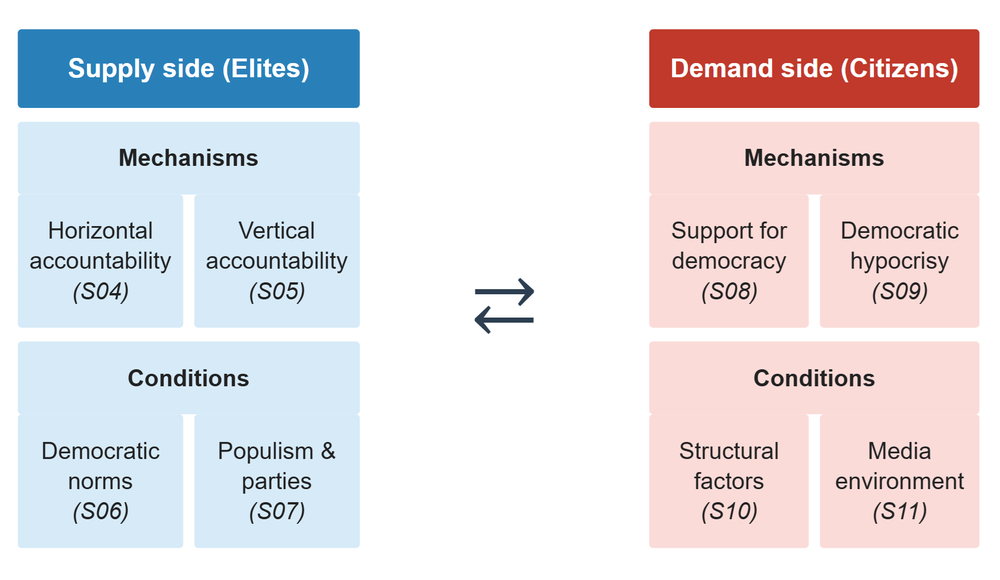

# Introduction

::: notes
~ 5 minutes
:::

## This session's goals

 

. . .

- **Recap** the course content and framework

. . .

- Introduce some **topics** we did not cover

. . .

- Final **debate** and reflection

. . .

- *No student presentation* in this session!

# Democratic Backsliding: A Recap

::: notes
~ 10 minutes
:::

## Democracy and democratic backsliding {.smaller}

 

. . .

- **Democracy** *(S02)* is a contested concept:

    + Minimalist definitions focus on elections
    
    + Broader ones add civil liberties
    
    + The crucial dimensions are contestation and participation

. . .

- **Democratic backsliding** *(S03)* is a special form of autocratization: gradual and state-led, retaining a facade of legal and even democratic legitimacy

---

{fig-align="center"}

::: notes
Walk through the full framework. Supply side: mechanisms (S04–05) and conditions (S06–07). Demand side: mechanisms (S08–09) and conditions (S10–11).
:::

## Trends, measurement issues and resistance {.smaller}

 

. . .

- Global backsliding is **contested** *(S12)*

    + Debates on measurement and conceptual precision underlie this contestation

    + Despite that, it is undeniable that **crucial global actors** are experiencing backsliding episodes

. . .

- **Resistance paths** are unclear *(S13)*, but real-world examples show the importance of timing, institutions, and strategies

# Advanced Topics and Current Debates

::: notes
~ 10 minutes
:::

## Topics not covered {.smaller}

*Benmelech & Monteiro, 2026; Samuels, 2023; Pattison, 2025*

. . .

- **War as a driver** (Benmelech & Monteiro): conflict causes large and **persistent** democratic decline (media censorship, judicial purges, irregular leadership transitions); not because war *requires* autocracy, but because it creates **political opportunity** for executives to consolidate power

. . .

- **The international context matter** (Samuels): the three main pro-democracy actors of the third wave (the **US, EU, and Vatican**) have progressively weakened their incentives to defend democracy abroad; would-be autocrats face less external constraint

. . .

- **The ethics of responding** (Pattison): how *should* liberal states react to backsliding abroad? Avoiding complicity and maintaining liberal integrity are insufficient guides; what may create sufficient incentives is the **external effects** of backsliding on the fulfilment of global responsibilities

## Resilience and resistance {.smaller}

*Riedl, Friesen, McCoy & Roberts, 2024*

. . .

The "next-level" questions in backsliding research:

- **Sources of resilience** (structural): proportional systems, veto points, independent courts, civil society
- **Strategies of resistance**: active choices by opposition and civil society

. . .

Plus, we need to re-think the relationship between **democracy and the market**:

- Przeworski and Limongi argued that beyond a certain level of **wealth**, democracy would not collapse
- This hypothesis rested on **specific industrial market relations and rooted political parties**
- The transition to a **globalised knowledge economy** changes how wealth relates to democracy: **from redistributive to constitutive debates**

# Final Reflection

::: notes
~ 20 minutes
:::

## Is democracy in danger?

 

. . .

- Is the current wave of backsliding **overstated**? Is it a *temporary crisis* or a *structural transformation*?

. . .

- Which matters more for **democratic survival**?

. . .

- What's the role of the **international community**?

. . .

What are ***your thoughts, hopes, and concerns***?

---

{fig-align="center"}

## It's being an enormous pleasure! :slightly_smiling_face:

. . .

 

 

**Thank you all!**

 

[alvaro.canalejo@unilu.ch](alvaro.canalejo@unilu.ch)

